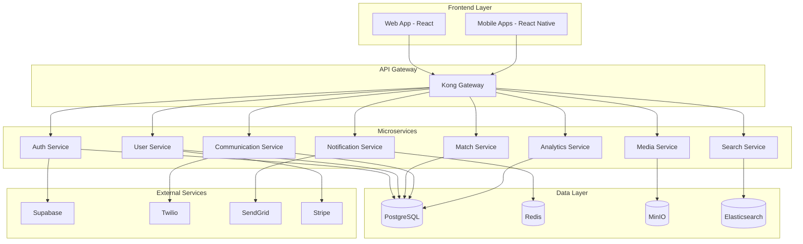

# SoulMatting Platform 💕

> A modern, AI-powered dating platform built with cutting-edge technology

[](https://github.com/kimhsiao/soulmatting/actions/workflows/ci.yml)
[](https://github.com/kimhsiao/soulmatting/actions/workflows/deploy.yml)
[](https://opensource.org/licenses/MIT)
[](https://www.typescriptlang.org/)
[](https://reactjs.org/)
[](https://nodejs.org/)
[](https://supabase.com/)
[](https://www.docker.com/)

## 📋 Table of Contents

- [Overview](#overview)
- [Features](#features)
- [Architecture](#architecture)
- [Tech Stack](#tech-stack)
- [Getting Started](#getting-started)
- [Development](#development)
- [Deployment](#deployment)
- [API Documentation](#api-documentation)
- [Testing](#testing)
- [Contributing](#contributing)
- [License](#license)

## 🌟 Overview

SoulMatting is a next-generation dating platform that leverages artificial intelligence to create meaningful connections. Built with a modern microservices architecture, it provides a scalable, secure, and user-friendly experience for finding your perfect match.

### Key Highlights

- 🤖 **AI-Powered Matching**: Advanced algorithms for compatibility analysis
- 🔒 **Privacy-First**: End-to-end encryption and data protection
- 📱 **Cross-Platform**: Web, iOS, and Android support
- ⚡ **Real-Time**: Instant messaging and live notifications
- 🌍 **Global Scale**: Multi-region deployment with CDN
- 🔧 **Developer-Friendly**: Comprehensive APIs and documentation

## ✨ Features

### Core Features

- **Smart Matching Algorithm**: AI-driven compatibility scoring
- **Real-Time Messaging**: Instant chat with multimedia support
- **Video Calls**: Secure peer-to-peer video communication
- **Profile Verification**: Multi-factor identity verification
- **Advanced Filters**: Location, interests, and preference-based search
- **Safety Features**: Report, block, and safety center

### Premium Features

- **Super Likes**: Enhanced visibility and priority matching
- **Boost**: Temporary profile promotion
- **Passport**: Global location changing
- **Read Receipts**: Message status tracking
- **Advanced Analytics**: Detailed profile insights

## 🏗️ Architecture



## 🛠️ Tech Stack

### Frontend
- **Framework**: React 18 with TypeScript
- **State Management**: Zustand + React Query
- **Styling**: Tailwind CSS + Headless UI
- **Build Tool**: Vite
- **Testing**: Vitest + React Testing Library

### Backend
- **Runtime**: Node.js 22 LTS
- **Framework**: Express.js with TypeScript
- **Authentication**: Supabase Auth
- **Database**: PostgreSQL 15
- **Cache**: Redis 7
- **File Storage**: MinIO (S3-compatible)
- **Search**: Elasticsearch 8

### Infrastructure
- **Containerization**: Docker + Docker Compose
- **Orchestration**: Kubernetes (production)
- **API Gateway**: Kong
- **Monitoring**: Prometheus + Grafana
- **Logging**: ELK Stack
- **CI/CD**: GitHub Actions

### Development Tools
- **Package Manager**: pnpm
- **Monorepo**: Turborepo
- **Code Quality**: ESLint + Prettier
- **Type Checking**: TypeScript
- **Testing**: Jest + Cypress
- **Documentation**: Storybook

## 🚀 Getting Started

### Prerequisites

Before you begin, ensure you have the following installed:

- **Node.js** 22 LTS or higher
- **pnpm** 10.0 or higher
- **Docker** 24.0 or higher
- **Docker Compose** 2.0 or higher
- **Git** 2.30 or higher

### Quick Start

1. **Clone the repository**
   ```bash
   git clone https://github.com/kimhsiao/soulmatting.git
   cd soulmatting
   ```

2. **Install dependencies**
   ```bash
   pnpm install
   ```

3. **Set up environment variables**
   ```bash
   cp .env.example .env
   # Edit .env with your configuration
   ```

4. **Start development environment**
   ```bash
   # Using Docker Compose (Recommended)
   chmod +x docker-dev.sh
   ./docker-dev.sh start
   
   # Or using Helm for Kubernetes
   cd helm
   chmod +x deploy.sh
   ./deploy.sh --environment development
   ```

5. **Access the application**
   - Web App: http://localhost:3000
   - API Gateway: http://localhost:8000
   - pgAdmin: http://localhost:5050
   - Redis Commander: http://localhost:8081
   - MailHog: http://localhost:8025
   - Grafana: http://localhost:3001
   - Prometheus: http://localhost:9090

## 💻 Development

### Project Structure

```
soulmatting/
├── apps/
│   ├── web/                 # React web application
│   └── mobile/              # React Native mobile app (future)
├── services/
│   ├── auth/                # Authentication service
│   ├── user/                # User management service
│   ├── match/               # Matching algorithm service
│   ├── communication/       # Messaging service
│   ├── media/               # File upload service
│   ├── notification/        # Push notification service
│   ├── search/              # Search and discovery service
│   └── analytics/           # Analytics service
├── packages/
│   ├── types/               # Shared TypeScript types
│   ├── shared/              # Shared utilities
│   ├── config/              # Configuration management
│   ├── utils/               # Utility functions
│   └── database/            # Database schemas and migrations
├── helm/                    # Helm charts for Kubernetes deployment
│   ├── soulmatting/         # Umbrella chart
│   ├── charts/              # Individual service charts
│   ├── deploy.sh            # Deployment script
│   ├── Makefile             # Deployment shortcuts
│   ├── values-*.yaml        # Environment-specific values
│   └── secrets.yaml         # Secrets template
├── docs/                    # Documentation
├── scripts/                 # Build and deployment scripts
├── docker/                  # Docker configurations
├── .github/                 # GitHub Actions workflows
│   └── workflows/
│       ├── ci-cd.yml        # Main CI/CD pipeline
│       └── dependency-update.yml # Automated dependency updates
└── tests/                   # BDD test scenarios
    └── bdd/                 # Behavior-driven development tests
```

### Development Workflow

1. **Create a feature branch**
   ```bash
   git checkout -b feature/your-feature-name
   ```

2. **Make your changes**
   - Follow the coding standards
   - Write tests for new features
   - Update documentation as needed

3. **Run tests**
   ```bash
   pnpm test
   pnpm test:e2e
   ```

4. **Commit your changes**
   ```bash
   git add .
   git commit -m "feat: add your feature description"
   ```

5. **Push and create a pull request**
   ```bash
   git push origin feature/your-feature-name
   ```

### Available Scripts

```bash
# Development
pnpm dev              # Start all services in development mode
pnpm dev:web          # Start only web application
pnpm dev:auth         # Start only auth service

# Building
pnpm build            # Build all applications
pnpm build:web        # Build web application
pnpm build:services   # Build all services

# Testing
pnpm test             # Run unit tests
pnpm test:watch       # Run tests in watch mode
pnpm test:e2e         # Run end-to-end tests
pnpm test:coverage    # Generate test coverage report

# Linting and Formatting
pnpm lint             # Lint all code
pnpm lint:fix         # Fix linting issues
pnpm format           # Format code with Prettier

# Database
pnpm db:migrate       # Run database migrations
pnpm db:seed          # Seed database with sample data
pnpm db:reset         # Reset database

# Docker
./docker-dev.sh start    # Start development environment
./docker-dev.sh stop     # Stop development environment
./docker-dev.sh restart  # Restart development environment
./docker-dev.sh logs     # View logs
./docker-dev.sh status   # Check service status

# Helm/Kubernetes
cd helm && make install-dev     # Install development environment
cd helm && make install-staging # Install staging environment
cd helm && make install-prod    # Install production environment
cd helm && make status          # Check deployment status
cd helm && make logs            # View pod logs
cd helm && make uninstall       # Uninstall deployment
```

## 📚 API Documentation

Our API follows RESTful principles and is documented using OpenAPI 3.0 specification.

### Base URLs

- **Development**: `http://localhost:8000/api`
- **Staging**: `https://api-staging.soulmatting.com`
- **Production**: `https://api.soulmatting.com`

### Authentication

All API endpoints require authentication using JWT tokens provided by Supabase Auth.

```bash
# Include in request headers
Authorization: Bearer <your-jwt-token>
```

### Core Endpoints

#### Authentication
- `POST /auth/login` - User login
- `POST /auth/register` - User registration
- `POST /auth/logout` - User logout
- `POST /auth/refresh` - Refresh token

#### User Management
- `GET /users/profile` - Get user profile
- `PUT /users/profile` - Update user profile
- `POST /users/upload-photo` - Upload profile photo

#### Matching
- `GET /matches/suggestions` - Get match suggestions
- `POST /matches/like` - Like a user
- `POST /matches/pass` - Pass on a user
- `GET /matches/mutual` - Get mutual matches

#### Communication
- `GET /conversations` - Get user conversations
- `POST /conversations` - Start new conversation
- `GET /conversations/:id/messages` - Get conversation messages
- `POST /conversations/:id/messages` - Send message

### API Documentation

Interactive API documentation is available at:
- Development: http://localhost:8000/docs
- Staging: https://api-staging.soulmatting.com/docs

## 🧪 Testing

### Testing Strategy

We follow a comprehensive testing approach:

1. **Unit Tests**: Test individual functions and components
2. **Integration Tests**: Test service interactions
3. **End-to-End Tests**: Test complete user workflows
4. **Performance Tests**: Test system performance under load

### Running Tests

```bash
# Run all tests
pnpm test

# Run tests for specific service
pnpm test --filter=@soulmatting/auth

# Run tests with coverage
pnpm test:coverage

# Run E2E tests
pnpm test:e2e

# Run performance tests
pnpm test:performance
```

### Test Structure

```
tests/
├── unit/                # Unit tests
├── integration/         # Integration tests
├── e2e/                # End-to-end tests
├── performance/        # Performance tests
└── fixtures/           # Test data and fixtures
```

### Writing Tests

- Use **Jest** for unit and integration tests
- Use **Cypress** for E2E tests
- Use **Artillery** for performance tests
- Follow BDD (Behavior-Driven Development) principles
- Maintain test coverage above 80%

## 🚀 Deployment

### Environments

- **Development**: Local development environment
- **Staging**: Pre-production testing environment
- **Production**: Live production environment

### Deployment Process

#### Docker Compose (Development)
```bash
# Start development environment
./docker-dev.sh start

# Stop development environment
./docker-dev.sh stop
```

#### Helm/Kubernetes (Staging/Production)
```bash
# Deploy to staging
cd helm
./deploy.sh --environment staging --namespace soulmatting-staging

# Deploy to production
./deploy.sh --environment production --namespace soulmatting-prod

# Using Makefile shortcuts
make install-staging  # Deploy staging
make install-prod     # Deploy production
make status          # Check deployment status
make logs           # View logs
```

#### CI/CD Pipeline
1. **Automated Deployment**: Push to `main` branch triggers production deployment
2. **Manual Deployment**: Use GitHub Actions workflow dispatch
3. **Rollback**: Automatic rollback on deployment failure
4. **Security Scanning**: Trivy scans for vulnerabilities
5. **Dependency Updates**: Automated dependency updates with security checks

### Infrastructure

- **Container Orchestration**: Kubernetes with Helm charts
- **Load Balancer**: Kong API Gateway
- **Database**: PostgreSQL with read replicas
- **Cache**: Redis Cluster
- **Storage**: MinIO (S3-compatible)
- **Monitoring**: Prometheus + Grafana
- **Logging**: ELK Stack
- **Service Mesh**: Istio (production)
- **Secrets Management**: Kubernetes Secrets + External Secrets Operator

## 🤝 Contributing

We welcome contributions! Please see our [Contributing Guide](CONTRIBUTING.md) for details.

### Code of Conduct

This project adheres to our [Code of Conduct](CODE_OF_CONDUCT.md). By participating, you are expected to uphold this code.

### Development Guidelines

1. **Code Style**: Follow ESLint and Prettier configurations
2. **Commit Messages**: Use conventional commit format
3. **Pull Requests**: Include tests and documentation
4. **Security**: Never commit secrets or sensitive data

## 📄 License

This project is licensed under the MIT License - see the [LICENSE](LICENSE) file for details.

## 🆘 Support

- **Documentation**: [docs.soulmatting.com](https://docs.soulmatting.com)
- **Issues**: [GitHub Issues](https://github.com/kimhsiao/soulmatting/issues)
- **Discussions**: [GitHub Discussions](https://github.com/kimhsiao/soulmatting/discussions)
- **Email**: support@soulmatting.com

## 🙏 Acknowledgments

- [Supabase](https://supabase.com) for the amazing backend-as-a-service platform
- [React](https://reactjs.org) team for the excellent frontend framework
- [Node.js](https://nodejs.org) community for the robust runtime environment
- All our contributors and the open-source community

---

<div align="center">
  <p>Made with ❤️ by the SoulMatting Team</p>
  <p>© 2024 SoulMatting. All rights reserved.</p>
</div>
