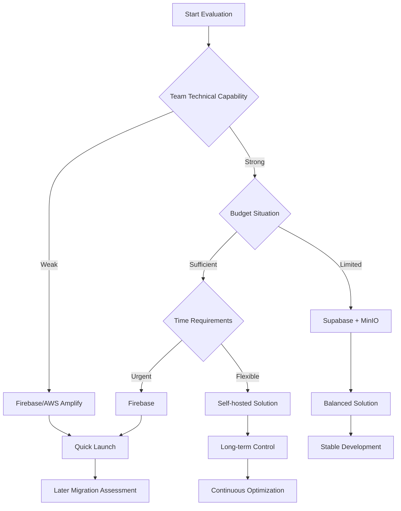

# SoulMatting Alternative Technology Solutions Analysis

## Overview

This document provides a detailed analysis of alternative technology solutions for the SoulMatting project, including different Backend-as-a-Service (BaaS) platforms, object storage solutions, and database options, providing a comprehensive comparison foundation for technical decision-making.

## Current Recommended Solution Review

**PostgreSQL + Supabase + MinIO**
- **Advantages**: Open source, cost-effective, complete functionality, autonomous control
- **Challenges**: Requires more operational work, learning curve
- **Use Cases**: Medium to long-term projects, need for data control, limited budget

## Alternative Solutions Analysis

### 1. Backend-as-a-Service (BaaS) Platform Comparison

#### 1.1 Firebase (Google)

**Technical Architecture**:
```
客戶端應用
    ↓
Firebase SDK
    ↓
┌─────────────────────────────────────┐
│ Firebase Services                   │
├─────────────────────────────────────┤
│ • Authentication                    │
│ • Firestore (NoSQL)                │
│ • Cloud Storage                     │
│ • Cloud Functions                   │
│ • Hosting                          │
│ • Analytics                        │
│ • Push Notifications               │
└─────────────────────────────────────┘
```

**Advantages**:
- ✅ **Rapid Development**: Rich SDK and toolchain
- ✅ **Real-time Sync**: Firestore native support for real-time data synchronization
- ✅ **Auto Scaling**: Google infrastructure, no operational overhead
- ✅ **Rich Ecosystem**: Extensive third-party integrations and community support
- ✅ **Mobile First**: Excellent mobile support
- ✅ **Security**: Google-level security assurance

**Disadvantages**:
- ❌ **Vendor Lock-in**: High dependency on Google ecosystem
- ❌ **Cost Growth**: Rapid cost increase after user growth
- ❌ **Query Limitations**: Limited complex query capabilities in Firestore
- ❌ **Data Export**: Difficult data migration
- ❌ **NoSQL Limitations**: Not suitable for complex relational queries

**Cost Analysis** (Monthly fees):
```
Free Tier:
- Firestore: 1GB storage, 50K reads/20K writes
- Authentication: Unlimited
- Cloud Storage: 5GB
- Cloud Functions: 2M invocations

Paid Tier (10K active users):
- Firestore: ~$200-400
- Cloud Storage: ~$50-100
- Cloud Functions: ~$100-200
- Total: ~$350-700/month
```

**Use Cases**:
- Rapid MVP development
- Mobile-first applications
- Teams lacking backend experience
- Need for quick time-to-market

#### 1.2 AWS Amplify + AppSync

**Technical Architecture**:
```
客戶端應用
    ↓
Amplify SDK
    ↓
┌─────────────────────────────────────┐
│ AWS Services                        │
├─────────────────────────────────────┤
│ • Cognito (Auth)                   │
│ • AppSync (GraphQL)                │
│ • DynamoDB                         │
│ • S3 (Storage)                     │
│ • Lambda (Functions)               │
│ • CloudFront (CDN)                 │
└─────────────────────────────────────┘
```

**Advantages**:
- ✅ **GraphQL Native**: AppSync provides powerful GraphQL API
- ✅ **AWS Ecosystem**: Complete cloud service integration
- ✅ **Real-time Subscriptions**: Built-in real-time data synchronization
- ✅ **Offline Support**: Excellent offline data synchronization
- ✅ **Enterprise Grade**: Suitable for large enterprise applications

**Disadvantages**:
- ❌ **Complexity**: Steep learning curve
- ❌ **Cost**: Higher cost for multi-service combination
- ❌ **Vendor Lock-in**: Deep binding to AWS
- ❌ **DynamoDB Limitations**: NoSQL query limitations

**Cost Analysis** (Monthly fees):
```
10K active users estimate:
- Cognito: ~$50
- AppSync: ~$150-300
- DynamoDB: ~$100-200
- S3: ~$30-60
- Lambda: ~$50-100
- Total: ~$380-710/month
```

#### 1.3 PlanetScale + Clerk + Vercel

**Technical Architecture**:
```
客戶端應用 (Vercel)
    ↓
Next.js API Routes
    ↓
┌─────────────────────────────────────┐
│ 服務組合                            │
├─────────────────────────────────────┤
│ • Clerk (Authentication)           │
│ • PlanetScale (MySQL)              │
│ • Vercel (Hosting + Functions)     │
│ • Uploadthing (File Upload)        │
└─────────────────────────────────────┘
```

**Advantages**:
- ✅ **Modern Tech Stack**: Based on latest web technologies
- ✅ **SQL Support**: PlanetScale provides complete MySQL functionality
- ✅ **Database Branching**: Database version control and branching
- ✅ **Developer Experience**: Excellent DX and toolchain
- ✅ **Performance**: Edge computing and global distribution

**Disadvantages**:
- ❌ **Service Integration**: Need to integrate multiple services
- ❌ **Real-time Features**: Need additional implementation for real-time sync
- ❌ **Cost Accumulation**: Multiple service fees accumulate

**Cost Analysis** (Monthly fees):
```
10K active users estimate:
- PlanetScale: ~$39-99
- Clerk: ~$25-99
- Vercel: ~$20-99
- Uploadthing: ~$20-50
- Total: ~$104-347/month
```

#### 1.4 Appwrite (Open Source)

**Technical Architecture**:
```
Client Application
    ↓
Appwrite SDK
    ↓
┌─────────────────────────────────────┐
│ Appwrite Server (Self-hosted)       │
├─────────────────────────────────────┤
│ • Authentication                    │
│ • Database (MariaDB)               │
│ • Storage                          │
│ • Functions                        │
│ • Realtime                         │
└─────────────────────────────────────┘
```

**Advantages**:
- ✅ **Open Source Free**: Completely open source, no vendor lock-in
- ✅ **Full Control**: Complete control over data and infrastructure
- ✅ **Feature Complete**: Provides complete BaaS functionality
- ✅ **Multi-platform**: Supports multiple client platforms

**Disadvantages**:
- ❌ **Operational Burden**: Need to maintain and scale yourself
- ❌ **Smaller Community**: Relatively new, limited community support
- ❌ **Documentation**: Relatively fewer docs and tutorials

**Cost Analysis** (Monthly fees):
```
Self-hosted costs:
- VPS (4 vCPU, 8GB): ~$80
- Storage: ~$20-40
- CDN: ~$20
- Monitoring: ~$30
- Total: ~$150-170/month
```

### 2. Object Storage Solutions Comparison

#### 2.1 Amazon S3

**Advantages**:
- ✅ **Industry Standard**: Most mature object storage service
- ✅ **Rich Features**: Lifecycle management, versioning, encryption
- ✅ **Global Distribution**: CloudFront CDN integration
- ✅ **Ecosystem**: Extensive third-party tools and integrations
- ✅ **Reliability**: 99.999999999% (11 9's) durability

**Disadvantages**:
- ❌ **Cost**: Expensive at high traffic volumes
- ❌ **Complexity**: Complex configuration and permission management
- ❌ **Vendor Lock-in**: Deep integration with AWS ecosystem

**Cost Analysis**:
```
Storage costs (per month):
- Standard storage: $0.023/GB
- Request fees: $0.0004/1000 GET, $0.005/1000 PUT
- Data transfer: $0.09/GB (outbound)

10K users, average 5 photos/user, 2MB/photo:
- Storage: 100GB × $0.023 = $2.3
- Requests: ~$50-100
- Transfer: ~$200-500
- Total: ~$252-602/month
```

#### 2.2 Google Cloud Storage

**Advantages**:
- ✅ **Performance**: Excellent global performance
- ✅ **Integration**: Seamless integration with Firebase
- ✅ **Machine Learning**: Built-in AI/ML capabilities
- ✅ **Simplified Management**: Relatively simple configuration

**Disadvantages**:
- ❌ **Cost**: Similar cost structure to S3
- ❌ **Ecosystem**: Relatively smaller third-party ecosystem

**Cost Analysis**:
```
Similar cost structure to S3:
- Storage: $0.020/GB
- Operations: $0.05/10000 Class A, $0.004/10000 Class B
- Network: $0.12/GB

Estimated total cost: ~$240-580/month
```

#### 2.3 Cloudflare R2

**Advantages**:
- ✅ **Zero Egress Fees**: No data transfer charges
- ✅ **S3 Compatible**: Fully compatible with S3 API
- ✅ **Global Network**: Cloudflare's edge network
- ✅ **Cost Effective**: Significantly reduces total cost

**Disadvantages**:
- ❌ **Relatively New**: Service is relatively new
- ❌ **Features**: Some advanced features not yet supported

**Cost Analysis**:
```
Storage costs:
- Storage: $0.015/GB
- Class A operations: $4.50/million
- Class B operations: $0.36/million
- Zero egress fees

Estimated total cost: ~$50-100/month (70-80% savings)
```

#### 2.4 MinIO (Self-hosted)

**Advantages**:
- ✅ **Open Source**: Completely open source, no vendor lock-in
- ✅ **S3 Compatible**: Fully compatible with S3 API
- ✅ **High Performance**: Optimized storage performance
- ✅ **Cost Control**: Fixed infrastructure costs
- ✅ **Data Sovereignty**: Complete control over data location

**Disadvantages**:
- ❌ **Operations**: Need to maintain and monitor yourself
- ❌ **Scaling**: Manual scaling and load balancing
- ❌ **Disaster Recovery**: Need to implement backup strategy yourself

**Cost Analysis**:
```
Self-hosted costs (3-node cluster):
- Servers: 3 × $50 = $150
- Storage: 3 × $30 = $90
- Network: $20
- Total: ~$260/month (fixed cost)
```

### 3. Database Solutions Comparison

#### 3.1 PostgreSQL (Self-hosted)

**Advantages**:
- ✅ **Feature Rich**: Complete SQL functionality and extensions
- ✅ **Performance**: Excellent query performance
- ✅ **Open Source**: No licensing fees
- ✅ **Ecosystem**: Rich tools and extensions
- ✅ **Geospatial Data**: PostGIS support for geographic queries

**Disadvantages**:
- ❌ **Operations**: Requires professional database management
- ❌ **Scaling**: Horizontal scaling is relatively complex
- ❌ **Backup**: Need to implement backup strategy yourself

#### 3.2 PlanetScale (Managed MySQL)

**Advantages**:
- ✅ **Database Branching**: Database version control
- ✅ **Zero-downtime Migrations**: Safe schema changes
- ✅ **Auto-scaling**: Automatically handles traffic spikes
- ✅ **Developer Experience**: Excellent development tools

**Disadvantages**:
- ❌ **MySQL Limitations**: Some PostgreSQL features unavailable
- ❌ **Cost**: Higher cost at high traffic volumes
- ❌ **Vendor Lock-in**: Specific to PlanetScale

#### 3.3 Supabase (Managed PostgreSQL)

**Advantages**:
- ✅ **PostgreSQL**: Complete PostgreSQL functionality
- ✅ **Real-time**: Built-in real-time subscriptions
- ✅ **Authentication**: Integrated authentication system
- ✅ **Open Source**: Can be self-hosted
- ✅ **Cost**: Relatively low cost

**Disadvantages**:
- ❌ **Relatively New**: Service is relatively new
- ❌ **Features**: Some enterprise features still in development

### 4. Complete Technology Stack Solutions Comparison

#### Solution A: Firebase + Google Cloud Storage

```
┌─────────────────────────────────────┐
│ Client App (React/React Native)     │
└─────────────────┬───────────────────┘
                  │
┌─────────────────▼───────────────────┐
│ Firebase                            │
├─────────────────────────────────────┤
│ • Authentication                    │
│ • Firestore                        │
│ • Cloud Functions                   │
│ • Cloud Storage                     │
│ • Hosting                          │
└─────────────────────────────────────┘
```

**Total Cost**: $350-700/month
**Development Time**: 3-4 months
**Maintenance Cost**: Low
**Scalability**: Automatic
**Vendor Lock-in**: High

#### Solution B: AWS Amplify Full Stack

```
┌─────────────────────────────────────┐
│ Client App (React/React Native)     │
└─────────────────┬───────────────────┘
                  │
┌─────────────────▼───────────────────┐
│ AWS Amplify                         │
├─────────────────────────────────────┤
│ • Cognito (Auth)                   │
│ • AppSync (GraphQL)                │
│ • DynamoDB                         │
│ • S3 + CloudFront                 │
│ • Lambda                           │
└─────────────────────────────────────┘
```

**Total Cost**: $380-710/month
**Development Time**: 4-5 months
**Maintenance Cost**: Low
**Scalability**: Automatic
**Vendor Lock-in**: High

#### Solution C: PostgreSQL + Supabase + MinIO (Recommended)

```
┌─────────────────────────────────────┐
│ Client App (React/Next.js)          │
└─────────────────┬───────────────────┘
                  │
┌─────────────────▼───────────────────┐
│ Hybrid Architecture                 │
├─────────────────────────────────────┤
│ • Supabase (Auth + PostgreSQL)     │
│ • MinIO (Object Storage)           │
│ • Edge Functions                   │
│ • Realtime                         │
└─────────────────────────────────────┘
```

**Total Cost**: $325/month
**Development Time**: 4-6 months
**Maintenance Cost**: Medium
**Scalability**: Manual
**Vendor Lock-in**: Low

#### Solution D: Fully Open Source Self-hosted

```
┌─────────────────────────────────────┐
│ Client App (React/Next.js)          │
└─────────────────┬───────────────────┘
                  │
┌─────────────────▼───────────────────┐
│ Self-hosted Architecture            │
├─────────────────────────────────────┤
│ • PostgreSQL                       │
│ • MinIO                            │
│ • Redis                            │
│ • Node.js API                      │
│ • Nginx                            │
└─────────────────────────────────────┘
```

**Total Cost**: $200-300/month
**Development Time**: 6-8 months
**Maintenance Cost**: High
**Scalability**: Manual
**Vendor Lock-in**: None

### 5. Decision Matrix

| Solution | Dev Speed | Cost | Scalability | Control | Maintenance | Total |
|----------|-----------|------|-------------|---------|-------------|-------|
| Firebase | 9 | 6 | 9 | 3 | 9 | 36 |
| AWS Amplify | 7 | 6 | 9 | 4 | 8 | 34 |
| Supabase + MinIO | 8 | 8 | 7 | 8 | 7 | 38 |
| Fully Self-hosted | 5 | 9 | 6 | 10 | 4 | 34 |

**Scoring Criteria**: 1-10 points, 10 being the best

### 6. Scenario-specific Recommendations

#### 6.1 Rapid MVP (Launch within 3 months)
**Recommendation**: Firebase
- Fastest development speed
- Rich documentation and tutorials
- Automatic scaling and maintenance
- Suitable for product concept validation

#### 6.2 Mid-term Product (6-12 months)
**Recommendation**: PostgreSQL + Supabase + MinIO
- Balanced cost and functionality
- Good scalability
- Maintains technical flexibility
- Suitable for stable development

#### 6.3 Enterprise Applications
**Recommendation**: AWS Amplify or Fully Self-hosted
- Enterprise-level security and compliance
- Complete data control
- Professional technical support
- Long-term stability

#### 6.4 Budget-constrained Startups
**Recommendation**: Supabase + Cloudflare R2
- Lowest operational cost
- Open source tech stack
- Avoid vendor lock-in
- Maintain future flexibility

### 7. Migration Strategy

#### 7.1 Migration from Firebase

**Phase 1: Data Export**
```typescript
// Firebase data export script
import admin from 'firebase-admin'
import { createClient } from '@supabase/supabase-js'

const exportFirestoreToSupabase = async () => {
  const firestore = admin.firestore()
  const supabase = createClient(SUPABASE_URL, SUPABASE_KEY)
  
  // Export user data
  const usersSnapshot = await firestore.collection('users').get()
  
  for (const doc of usersSnapshot.docs) {
    const userData = doc.data()
    
    await supabase
      .from('profiles')
      .insert({
        id: doc.id,
        ...transformUserData(userData)
      })
  }
}
```

**Phase 2: Gradual Migration**
- New features use new tech stack
- Gradually migrate old features
- Dual-write to ensure data consistency

#### 7.2 Migration from AWS

**Data Migration Tools**:
```bash
# S3 to MinIO migration
mc mirror s3/source-bucket minio/target-bucket

# DynamoDB to PostgreSQL migration
aws dynamodb scan --table-name Users | \
jq '.Items[]' | \
psql -d soulmatting -c "COPY profiles FROM STDIN WITH CSV HEADER"
```

### 8. Risk Assessment

#### 8.1 Technical Risks

| Risk | Firebase | AWS | Supabase+MinIO | Self-hosted |
|------|----------|-----|----------------|-------------|
| Vendor Lock-in | High | High | Low | None |
| Service Outage | Low | Low | Medium | High |
| Cost Explosion | High | High | Low | Low |
| Technical Debt | Medium | Medium | Low | Low |
| Talent Requirements | Low | Medium | Medium | High |

#### 8.2 Business Risks

| Risk | Impact | Mitigation Strategy |
|------|--------|--------------------|
| Rapid Growth | Cost Explosion | Choose cost-controllable solution |
| Data Compliance | Legal Risk | Choose compliance-supporting solution |
| Competitive Pressure | Feature Lag | Choose rapid iteration solution |
| Funding Shortage | Service Interruption | Choose cost-controllable solution |

### 9. Final Recommendations

#### 9.1 Phased Strategy

**Phase 1: MVP (0-6 months)**
- Use **Supabase + Cloudflare R2**
- Rapid development, low cost
- Validate product-market fit

**Phase 2: Growth Period (6-18 months)**
- Migrate to **PostgreSQL + Supabase + MinIO**
- Enhanced performance and control
- Prepare for scaling

**Phase 3: Maturity Period (18+ months)**
- Evaluate fully self-hosted or enterprise cloud services
- Adjust architecture based on business needs
- Optimize cost and performance

#### 9.2 Decision Framework



#### 9.3 Specific Recommendations

**For the SoulMatting Project**, based on the following considerations:

1. **Startup Company**: Need to control costs
2. **Dating Application**: Need real-time features and geo-queries
3. **Image-intensive**: Need efficient storage and CDN
4. **Privacy-sensitive**: Need data control
5. **Rapid Iteration**: Need development flexibility

**Final Recommendation**: **PostgreSQL + Supabase + MinIO**

This solution provides:
- ✅ Best cost-effectiveness ratio
- ✅ Sufficient technical flexibility
- ✅ Good scaling path
- ✅ Avoid vendor lock-in
- ✅ Support complex business logic

Additional recommendations:
- Use **Cloudflare R2** as CDN and backup storage
- Consider **Vercel** for frontend hosting
- Prepare **Firebase** as backup option for rapid MVP

### 10. Implementation Checklist

#### 10.1 Technical Assessment
- [ ] Team technical capability assessment
- [ ] Budget and cost analysis
- [ ] Timeline and milestone planning
- [ ] Risk assessment and mitigation strategies

#### 10.2 Solution Selection
- [ ] Business requirements priority ranking
- [ ] Technical solution comparative analysis
- [ ] POC development and validation
- [ ] Final solution determination

#### 10.3 Implementation Preparation
- [ ] Development environment setup
- [ ] Team training and learning
- [ ] Project architecture design
- [ ] Development plan formulation

## Summary

Choosing the right technology stack is a key factor for project success. Through detailed comparative analysis, the **PostgreSQL + Supabase + MinIO** solution provides the best balance for the SoulMatting project:

- **Cost Control**: Save 40-60% costs compared to cloud service providers
- **Advanced Technology**: Use modern open-source technologies
- **Flexible Scaling**: Support business growth and technical evolution
- **Risk Control**: Avoid vendor lock-in, maintain technical autonomy

This choice not only meets current MVP requirements but also provides a solid technical foundation for future development.