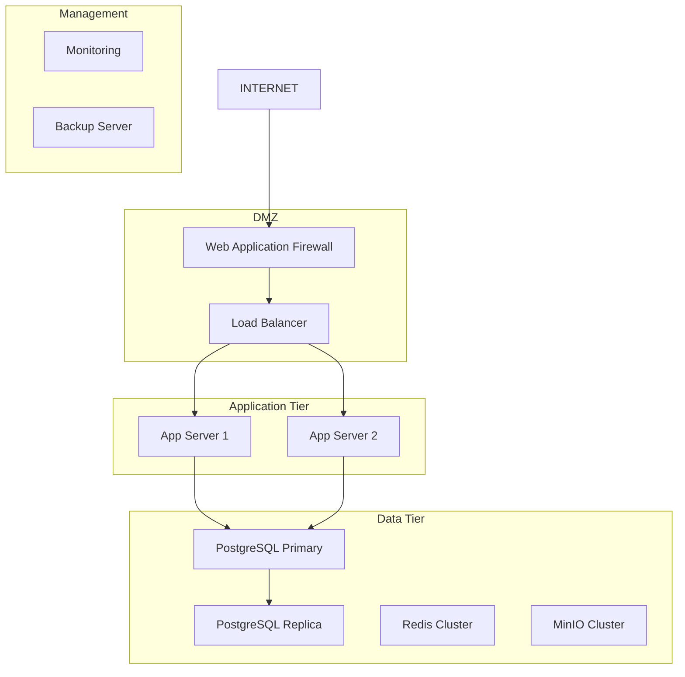

# Self-Hosted Deployment Additional Considerations

**Version:** 1.0.0  
**Created:** 2025-01-21  
**Author:** Kim Hsiao  
**Status:** Draft

## Overview

This document outlines additional considerations for self-hosted deployment of the SoulMatting
platform beyond the core architecture design. These considerations are crucial for successful
production deployment, maintenance, and long-term operation.

## 1. Infrastructure Requirements

### 1.1 Hardware Specifications

#### Minimum Production Requirements

- **CPU:** 8 cores (16 threads) Intel Xeon or AMD EPYC
- **RAM:** 32GB DDR4 (64GB recommended for high traffic)
- **Storage:** 1TB NVMe SSD (primary) + 4TB HDD (backup/logs)
- **Network:** 1Gbps dedicated bandwidth
- **Redundancy:** RAID 1 for OS, RAID 10 for data

#### Recommended Production Setup

- **Load Balancer Node:** 4 cores, 8GB RAM, 100GB SSD
- **Application Nodes (2x):** 8 cores, 16GB RAM, 500GB SSD each
- **Database Node:** 16 cores, 64GB RAM, 2TB NVMe SSD
- **Storage Node:** 8 cores, 32GB RAM, 8TB storage array
- **Monitoring Node:** 4 cores, 8GB RAM, 1TB SSD

### 1.2 Network Architecture



## 2. Security Considerations

### 2.1 Network Security

#### Firewall Configuration

```bash
# UFW firewall rules example
sudo ufw default deny incoming
sudo ufw default allow outgoing

# Allow SSH (change port from default 22)
sudo ufw allow 2222/tcp

# Allow HTTP/HTTPS
sudo ufw allow 80/tcp
sudo ufw allow 443/tcp

# Allow internal communication (adjust subnet)
sudo ufw allow from 10.0.0.0/24

# Enable firewall
sudo ufw enable
```

#### SSL/TLS Configuration

- **Certificate Management:** Let's Encrypt with automatic renewal
- **TLS Version:** Minimum TLS 1.2, prefer TLS 1.3
- **Cipher Suites:** Modern cipher suites only
- **HSTS:** Enable HTTP Strict Transport Security

### 2.2 Application Security

#### Environment Variables Security

```bash
# Secure .env file permissions
chmod 600 .env
chown root:docker .env

# Use Docker secrets for sensitive data
docker secret create db_password /path/to/password/file
docker secret create jwt_secret /path/to/jwt/secret
```

#### Database Security

- **Authentication:** Strong passwords, certificate-based auth
- **Encryption:** Encrypt data at rest and in transit
- **Access Control:** Role-based access with principle of least privilege
- **Audit Logging:** Enable comprehensive audit trails

## 3. Backup and Disaster Recovery

### 3.1 Backup Strategy

#### PostgreSQL Backup

```bash
#!/bin/bash
# Daily PostgreSQL backup script

BACKUP_DIR="/backup/postgresql"
DATE=$(date +%Y%m%d_%H%M%S)
RETENTION_DAYS=30

# Create backup
pg_dump -h localhost -U postgres -d soulmatting | gzip > "$BACKUP_DIR/soulmatting_$DATE.sql.gz"

# Remove old backups
find $BACKUP_DIR -name "*.sql.gz" -mtime +$RETENTION_DAYS -delete

# Upload to remote storage (optional)
aws s3 cp "$BACKUP_DIR/soulmatting_$DATE.sql.gz" s3://backup-bucket/postgresql/
```

#### MinIO Backup

```bash
#!/bin/bash
# MinIO data backup using mc (MinIO Client)

SOURCE_ALIAS="local"
TARGET_ALIAS="backup"
BUCKET="soulmatting-media"

# Sync to backup location
mc mirror $SOURCE_ALIAS/$BUCKET $TARGET_ALIAS/$BUCKET

# Create snapshot
mc cp --recursive $SOURCE_ALIAS/$BUCKET $TARGET_ALIAS/snapshots/$(date +%Y%m%d)/
```

### 3.2 Disaster Recovery Plan

#### Recovery Time Objectives (RTO)

- **Critical Services:** 15 minutes
- **Database Recovery:** 30 minutes
- **Full System Recovery:** 2 hours

#### Recovery Point Objectives (RPO)

- **Database:** 5 minutes (continuous replication)
- **File Storage:** 1 hour (hourly sync)
- **Configuration:** 24 hours (daily backup)

## 4. Monitoring and Observability

### 4.1 System Monitoring

#### Prometheus Configuration

```yaml
# prometheus.yml
global:
  scrape_interval: 15s
  evaluation_interval: 15s

rule_files:
  - 'alert_rules.yml'

scrape_configs:
  - job_name: 'node-exporter'
    static_configs:
      - targets: ['localhost:9100']

  - job_name: 'postgres-exporter'
    static_configs:
      - targets: ['localhost:9187']

  - job_name: 'redis-exporter'
    static_configs:
      - targets: ['localhost:9121']

  - job_name: 'minio-exporter'
    static_configs:
      - targets: ['localhost:9000']

alerting:
  alertmanagers:
    - static_configs:
        - targets: ['localhost:9093']
```

#### Key Metrics to Monitor

- **System Metrics:** CPU, Memory, Disk I/O, Network
- **Application Metrics:** Response time, Error rate, Throughput
- **Database Metrics:** Connection count, Query performance, Replication lag
- **Storage Metrics:** Disk usage, I/O performance, Backup status

### 4.2 Log Management

#### Centralized Logging with ELK Stack

```yaml
# docker-compose.logging.yml
version: '3.8'
services:
  elasticsearch:
    image: docker.elastic.co/elasticsearch/elasticsearch:8.11.0
    environment:
      - discovery.type=single-node
      - 'ES_JAVA_OPTS=-Xms2g -Xmx2g'
    volumes:
      - elasticsearch_data:/usr/share/elasticsearch/data
    ports:
      - '9200:9200'

  logstash:
    image: docker.elastic.co/logstash/logstash:8.11.0
    volumes:
      - ./logstash/config:/usr/share/logstash/pipeline
    ports:
      - '5044:5044'
    depends_on:
      - elasticsearch

  kibana:
    image: docker.elastic.co/kibana/kibana:8.11.0
    ports:
      - '5601:5601'
    environment:
      - ELASTICSEARCH_HOSTS=http://elasticsearch:9200
    depends_on:
      - elasticsearch

volumes:
  elasticsearch_data:
```

## 5. Performance Optimization

### 5.1 Database Optimization

#### PostgreSQL Configuration

```sql
-- postgresql.conf optimizations
shared_buffers = '8GB'                    -- 25% of total RAM
effective_cache_size = '24GB'             -- 75% of total RAM
work_mem = '256MB'                        -- Per connection
maintenance_work_mem = '2GB'              -- For maintenance operations
wal_buffers = '64MB'                      -- WAL buffer size
checkpoint_completion_target = 0.9        -- Checkpoint spread
random_page_cost = 1.1                    -- For SSD storage
effective_io_concurrency = 200            -- For SSD storage

-- Enable query optimization
log_min_duration_statement = 1000         -- Log slow queries
log_checkpoints = on
log_connections = on
log_disconnections = on
```

#### Database Indexing Strategy

```sql
-- Essential indexes for SoulMatting
CREATE INDEX CONCURRENTLY idx_users_location ON users USING GIST (location);
CREATE INDEX CONCURRENTLY idx_users_age_gender ON users (age, gender);
CREATE INDEX CONCURRENTLY idx_matches_created_at ON matches (created_at DESC);
CREATE INDEX CONCURRENTLY idx_messages_conversation_id ON messages (conversation_id, created_at);
CREATE INDEX CONCURRENTLY idx_user_interests_user_id ON user_interests (user_id);

-- Partial indexes for active users
CREATE INDEX CONCURRENTLY idx_active_users ON users (last_active) WHERE status = 'active';
```

### 5.2 Caching Strategy

#### Redis Configuration

```redis
# redis.conf optimizations
maxmemory 8gb
maxmemory-policy allkeys-lru
save 900 1
save 300 10
save 60 10000

# Enable AOF for durability
appendonly yes
appendfsync everysec

# Optimize for performance
tcp-keepalive 300
timeout 0
```

## 6. Scalability Planning

### 6.1 Horizontal Scaling Strategy

#### Load Balancer Configuration (Nginx)

```nginx
upstream app_servers {
    least_conn;
    server app1:3000 weight=1 max_fails=3 fail_timeout=30s;
    server app2:3000 weight=1 max_fails=3 fail_timeout=30s;
    server app3:3000 weight=1 max_fails=3 fail_timeout=30s backup;
}

server {
    listen 80;
    server_name soulmatting.com;

    # Rate limiting
    limit_req_zone $binary_remote_addr zone=api:10m rate=10r/s;

    location / {
        limit_req zone=api burst=20 nodelay;
        proxy_pass http://app_servers;
        proxy_set_header Host $host;
        proxy_set_header X-Real-IP $remote_addr;
        proxy_set_header X-Forwarded-For $proxy_add_x_forwarded_for;
        proxy_set_header X-Forwarded-Proto $scheme;

        # Health check
        proxy_next_upstream error timeout invalid_header http_500 http_502 http_503 http_504;
    }
}
```

### 6.2 Database Scaling

#### Read Replica Setup

```yaml
# docker-compose.scale.yml
version: '3.8'
services:
  postgres-primary:
    image: postgres:15
    environment:
      POSTGRES_REPLICATION_USER: replicator
      POSTGRES_REPLICATION_PASSWORD: ${REPLICATION_PASSWORD}
    command: |
      postgres
      -c wal_level=replica
      -c max_wal_senders=3
      -c max_replication_slots=3
      -c hot_standby=on

  postgres-replica:
    image: postgres:15
    environment:
      PGUSER: postgres
      POSTGRES_PASSWORD: ${POSTGRES_PASSWORD}
      POSTGRES_PRIMARY_HOST: postgres-primary
      POSTGRES_REPLICATION_USER: replicator
      POSTGRES_REPLICATION_PASSWORD: ${REPLICATION_PASSWORD}
    command: |
      bash -c '
      until pg_basebackup --pgdata=/var/lib/postgresql/data -R --slot=replication_slot --host=postgres-primary --port=5432
      do
        echo "Waiting for primary to connect..."
        sleep 1s
      done
      echo "Backup done, starting replica..."
      chmod 0700 /var/lib/postgresql/data
      postgres
      '
    depends_on:
      - postgres-primary
```

## 7. Compliance and Legal Considerations

### 7.1 Data Protection (GDPR/CCPA)

#### Data Retention Policy

```sql
-- Automated data cleanup procedures
CREATE OR REPLACE FUNCTION cleanup_old_data()
RETURNS void AS $$
BEGIN
    -- Delete old messages (older than 2 years)
    DELETE FROM messages WHERE created_at < NOW() - INTERVAL '2 years';

    -- Anonymize deleted user data
    UPDATE users SET
        email = 'deleted_' || id || '@example.com',
        phone = NULL,
        first_name = 'Deleted',
        last_name = 'User'
    WHERE deleted_at < NOW() - INTERVAL '30 days';

    -- Delete old audit logs (older than 7 years)
    DELETE FROM audit_logs WHERE created_at < NOW() - INTERVAL '7 years';
END;
$$ LANGUAGE plpgsql;

-- Schedule cleanup job
SELECT cron.schedule('cleanup-old-data', '0 2 * * 0', 'SELECT cleanup_old_data();');
```

### 7.2 Audit and Compliance

#### Audit Logging

```sql
-- Audit table for compliance
CREATE TABLE audit_logs (
    id SERIAL PRIMARY KEY,
    user_id INTEGER,
    action VARCHAR(100) NOT NULL,
    table_name VARCHAR(100),
    record_id INTEGER,
    old_values JSONB,
    new_values JSONB,
    ip_address INET,
    user_agent TEXT,
    created_at TIMESTAMP DEFAULT NOW()
);

-- Audit trigger function
CREATE OR REPLACE FUNCTION audit_trigger_function()
RETURNS TRIGGER AS $$
BEGIN
    INSERT INTO audit_logs (
        user_id, action, table_name, record_id,
        old_values, new_values, ip_address
    ) VALUES (
        COALESCE(current_setting('app.current_user_id', true)::INTEGER, 0),
        TG_OP,
        TG_TABLE_NAME,
        COALESCE(NEW.id, OLD.id),
        CASE WHEN TG_OP = 'DELETE' THEN row_to_json(OLD) ELSE NULL END,
        CASE WHEN TG_OP IN ('INSERT', 'UPDATE') THEN row_to_json(NEW) ELSE NULL END,
        inet_client_addr()
    );
    RETURN COALESCE(NEW, OLD);
END;
$$ LANGUAGE plpgsql;
```

## 8. Maintenance and Updates

### 8.1 Update Strategy

#### Blue-Green Deployment

```bash
#!/bin/bash
# Blue-Green deployment script

CURRENT_ENV=$(docker-compose ps | grep "_app_" | head -1 | awk '{print $1}' | cut -d'_' -f1)
NEW_ENV=$([ "$CURRENT_ENV" = "blue" ] && echo "green" || echo "blue")

echo "Current environment: $CURRENT_ENV"
echo "Deploying to: $NEW_ENV"

# Deploy to new environment
docker-compose -f docker-compose.$NEW_ENV.yml up -d

# Health check
for i in {1..30}; do
    if curl -f http://localhost:8080/health; then
        echo "Health check passed"
        break
    fi
    echo "Waiting for health check... ($i/30)"
    sleep 10
done

# Switch traffic
echo "Switching traffic to $NEW_ENV"
# Update load balancer configuration
sed -i "s/$CURRENT_ENV/$NEW_ENV/g" /etc/nginx/sites-available/soulmatting
nginx -s reload

# Stop old environment
echo "Stopping $CURRENT_ENV environment"
docker-compose -f docker-compose.$CURRENT_ENV.yml down

echo "Deployment completed successfully"
```

### 8.2 Database Migrations

#### Migration Strategy

```javascript
// Migration script with rollback capability
const { Pool } = require('pg');
const fs = require('fs');

class MigrationManager {
  constructor(dbConfig) {
    this.pool = new Pool(dbConfig);
  }

  async runMigration(migrationFile) {
    const client = await this.pool.connect();

    try {
      await client.query('BEGIN');

      // Create migration tracking table if not exists
      await client.query(`
                CREATE TABLE IF NOT EXISTS schema_migrations (
                    version VARCHAR(255) PRIMARY KEY,
                    applied_at TIMESTAMP DEFAULT NOW()
                )
            `);

      const migration = fs.readFileSync(migrationFile, 'utf8');
      const version = path.basename(migrationFile, '.sql');

      // Check if migration already applied
      const result = await client.query(
        'SELECT version FROM schema_migrations WHERE version = $1',
        [version]
      );

      if (result.rows.length === 0) {
        await client.query(migration);
        await client.query('INSERT INTO schema_migrations (version) VALUES ($1)', [version]);
        console.log(`Migration ${version} applied successfully`);
      } else {
        console.log(`Migration ${version} already applied`);
      }

      await client.query('COMMIT');
    } catch (error) {
      await client.query('ROLLBACK');
      console.error(`Migration failed: ${error.message}`);
      throw error;
    } finally {
      client.release();
    }
  }
}
```

## 9. Cost Optimization

### 9.1 Resource Optimization

#### Container Resource Limits

```yaml
# docker-compose.prod.yml with resource limits
version: '3.8'
services:
  app:
    deploy:
      resources:
        limits:
          cpus: '2.0'
          memory: 4G
        reservations:
          cpus: '1.0'
          memory: 2G
      restart_policy:
        condition: on-failure
        delay: 5s
        max_attempts: 3

  postgres:
    deploy:
      resources:
        limits:
          cpus: '4.0'
          memory: 8G
        reservations:
          cpus: '2.0'
          memory: 4G

  redis:
    deploy:
      resources:
        limits:
          cpus: '1.0'
          memory: 2G
        reservations:
          cpus: '0.5'
          memory: 1G
```

### 9.2 Storage Optimization

#### Automated Cleanup Scripts

```bash
#!/bin/bash
# Storage cleanup automation

# Clean Docker images and containers
docker system prune -f
docker image prune -a -f

# Clean old log files
find /var/log -name "*.log" -mtime +30 -delete
find /var/log -name "*.gz" -mtime +90 -delete

# Clean temporary files
find /tmp -mtime +7 -delete

# Optimize database
psql -d soulmatting -c "VACUUM ANALYZE;"
psql -d soulmatting -c "REINDEX DATABASE soulmatting;"

echo "Cleanup completed at $(date)"
```

## 10. Emergency Procedures

### 10.1 Incident Response Plan

#### Emergency Contacts

- **System Administrator:** [Contact Info]
- **Database Administrator:** [Contact Info]
- **Security Team:** [Contact Info]
- **Management:** [Contact Info]

#### Emergency Procedures

```bash
#!/bin/bash
# Emergency shutdown script

echo "EMERGENCY SHUTDOWN INITIATED"
echo "Timestamp: $(date)"

# Stop application services
docker-compose stop app

# Create emergency backup
pg_dump soulmatting > /emergency/backup_$(date +%Y%m%d_%H%M%S).sql

# Stop all services
docker-compose down

# Send alert
curl -X POST "https://hooks.slack.com/services/YOUR/SLACK/WEBHOOK" \
     -H 'Content-type: application/json' \
     --data '{"text":"🚨 EMERGENCY SHUTDOWN: SoulMatting platform has been shut down"}'

echo "Emergency shutdown completed"
```

### 10.2 Recovery Procedures

#### Service Recovery Checklist

1. **Assess the situation**
   - [ ] Identify root cause
   - [ ] Estimate impact
   - [ ] Determine recovery strategy

2. **System checks**
   - [ ] Verify hardware status
   - [ ] Check network connectivity
   - [ ] Validate storage integrity
   - [ ] Confirm backup availability

3. **Service restoration**
   - [ ] Restore from backup if needed
   - [ ] Start core services (database, cache)
   - [ ] Start application services
   - [ ] Verify functionality
   - [ ] Monitor for issues

4. **Post-incident**
   - [ ] Document incident
   - [ ] Conduct post-mortem
   - [ ] Update procedures
   - [ ] Implement preventive measures

## Conclusion

This document provides comprehensive guidance for self-hosted deployment considerations. Regular
review and updates of these procedures are essential for maintaining a robust, secure, and scalable
SoulMatting platform.

### Next Steps

1. Review and customize configurations for your specific environment
2. Implement monitoring and alerting systems
3. Establish backup and disaster recovery procedures
4. Create operational runbooks for common scenarios
5. Train team members on emergency procedures

### Regular Maintenance Schedule

- **Daily:** Monitor system health, check backups
- **Weekly:** Review security logs, update dependencies
- **Monthly:** Performance optimization, capacity planning
- **Quarterly:** Security audit, disaster recovery testing
- **Annually:** Full system review, technology updates
