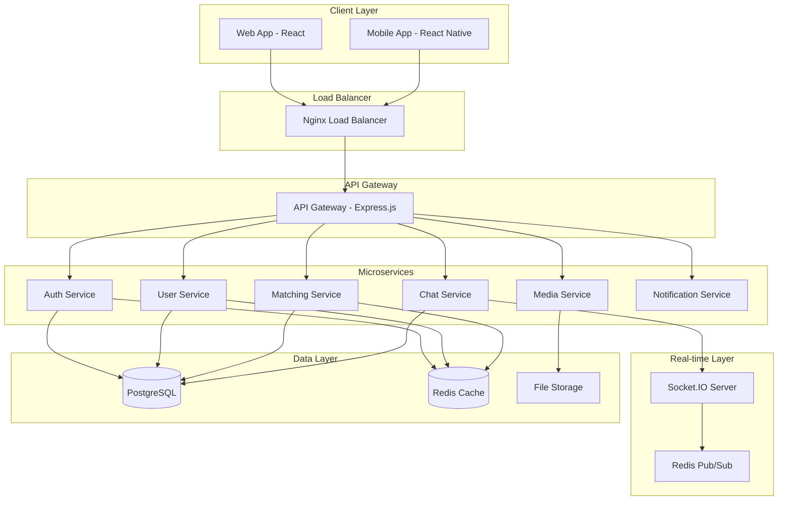
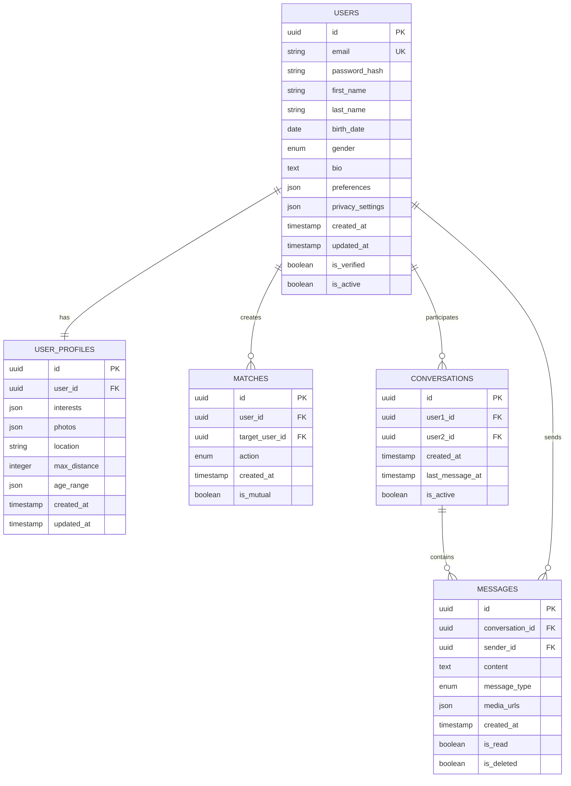

# Technical Architecture Design - SoulMatting Platform

**Version:** 2.0.0  
**Created:** 2024-12-19  
**Updated:** 2025-01-21  
**Status:** Approved  

## Changelog

| Version | Date | Changes | Author |
|---------|------|---------|--------|
| 2.0.0 | 2025-01-21 | Updated with final microservices architecture and tech stack | Kim Hsiao |
| 1.0.0 | 2024-12-19 | Initial technical architecture design | System Architect |

---

## 1. System Architecture Overview

### 1.1 Architecture Pattern
- **Pattern:** Microservices Architecture with Event-Driven Design
- **Deployment:** Containerized with Docker & Docker Compose + Kubernetes
- **Scalability:** Horizontal scaling with load balancing
- **Communication:** gRPC (sync) + RabbitMQ (async) + Socket.io (real-time)
- **API Gateway:** NestJS with Swagger/OpenAPI documentation
- **Package Management:** pnpm (Node.js), uv (Python)
- **Database Strategy:** PostgreSQL + MongoDB + Redis hybrid architecture

### 1.2 High-Level Architecture Diagram



---

## 2. Technology Stack

### 2.1 Frontend Technologies
- **Framework:** React 18+ with TypeScript
- **State Management:** Redux Toolkit + RTK Query
- **UI Library:** Material-UI (MUI) with custom theming
- **Routing:** React Router v6
- **Real-time:** Socket.IO Client
- **Build Tool:** Vite
- **Testing:** Jest + React Testing Library

### 2.2 Backend Technologies
- **Runtime:** Node.js 20+ LTS
- **Framework:** Express.js with TypeScript
- **Authentication:** JWT + Passport.js
- **Real-time:** Socket.IO
- **Validation:** Joi / Zod
- **ORM:** Prisma
- **Testing:** Jest + Supertest

### 2.3 Database & Storage
- **Primary Database:** PostgreSQL 16+
- **Cache:** Redis 7+
- **File Storage:** AWS S3 / MinIO
- **Search:** PostgreSQL Full-Text Search + Redis

### 2.4 DevOps & Infrastructure
- **Containerization:** Docker + Docker Compose
- **Reverse Proxy:** Nginx
- **Process Manager:** PM2
- **Monitoring:** Prometheus + Grafana
- **Logging:** Winston + ELK Stack

---

## 3. Microservices Design

### 3.1 Service Breakdown

#### Authentication Service
- **Responsibilities:**
  - User registration/login
  - JWT token management
  - OAuth integration (Google, Discord)
  - Password reset
  - Session management

- **API Endpoints:**
  ```
  POST /auth/register
  POST /auth/login
  POST /auth/logout
  POST /auth/refresh
  POST /auth/forgot-password
  GET  /auth/oauth/google
  GET  /auth/oauth/discord
  ```

#### User Service
- **Responsibilities:**
  - User profile management
  - Preference settings
  - Privacy controls
  - User verification

- **API Endpoints:**
  ```
  GET    /users/profile
  PUT    /users/profile
  GET    /users/preferences
  PUT    /users/preferences
  POST   /users/verify
  GET    /users/search
  ```

#### Matching Service
- **Responsibilities:**
  - Compatibility algorithm
  - Interest-based matching
  - Like/dislike functionality
  - Match recommendations

- **API Endpoints:**
  ```
  GET    /matches/recommendations
  POST   /matches/like
  POST   /matches/dislike
  GET    /matches/mutual
  GET    /matches/history
  ```

#### Chat Service
- **Responsibilities:**
  - One-on-one messaging
  - Message history
  - Media sharing
  - Message encryption

- **API Endpoints:**
  ```
  GET    /chats/conversations
  GET    /chats/:id/messages
  POST   /chats/:id/messages
  PUT    /chats/:id/read
  DELETE /chats/:id/messages/:messageId
  ```

#### Media Service
- **Responsibilities:**
  - File upload/download
  - Image processing
  - Video/audio handling
  - Content moderation

- **API Endpoints:**
  ```
  POST   /media/upload
  GET    /media/:id
  DELETE /media/:id
  POST   /media/process
  ```

#### Notification Service
- **Responsibilities:**
  - Push notifications
  - Email notifications
  - In-app notifications
  - Notification preferences

- **API Endpoints:**
  ```
  GET    /notifications
  PUT    /notifications/:id/read
  POST   /notifications/preferences
  POST   /notifications/send
  ```

---

## 4. Database Design

### 4.1 PostgreSQL Schema Design



### 4.2 Redis Cache Strategy

- **Session Storage:** `session:{userId}` (TTL: 24h)
- **User Profiles:** `profile:{userId}` (TTL: 1h)
- **Match Recommendations:** `matches:{userId}` (TTL: 30min)
- **Active Conversations:** `conversations:{userId}` (TTL: 1h)
- **Real-time Presence:** `presence:{userId}` (TTL: 5min)

---

## 5. Real-time Communication

### 5.1 Socket.IO Implementation

```typescript
// Socket Events
interface SocketEvents {
  // Connection
  'user:online': (userId: string) => void;
  'user:offline': (userId: string) => void;
  
  // Messaging
  'message:send': (data: MessageData) => void;
  'message:receive': (message: Message) => void;
  'message:typing': (conversationId: string) => void;
  'message:read': (messageId: string) => void;
  
  // Matching
  'match:new': (match: Match) => void;
  'match:mutual': (match: MutualMatch) => void;
  
  // Notifications
  'notification:new': (notification: Notification) => void;
}
```

### 5.2 WebRTC Integration (Future)
- **Voice Calls:** Simple-peer + Socket.IO signaling
- **Video Calls:** WebRTC with STUN/TURN servers
- **Screen Sharing:** Future enhancement

---

## 6. Security Architecture

### 6.1 Authentication & Authorization
- **JWT Strategy:** Access tokens (15min) + Refresh tokens (7 days)
- **OAuth Integration:** Google OAuth 2.0, Discord OAuth 2.0
- **Rate Limiting:** Express-rate-limit with Redis store
- **CORS:** Configured for specific origins

### 6.2 Data Protection
- **Encryption:** bcrypt for passwords, AES-256 for sensitive data
- **Input Validation:** Joi/Zod schemas for all endpoints
- **SQL Injection:** Prisma ORM with parameterized queries
- **XSS Protection:** Helmet.js middleware

### 6.3 Privacy Controls
- **Data Anonymization:** Remove PII from logs
- **GDPR Compliance:** Data export/deletion endpoints
- **Content Moderation:** AI-powered image/text filtering

---

## 7. Performance Optimization

### 7.1 Caching Strategy
- **Application Cache:** Redis for frequently accessed data
- **CDN:** CloudFlare for static assets
- **Database:** Query optimization with indexes
- **API:** Response caching with ETags

### 7.2 Scalability Considerations
- **Horizontal Scaling:** Load balancer with multiple service instances
- **Database Scaling:** Read replicas for PostgreSQL
- **File Storage:** Distributed storage with CDN
- **Message Queue:** Redis Pub/Sub for service communication

---

## 8. Monitoring & Observability

### 8.1 Logging Strategy
```typescript
// Log Levels
interface LogLevels {
  error: 'Authentication failures, API errors, system crashes';
  warn: 'Rate limit exceeded, deprecated API usage';
  info: 'User actions, API requests, system events';
  debug: 'Detailed execution flow, variable states';
}
```

### 8.2 Metrics Collection
- **Application Metrics:** Response times, error rates, throughput
- **Business Metrics:** User registrations, matches, messages
- **Infrastructure Metrics:** CPU, memory, disk, network
- **Custom Metrics:** Matching algorithm performance

---

## 9. Deployment Architecture

### 9.1 Docker Compose Structure
```yaml
services:
  # Frontend
  web-app:
    build: ./frontend
    ports: ["3000:3000"]
  
  # API Gateway
  api-gateway:
    build: ./api-gateway
    ports: ["8000:8000"]
  
  # Microservices
  auth-service:
    build: ./services/auth
  user-service:
    build: ./services/user
  matching-service:
    build: ./services/matching
  chat-service:
    build: ./services/chat
  media-service:
    build: ./services/media
  notification-service:
    build: ./services/notification
  
  # Databases
  postgres:
    image: postgres:16
  redis:
    image: redis:7
  
  # Infrastructure
  nginx:
    image: nginx:alpine
  prometheus:
    image: prom/prometheus
  grafana:
    image: grafana/grafana
```

### 9.2 Environment Configuration
- **Development:** Docker Compose with hot reload
- **Staging:** Kubernetes cluster with CI/CD
- **Production:** Self-hosted with Docker Swarm

---

## 10. API Design Standards

### 10.1 RESTful API Conventions
- **HTTP Methods:** GET, POST, PUT, DELETE
- **Status Codes:** 200, 201, 400, 401, 403, 404, 500
- **Response Format:** JSON with consistent structure
- **Versioning:** URL versioning (/api/v1/)

### 10.2 Error Handling
```typescript
interface APIResponse<T> {
  success: boolean;
  data?: T;
  error?: {
    code: string;
    message: string;
    details?: any;
  };
  meta?: {
    pagination?: PaginationMeta;
    timestamp: string;
  };
}
```

---

## 11. Testing Strategy

### 11.1 Testing Pyramid
- **Unit Tests:** 70% coverage for business logic
- **Integration Tests:** API endpoints and database operations
- **E2E Tests:** Critical user journeys
- **Performance Tests:** Load testing with Artillery

### 11.2 BDD Implementation
- **Feature Files:** Gherkin syntax for user stories
- **Step Definitions:** Jest + Cucumber integration
- **Test Data:** Factory pattern with Faker.js

---

## 12. Migration & Rollback Strategy

### 12.1 Database Migrations
- **Tool:** Prisma Migrate
- **Strategy:** Forward-only migrations with rollback scripts
- **Backup:** Automated backups before migrations

### 12.2 Application Deployment
- **Blue-Green Deployment:** Zero-downtime deployments
- **Feature Flags:** Gradual feature rollouts
- **Rollback Plan:** Automated rollback on health check failures

---

## 13. Compliance & Regulations

### 13.1 Data Protection
- **GDPR:** Right to be forgotten, data portability
- **CCPA:** California Consumer Privacy Act compliance
- **Data Retention:** Configurable retention policies

### 13.2 Content Moderation
- **AI Moderation:** Automated content filtering
- **Human Review:** Escalation for complex cases
- **Reporting System:** User-generated content reports

---

## 14. Future Enhancements

### 14.1 Phase 2 Features
- **Video Calling:** WebRTC implementation
- **AI Matching:** Machine learning algorithms
- **Social Features:** Groups and events
- **Premium Features:** Subscription model

### 14.2 Technical Improvements
- **Microservices:** Service mesh with Istio
- **Database:** Sharding for horizontal scaling
- **Search:** Elasticsearch for advanced search
- **Analytics:** Real-time analytics with Apache Kafka

---

## 15. Risk Assessment

### 15.1 Technical Risks
- **Scalability:** Database bottlenecks at high user volumes
- **Security:** Data breaches and privacy violations
- **Performance:** Real-time messaging latency
- **Availability:** Single points of failure

### 15.2 Mitigation Strategies
- **Load Testing:** Regular performance testing
- **Security Audits:** Quarterly security assessments
- **Monitoring:** 24/7 system monitoring
- **Backup Strategy:** Multi-region backups

---

**Document Status:** Ready for Review  
**Next Phase:** Atomize - Task Decomposition  
**Approval Required:** Technical Lead, Product Owner