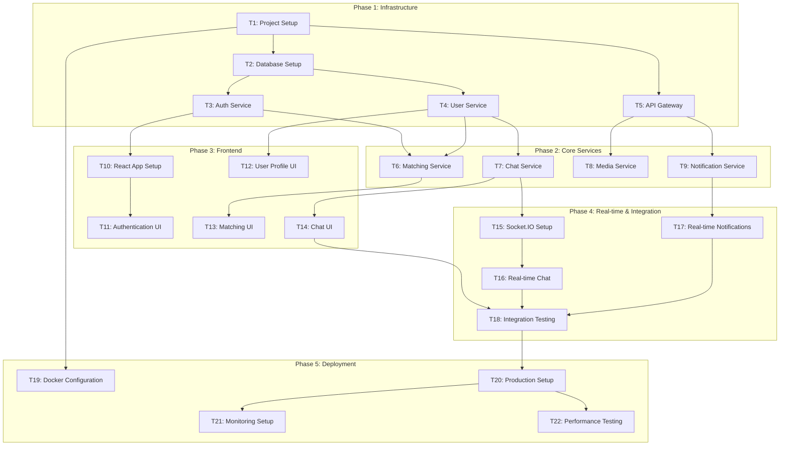

# Task Decomposition - SoulMatting Platform

**Version:** 2.0.0  
**Created:** 2024-12-19  
**Updated:** 2025-01-21  
**Status:** Ready for Implementation  

## Changelog

| Version | Date | Changes | Author |
|---------|------|---------|--------|
| 2.0.0 | 2025-01-21 | Updated with detailed task breakdown, roles, and development standards | Kim Hsiao |
| 1.0.0 | 2024-12-19 | Initial task decomposition | System Architect |

---

## 1. Task Decomposition Overview

### 1.1 Development Phases
- **Phase 1:** Infrastructure & Core Services (MVP) - 4-6 weeks
- **Phase 2:** Frontend Development & Integration - 3-4 weeks
- **Phase 3:** Real-time Features & Testing - 2-3 weeks
- **Phase 4:** Deployment & Optimization - 1-2 weeks
- **Total Estimated Time:** 10-15 weeks

### 1.2 Development Standards
- **Code Comments:** English only
- **Package Management:** pnpm (Node.js), uv (Python)
- **Database Versioning:** Prisma migrations + custom seed scripts
- **Communication:** gRPC (sync), RabbitMQ (async), Socket.io (real-time)
- **API Documentation:** Swagger/OpenAPI integration
- **Testing:** Jest + Supertest (backend), React Testing Library (frontend)
- **Code Quality:** ESLint + Prettier + Husky + lint-staged

### 1.2 Task Dependency Graph



---

## 2. Phase 1: Infrastructure & Core Services

### Task T1: Project Setup & Configuration

**Priority:** High  
**Estimated Time:** 4 hours  
**Dependencies:** None  

#### Input Contracts
- Project requirements from ALIGNMENT document
- Technical architecture from DESIGN document
- Development environment (Node.js 20+, Docker)

#### Output Contracts
- Monorepo structure with microservices
- Package.json configurations for all services
- TypeScript configurations
- ESLint and Prettier setup
- Environment variable templates
- Docker development setup

#### Implementation Constraints
- Use TypeScript for all services
- Follow Node.js best practices
- Implement proper error handling
- Use consistent code formatting

#### Acceptance Criteria
- [ ] Monorepo structure created with proper folder organization
- [ ] All services have package.json with required dependencies
- [ ] TypeScript compilation works for all services
- [ ] Linting and formatting rules applied
- [ ] Environment variables properly configured
- [ ] Docker development environment functional
- [ ] README.md with setup instructions

#### File Structure
```
soulmatting/
├── services/
│   ├── auth/
│   ├── user/
│   ├── matching/
│   ├── chat/
│   ├── media/
│   └── notification/
├── frontend/
├── api-gateway/
├── shared/
├── docker/
├── docs/
└── scripts/
```

---

### Task T2: Database Setup & Schema Design

**Priority:** High  
**Estimated Time:** 6 hours  
**Dependencies:** T1  

#### Input Contracts
- Database schema from DESIGN document
- PostgreSQL and Redis requirements
- Data migration strategy

#### Output Contracts
- PostgreSQL database with complete schema
- Prisma ORM setup with models
- Database migration scripts
- Redis configuration
- Seed data for development

#### Implementation Constraints
- Use Prisma as ORM
- Implement proper indexing
- Follow database normalization principles
- Include audit fields (created_at, updated_at)

#### Acceptance Criteria
- [ ] PostgreSQL database schema implemented
- [ ] Prisma models match database schema
- [ ] Migration scripts created and tested
- [ ] Database indexes optimized for queries
- [ ] Redis configuration for caching
- [ ] Seed data script for development
- [ ] Database connection pooling configured

---

### Task T3: Authentication Service Implementation

**Priority:** High  
**Estimated Time:** 8 hours  
**Dependencies:** T2  

#### Input Contracts
- User authentication requirements
- JWT token strategy
- OAuth integration requirements (Google, Discord)
- Security best practices

#### Output Contracts
- Complete authentication service
- JWT token management
- OAuth 2.0 integration
- Password hashing and validation
- Session management with Redis

#### Implementation Constraints
- Use bcrypt for password hashing
- Implement JWT with refresh tokens
- Follow OAuth 2.0 standards
- Include rate limiting
- Proper error handling and logging

#### Acceptance Criteria
- [ ] User registration endpoint functional
- [ ] User login with email/password
- [ ] JWT token generation and validation
- [ ] Refresh token mechanism
- [ ] Google OAuth integration
- [ ] Discord OAuth integration
- [ ] Password reset functionality
- [ ] Rate limiting implemented
- [ ] Comprehensive unit tests (>80% coverage)

#### API Endpoints
```typescript
POST /auth/register
POST /auth/login
POST /auth/logout
POST /auth/refresh
POST /auth/forgot-password
POST /auth/reset-password
GET  /auth/oauth/google
GET  /auth/oauth/discord
GET  /auth/verify-token
```

---

### Task T4: User Service Implementation

**Priority:** High  
**Estimated Time:** 6 hours  
**Dependencies:** T2, T3  

#### Input Contracts
- User profile requirements
- Privacy settings specifications
- User preferences structure
- Profile validation rules

#### Output Contracts
- Complete user service
- Profile management endpoints
- Privacy controls
- User search functionality
- Profile validation

#### Implementation Constraints
- Validate all user inputs
- Implement privacy controls
- Use caching for frequently accessed profiles
- Follow GDPR compliance requirements

#### Acceptance Criteria
- [ ] User profile CRUD operations
- [ ] Profile photo upload integration
- [ ] Privacy settings management
- [ ] User preferences configuration
- [ ] User search with filters
- [ ] Profile validation rules
- [ ] Data anonymization for privacy
- [ ] Comprehensive unit tests (>80% coverage)

#### API Endpoints
```typescript
GET    /users/profile
PUT    /users/profile
GET    /users/preferences
PUT    /users/preferences
POST   /users/upload-photo
GET    /users/search
DELETE /users/account
GET    /users/privacy
PUT    /users/privacy
```

---

### Task T5: API Gateway Implementation

**Priority:** High  
**Estimated Time:** 5 hours  
**Dependencies:** T1  

#### Input Contracts
- Microservices routing requirements
- Authentication middleware needs
- Rate limiting specifications
- CORS configuration

#### Output Contracts
- Centralized API gateway
- Request routing to microservices
- Authentication middleware
- Rate limiting and CORS
- Request/response logging

#### Implementation Constraints
- Use Express.js framework
- Implement proper middleware chain
- Include request validation
- Add comprehensive logging

#### Acceptance Criteria
- [ ] Request routing to all microservices
- [ ] JWT authentication middleware
- [ ] Rate limiting per endpoint
- [ ] CORS configuration
- [ ] Request/response logging
- [ ] Error handling middleware
- [ ] Health check endpoints
- [ ] API documentation with Swagger

---

## 3. Phase 2: Core Services

### Task T6: Matching Service Implementation

**Priority:** High  
**Estimated Time:** 10 hours  
**Dependencies:** T3, T4  

#### Input Contracts
- Matching algorithm requirements
- User preference data structure
- Like/dislike functionality
- Compatibility scoring logic

#### Output Contracts
- Complete matching service
- Recommendation algorithm
- Like/dislike tracking
- Mutual match detection
- Match history management

#### Implementation Constraints
- Implement efficient matching algorithm
- Use Redis for caching recommendations
- Consider user preferences and filters
- Prevent showing same users repeatedly

#### Acceptance Criteria
- [ ] User recommendation algorithm
- [ ] Like/dislike functionality
- [ ] Mutual match detection
- [ ] Match history tracking
- [ ] Preference-based filtering
- [ ] Distance-based matching
- [ ] Performance optimization with caching
- [ ] Comprehensive unit tests (>80% coverage)

#### API Endpoints
```typescript
GET    /matches/recommendations
POST   /matches/like
POST   /matches/dislike
GET    /matches/mutual
GET    /matches/history
PUT    /matches/preferences
```

---

### Task T7: Chat Service Implementation

**Priority:** High  
**Estimated Time:** 8 hours  
**Dependencies:** T4  

#### Input Contracts
- One-on-one messaging requirements
- Message types (text, image, emoji)
- Message history and pagination
- Read receipts functionality

#### Output Contracts
- Complete chat service
- Message CRUD operations
- Conversation management
- Message encryption
- Read receipts tracking

#### Implementation Constraints
- Implement message encryption
- Use pagination for message history
- Include message validation
- Support multiple message types

#### Acceptance Criteria
- [ ] Conversation creation and management
- [ ] Message sending and receiving
- [ ] Message history with pagination
- [ ] Read receipts functionality
- [ ] Message encryption/decryption
- [ ] Support for text, emoji, and media
- [ ] Message deletion (soft delete)
- [ ] Comprehensive unit tests (>80% coverage)

#### API Endpoints
```typescript
GET    /chats/conversations
POST   /chats/conversations
GET    /chats/:id/messages
POST   /chats/:id/messages
PUT    /chats/:id/read
DELETE /chats/:id/messages/:messageId
```

---

### Task T8: Media Service Implementation

**Priority:** Medium  
**Estimated Time:** 6 hours  
**Dependencies:** T5  

#### Input Contracts
- File upload requirements
- Image processing needs
- Storage solution (S3/MinIO)
- Content moderation requirements

#### Output Contracts
- Complete media service
- File upload/download functionality
- Image processing and optimization
- Content moderation integration
- CDN integration

#### Implementation Constraints
- Support multiple file formats
- Implement file size limits
- Include virus scanning
- Optimize images for web

#### Acceptance Criteria
- [ ] File upload with validation
- [ ] Image processing and optimization
- [ ] File storage integration
- [ ] Content moderation checks
- [ ] CDN integration for fast delivery
- [ ] File deletion and cleanup
- [ ] Comprehensive unit tests (>80% coverage)

#### API Endpoints
```typescript
POST   /media/upload
GET    /media/:id
DELETE /media/:id
POST   /media/process
GET    /media/moderation/:id
```

---

### Task T9: Notification Service Implementation

**Priority:** Medium  
**Estimated Time:** 5 hours  
**Dependencies:** T5  

#### Input Contracts
- Push notification requirements
- Email notification templates
- In-app notification system
- Notification preferences

#### Output Contracts
- Complete notification service
- Push notification integration
- Email notification system
- In-app notifications
- Notification preferences management

#### Implementation Constraints
- Support multiple notification channels
- Implement notification templates
- Include unsubscribe functionality
- Rate limit notifications

#### Acceptance Criteria
- [ ] Push notification integration
- [ ] Email notification system
- [ ] In-app notification management
- [ ] Notification preferences
- [ ] Template-based notifications
- [ ] Notification history tracking
- [ ] Comprehensive unit tests (>80% coverage)

#### API Endpoints
```typescript
GET    /notifications
PUT    /notifications/:id/read
POST   /notifications/preferences
POST   /notifications/send
GET    /notifications/history
```

---

## 4. Phase 3: Frontend Development

### Task T10: React Application Setup

**Priority:** High  
**Estimated Time:** 4 hours  
**Dependencies:** T3  

#### Input Contracts
- Frontend architecture requirements
- UI/UX design specifications
- Responsive design requirements
- Dark mode support

#### Output Contracts
- Complete React application setup
- Routing configuration
- State management setup
- UI component library integration
- Theme configuration with dark mode

#### Implementation Constraints
- Use React 18+ with TypeScript
- Implement responsive design
- Follow accessibility guidelines
- Use modern React patterns (hooks, context)

#### Acceptance Criteria
- [ ] React application with TypeScript
- [ ] Routing with React Router
- [ ] State management with Redux Toolkit
- [ ] Material-UI integration
- [ ] Dark/light theme support
- [ ] Responsive design implementation
- [ ] PWA configuration
- [ ] Build optimization

---

### Task T11: Authentication UI Implementation

**Priority:** High  
**Estimated Time:** 6 hours  
**Dependencies:** T10, T3  

#### Input Contracts
- Authentication service API
- UI/UX design for auth flows
- OAuth integration requirements
- Form validation specifications

#### Output Contracts
- Complete authentication UI
- Login/register forms
- OAuth integration buttons
- Password reset flow
- Form validation and error handling

#### Implementation Constraints
- Implement client-side validation
- Follow security best practices
- Include loading states
- Provide clear error messages

#### Acceptance Criteria
- [ ] Login form with validation
- [ ] Registration form with validation
- [ ] OAuth login buttons (Google, Discord)
- [ ] Password reset flow
- [ ] Form error handling
- [ ] Loading states and feedback
- [ ] Responsive design
- [ ] Accessibility compliance

---

### Task T12: User Profile UI Implementation

**Priority:** High  
**Estimated Time:** 8 hours  
**Dependencies:** T11, T4  

#### Input Contracts
- User service API
- Profile design specifications
- Photo upload requirements
- Privacy settings UI

#### Output Contracts
- Complete profile management UI
- Profile editing forms
- Photo upload interface
- Privacy settings panel
- Profile preview functionality

#### Implementation Constraints
- Implement image cropping
- Include form validation
- Support multiple photo uploads
- Provide privacy controls

#### Acceptance Criteria
- [ ] Profile editing interface
- [ ] Photo upload with cropping
- [ ] Privacy settings management
- [ ] Profile preview functionality
- [ ] Form validation and error handling
- [ ] Responsive design
- [ ] Accessibility compliance

---

### Task T13: Matching UI Implementation

**Priority:** High  
**Estimated Time:** 10 hours  
**Dependencies:** T12, T6  

#### Input Contracts
- Matching service API
- Swipe interface design
- Match display requirements
- Filter interface specifications

#### Output Contracts
- Complete matching interface
- Swipe functionality (like/dislike)
- Match display and management
- Filter and preference controls
- Match history view

#### Implementation Constraints
- Implement smooth swipe animations
- Include gesture support
- Optimize for mobile devices
- Provide keyboard navigation

#### Acceptance Criteria
- [ ] Swipe interface for matching
- [ ] Like/dislike functionality
- [ ] Match display and notifications
- [ ] Filter and preference controls
- [ ] Match history interface
- [ ] Smooth animations
- [ ] Mobile-optimized gestures
- [ ] Accessibility compliance

---

### Task T14: Chat UI Implementation

**Priority:** High  
**Estimated Time:** 12 hours  
**Dependencies:** T13, T7  

#### Input Contracts
- Chat service API
- Chat interface design
- Message types support
- Real-time requirements

#### Output Contracts
- Complete chat interface
- Message composition and display
- Conversation list
- Media sharing interface
- Typing indicators

#### Implementation Constraints
- Implement real-time messaging
- Support emoji and media
- Include message status indicators
- Optimize for performance

#### Acceptance Criteria
- [ ] Conversation list interface
- [ ] Message composition and sending
- [ ] Message display with timestamps
- [ ] Media sharing functionality
- [ ] Typing indicators
- [ ] Read receipts display
- [ ] Message search functionality
- [ ] Responsive design

---

## 5. Phase 4: Real-time & Integration

### Task T15: Socket.IO Setup and Configuration

**Priority:** High  
**Estimated Time:** 4 hours  
**Dependencies:** T7  

#### Input Contracts
- Real-time communication requirements
- Socket.IO architecture design
- Authentication integration
- Scalability considerations

#### Output Contracts
- Socket.IO server configuration
- Client-side Socket.IO setup
- Authentication middleware
- Connection management
- Event handling framework

#### Implementation Constraints
- Implement JWT authentication for sockets
- Include connection pooling
- Add error handling and reconnection
- Support horizontal scaling

#### Acceptance Criteria
- [ ] Socket.IO server setup
- [ ] Client authentication
- [ ] Connection management
- [ ] Event handling framework
- [ ] Error handling and reconnection
- [ ] Performance optimization
- [ ] Comprehensive testing

---

### Task T16: Real-time Chat Implementation

**Priority:** High  
**Estimated Time:** 8 hours  
**Dependencies:** T15, T14  

#### Input Contracts
- Socket.IO configuration
- Chat UI components
- Message synchronization requirements
- Typing indicators specifications

#### Output Contracts
- Real-time message delivery
- Typing indicators
- Online/offline status
- Message synchronization
- Connection status handling

#### Implementation Constraints
- Ensure message delivery reliability
- Implement message queuing
- Handle connection interruptions
- Optimize for low latency

#### Acceptance Criteria
- [ ] Real-time message delivery
- [ ] Typing indicators functionality
- [ ] Online/offline status tracking
- [ ] Message synchronization
- [ ] Connection status handling
- [ ] Message delivery confirmation
- [ ] Performance optimization

---

### Task T17: Real-time Notifications Implementation

**Priority:** Medium  
**Estimated Time:** 6 hours  
**Dependencies:** T15, T9  

#### Input Contracts
- Notification service API
- Real-time notification requirements
- Push notification integration
- Notification UI specifications

#### Output Contracts
- Real-time notification delivery
- Push notification integration
- In-app notification display
- Notification management
- Badge count updates

#### Implementation Constraints
- Implement notification queuing
- Include notification persistence
- Support notification preferences
- Optimize for battery life

#### Acceptance Criteria
- [ ] Real-time notification delivery
- [ ] Push notification integration
- [ ] In-app notification display
- [ ] Notification badge updates
- [ ] Notification preferences
- [ ] Notification history
- [ ] Performance optimization

---

### Task T18: Integration Testing

**Priority:** High  
**Estimated Time:** 12 hours  
**Dependencies:** T14, T16, T17  

#### Input Contracts
- All implemented services
- Frontend application
- Real-time features
- API documentation

#### Output Contracts
- Comprehensive integration tests
- End-to-end test scenarios
- Performance test results
- Bug reports and fixes
- Test documentation

#### Implementation Constraints
- Test all user journeys
- Include performance testing
- Test real-time functionality
- Validate data consistency

#### Acceptance Criteria
- [ ] API integration tests
- [ ] End-to-end user journey tests
- [ ] Real-time functionality tests
- [ ] Performance and load tests
- [ ] Cross-browser compatibility tests
- [ ] Mobile responsiveness tests
- [ ] Security testing
- [ ] Bug fixes and optimizations

---

## 6. Phase 5: Deployment & Optimization

### Task T19: Docker Configuration

**Priority:** High  
**Estimated Time:** 6 hours  
**Dependencies:** T1  

#### Input Contracts
- All service implementations
- Database configurations
- Environment requirements
- Deployment specifications

#### Output Contracts
- Docker images for all services
- Docker Compose configuration
- Environment variable management
- Health check implementations
- Multi-stage build optimization

#### Implementation Constraints
- Optimize image sizes
- Implement health checks
- Use multi-stage builds
- Include security scanning

#### Acceptance Criteria
- [ ] Dockerfiles for all services
- [ ] Docker Compose configuration
- [ ] Environment variable management
- [ ] Health check endpoints
- [ ] Image optimization
- [ ] Security scanning
- [ ] Documentation

---

### Task T20: Production Setup

**Priority:** High  
**Estimated Time:** 8 hours  
**Dependencies:** T18, T19  

#### Input Contracts
- Docker configurations
- Production requirements
- Security specifications
- Backup strategies

#### Output Contracts
- Production deployment configuration
- SSL/TLS setup
- Database backup automation
- Security hardening
- Load balancer configuration

#### Implementation Constraints
- Implement SSL/TLS encryption
- Configure automated backups
- Include security hardening
- Set up load balancing

#### Acceptance Criteria
- [ ] Production deployment scripts
- [ ] SSL/TLS configuration
- [ ] Database backup automation
- [ ] Security hardening
- [ ] Load balancer setup
- [ ] Domain and DNS configuration
- [ ] Production documentation

---

### Task T21: Monitoring Setup

**Priority:** Medium  
**Estimated Time:** 6 hours  
**Dependencies:** T20  

#### Input Contracts
- Production deployment
- Monitoring requirements
- Alerting specifications
- Dashboard requirements

#### Output Contracts
- Monitoring system setup
- Application metrics collection
- Alerting configuration
- Dashboard creation
- Log aggregation

#### Implementation Constraints
- Use Prometheus and Grafana
- Include custom metrics
- Set up alerting rules
- Implement log aggregation

#### Acceptance Criteria
- [ ] Prometheus metrics collection
- [ ] Grafana dashboard setup
- [ ] Alerting configuration
- [ ] Log aggregation system
- [ ] Custom application metrics
- [ ] Performance monitoring
- [ ] Documentation

---

### Task T22: Performance Testing

**Priority:** Medium  
**Estimated Time:** 8 hours  
**Dependencies:** T20  

#### Input Contracts
- Production deployment
- Performance requirements
- Load testing scenarios
- Optimization targets

#### Output Contracts
- Load testing results
- Performance optimization
- Scalability recommendations
- Performance documentation
- Monitoring alerts

#### Implementation Constraints
- Test realistic user loads
- Include stress testing
- Measure response times
- Identify bottlenecks

#### Acceptance Criteria
- [ ] Load testing execution
- [ ] Performance bottleneck identification
- [ ] Optimization implementation
- [ ] Scalability testing
- [ ] Performance documentation
- [ ] Monitoring alert setup
- [ ] Recommendations report

---

## 7. Quality Gates

### 7.1 Code Quality Requirements
- **Test Coverage:** Minimum 80% for all services
- **Code Review:** All code must be reviewed
- **Linting:** Zero linting errors
- **Type Safety:** Full TypeScript coverage

### 7.2 Performance Requirements
- **API Response Time:** < 200ms for 95% of requests
- **Page Load Time:** < 3 seconds
- **Real-time Latency:** < 100ms for messages
- **Concurrent Users:** Support 1000+ concurrent users

### 7.3 Security Requirements
- **Authentication:** JWT with refresh tokens
- **Authorization:** Role-based access control
- **Data Encryption:** All sensitive data encrypted
- **Security Scanning:** Regular vulnerability scans

---

## 8. Risk Mitigation

### 8.1 Technical Risks
- **Database Performance:** Implement caching and indexing
- **Real-time Scalability:** Use Redis Pub/Sub for scaling
- **File Storage:** Implement CDN for media delivery
- **Security Vulnerabilities:** Regular security audits

### 8.2 Timeline Risks
- **Scope Creep:** Strict adherence to MVP requirements
- **Integration Issues:** Early integration testing
- **Performance Issues:** Regular performance testing
- **Deployment Issues:** Staging environment testing

---

**Document Status:** Ready for Approval  
**Next Phase:** Approve - Review and Confirmation  
**Total Estimated Time:** 140 hours (3.5 weeks with 2 developers)  
**Critical Path:** T1 → T2 → T3 → T6 → T13 → T14 → T16 → T18 → T20