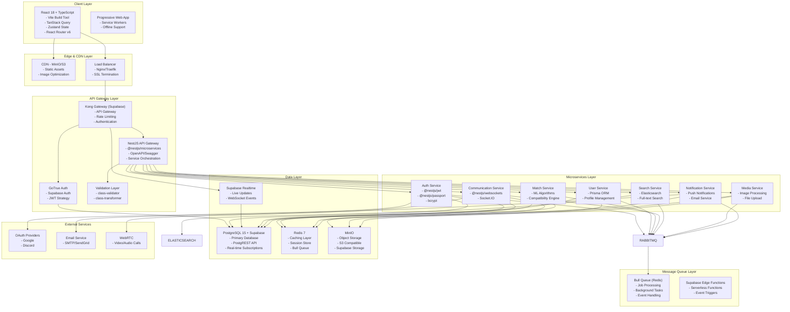
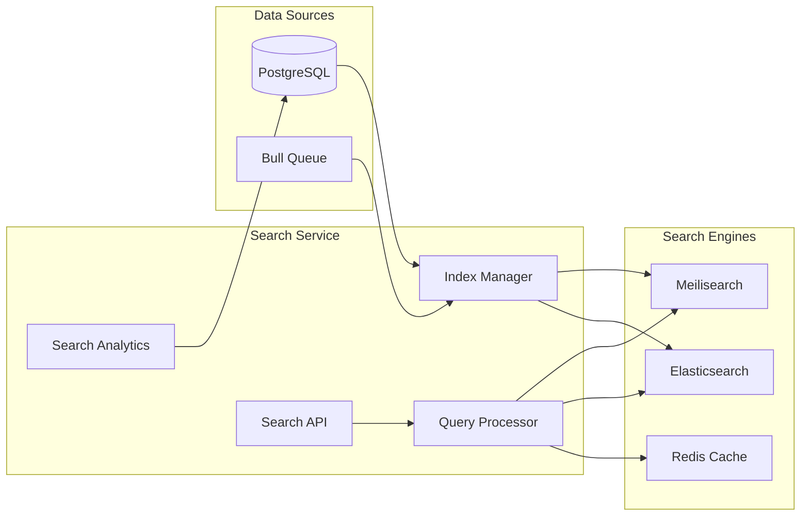

# System Design Document - SoulMatting Platform

**Version:** 1.0.0  
**Created:** 2025-01-21  
**Updated:** 2025-01-21  
**Author:** Kim Hsiao  

## Changelog
- v1.0.0 (2025-01-21): Initial system design specification

---

## 1. System Architecture Overview

### 1.1 High-Level Architecture

SoulMatting follows a **modern microservices architecture** with NestJS-based services, event-driven communication, and containerized deployment using Docker and Docker Compose for self-hosted environments.



### 1.2 Architecture Principles

#### 1.2.1 Core Principles
- **Microservices:** Independent, loosely coupled NestJS services with clear boundaries
- **Event-Driven:** Asynchronous communication via RabbitMQ and event patterns
- **API-First:** RESTful APIs with OpenAPI/Swagger documentation and validation
- **Container-Native:** Docker containerization with Docker Compose orchestration
- **Security-First:** JWT-based authentication with role-based access control
- **Type Safety:** Full TypeScript implementation across frontend and backend
- **Observability:** Comprehensive logging, monitoring, and health checks
- **Self-Hosted Ready:** Designed for easy deployment in self-hosted environments

#### 1.2.2 Design Patterns & Architecture
- **Domain-Driven Design (DDD):** Service boundaries align with business domains
- **CQRS (Command Query Responsibility Segregation):** Separate read/write operations
- **Event Sourcing:** Event-driven state management and audit trails
- **Circuit Breaker:** Fault tolerance with @nestjs/terminus health checks
- **Saga Pattern:** Distributed transaction management via event choreography
- **Repository Pattern:** Data access abstraction with Prisma Client
- **Dependency Injection:** NestJS IoC container for service management
- **Decorator Pattern:** Extensive use of NestJS decorators for metadata
- **Strategy Pattern:** Pluggable algorithms for matching and recommendations
- **Observer Pattern:** Event-driven notifications and real-time updates

---

## 2. Service Architecture

### 2.1 Authentication Service

#### 2.1.1 Service Responsibilities
- User registration and login with comprehensive validation
- JWT token management (access/refresh) with rotation
- Multi-factor authentication (2FA) using TOTP
- OAuth integration (Google, Discord) with Passport.js
- Session management with Redis storage
- Password reset and email verification workflows
- Rate limiting and brute force protection
- Audit logging for security events

#### 2.1.2 NestJS Service Architecture
```typescript
// auth.module.ts
@Module({
  imports: [
    PrismaModule,
    JwtModule.registerAsync({
      useFactory: (configService: ConfigService) => ({
        secret: configService.get('JWT_SECRET'),
        signOptions: { expiresIn: '15m' },
      }),
      inject: [ConfigService],
    }),
    PassportModule,
    ThrottlerModule.forRoot({
      ttl: 60,
      limit: 10,
    }),
  ],
  controllers: [AuthController],
  providers: [
    AuthService,
    JwtStrategy,
    LocalStrategy,
    GoogleStrategy,
    DiscordStrategy,
    AuthGuard,
  ],
  exports: [AuthService, JwtStrategy],
})
export class AuthModule {}
```

#### 2.1.3 API Endpoints with Decorators
```typescript
// Authentication Endpoints
@Post('register')
@UseGuards(ThrottleGuard)
@ApiOperation({ summary: 'Register new user' })
@ApiResponse({ status: 201, description: 'User successfully registered' })
register(@Body() registerDto: RegisterDto): Promise<AuthResponse>

@Post('login')
@UseGuards(LocalAuthGuard, ThrottleGuard)
@ApiOperation({ summary: 'User login' })
login(@Body() loginDto: LoginDto): Promise<AuthResponse>

@Post('logout')
@UseGuards(JwtAuthGuard)
@ApiOperation({ summary: 'User logout' })
logout(@Req() req: Request): Promise<void>

@Post('refresh')
@ApiOperation({ summary: 'Refresh access token' })
refresh(@Body() refreshDto: RefreshTokenDto): Promise<AuthResponse>

@Post('forgot-password')
@UseGuards(ThrottleGuard)
@ApiOperation({ summary: 'Request password reset' })
forgotPassword(@Body() forgotPasswordDto: ForgotPasswordDto): Promise<void>

@Post('reset-password')
@ApiOperation({ summary: 'Reset password with token' })
resetPassword(@Body() resetPasswordDto: ResetPasswordDto): Promise<void>

@Post('verify-email')
@ApiOperation({ summary: 'Verify email address' })
verifyEmail(@Body() verifyEmailDto: VerifyEmailDto): Promise<void>

// OAuth Endpoints
@Get('oauth/:provider')
@UseGuards(AuthGuard('google'))
@ApiOperation({ summary: 'OAuth login redirect' })
oauthLogin(@Param('provider') provider: string): void

@Get('oauth/:provider/callback')
@UseGuards(AuthGuard('google'))
@ApiOperation({ summary: 'OAuth callback handler' })
oauthCallback(@Req() req: Request): Promise<AuthResponse>

// 2FA Endpoints
@Post('2fa/enable')
@UseGuards(JwtAuthGuard)
@ApiOperation({ summary: 'Enable two-factor authentication' })
enable2FA(@Req() req: Request): Promise<TwoFactorResponse>

@Post('2fa/verify')
@UseGuards(JwtAuthGuard)
@ApiOperation({ summary: 'Verify 2FA token' })
verify2FA(@Body() verify2FADto: Verify2FADto, @Req() req: Request): Promise<void>

@Post('2fa/disable')
@UseGuards(JwtAuthGuard)
@ApiOperation({ summary: 'Disable two-factor authentication' })
disable2FA(@Body() disable2FADto: Disable2FADto, @Req() req: Request): Promise<void>

// Session Management
@Get('sessions')
@UseGuards(JwtAuthGuard)
@ApiOperation({ summary: 'Get user sessions' })
getSessions(@Req() req: Request): Promise<SessionResponse[]>

@Delete('sessions/:sessionId')
@UseGuards(JwtAuthGuard)
@ApiOperation({ summary: 'Revoke specific session' })
revokeSession(@Param('sessionId') sessionId: string, @Req() req: Request): Promise<void>
```

#### 2.1.4 Prisma Schema & DTOs
```prisma
// schema.prisma
model User {
  id                String    @id @default(cuid())
  email             String    @unique
  passwordHash      String    @map("password_hash")
  emailVerified     Boolean   @default(false) @map("email_verified")
  twoFactorEnabled  Boolean   @default(false) @map("two_factor_enabled")
  twoFactorSecret   String?   @map("two_factor_secret")
  lastLoginAt       DateTime? @map("last_login_at")
  createdAt         DateTime  @default(now()) @map("created_at")
  updatedAt         DateTime  @updatedAt @map("updated_at")

  sessions        Session[]
  oauthAccounts   OAuthAccount[]

  @@map("users")
}
}

model Session {
  id            String    @id @default(cuid())
  userId        String    @map("user_id")
  refreshToken  String    @map("refresh_token")
  expiresAt     DateTime  @map("expires_at")
  ipAddress     String    @map("ip_address")
  userAgent     String    @map("user_agent")
  isActive      Boolean   @default(true) @map("is_active")
  createdAt     DateTime  @default(now()) @map("created_at")

  user          User      @relation(fields: [userId], references: [id], onDelete: Cascade)

  @@map("sessions")
}

model OAuthAccount {
  id            String    @id @default(cuid())
  userId        String    @map("user_id")
  provider      Provider
  providerId    String    @map("provider_id")
  accessToken   String    @map("access_token")
  refreshToken  String?   @map("refresh_token")
  expiresAt     DateTime? @map("expires_at")
  createdAt     DateTime  @default(now()) @map("created_at")

  user          User      @relation(fields: [userId], references: [id], onDelete: Cascade)

  @@unique([provider, providerId])
  @@map("oauth_accounts")
}

enum Provider {
  GOOGLE
  DISCORD
}

// DTOs with validation
export class RegisterDto {
  @IsEmail()
  @ApiProperty({ example: 'user@example.com' })
  email: string;

  @IsString()
  @MinLength(8)
  @Matches(/^(?=.*[a-z])(?=.*[A-Z])(?=.*\d)(?=.*[@$!%*?&])[A-Za-z\d@$!%*?&]/, {
    message: 'Password must contain uppercase, lowercase, number and special character'
  })
  @ApiProperty({ example: 'SecurePass123!' })
  password: string;

  @IsString()
  @MinLength(2)
  @ApiProperty({ example: 'John' })
  firstName: string;

  @IsString()
  @MinLength(2)
  @ApiProperty({ example: 'Doe' })
  lastName: string;

  @IsDateString()
  @ApiProperty({ example: '1990-01-01' })
  dateOfBirth: string;
}

export class LoginDto {
  @IsEmail()
  @ApiProperty({ example: 'user@example.com' })
  email: string;

  @IsString()
  @ApiProperty({ example: 'SecurePass123!' })
  password: string;

  @IsOptional()
  @IsString()
  @ApiProperty({ example: '123456', required: false })
  twoFactorCode?: string;
}

export class AuthResponse {
  @ApiProperty()
  accessToken: string;

  @ApiProperty()
  refreshToken: string;

  @ApiProperty()
  user: {
    id: string;
    email: string;
    emailVerified: boolean;
    twoFactorEnabled: boolean;
  };
}
```

#### 2.1.4 Security Implementation
```typescript
// JWT Configuration
const JWT_CONFIG = {
  accessToken: {
    secret: process.env.JWT_ACCESS_SECRET,
    expiresIn: '15m',
    algorithm: 'HS256'
  },
  refreshToken: {
    secret: process.env.JWT_REFRESH_SECRET,
    expiresIn: '7d',
    algorithm: 'HS256'
  }
};

// Password Security
const PASSWORD_CONFIG = {
  saltRounds: 12,
  minLength: 8,
  requireUppercase: true,
  requireLowercase: true,
  requireNumbers: true,
  requireSymbols: true
};

// Rate Limiting
const RATE_LIMITS = {
  login: { windowMs: 15 * 60 * 1000, max: 5 },      // 5 attempts per 15 minutes
  register: { windowMs: 60 * 60 * 1000, max: 3 },   // 3 attempts per hour
  forgotPassword: { windowMs: 60 * 60 * 1000, max: 3 }
};
```

### 2.2 User Profile Service

#### 2.2.1 NestJS Service Architecture
```typescript
// profile.module.ts
@Module({
  imports: [
    PrismaModule, // 使用 Prisma 替代 TypeORM
    MulterModule.register({
      storage: diskStorage({
        destination: './uploads/photos',
        filename: (req, file, cb) => {
          const uniqueSuffix = Date.now() + '-' + Math.round(Math.random() * 1E9);
          cb(null, `${uniqueSuffix}-${file.originalname}`);
        },
      }),
    }),
    BullModule.registerQueue({
      name: 'image-processing',
    }),
  ],
  controllers: [ProfileController],
  providers: [
    ProfileService,
    PhotoService,
    LocationService,
    ImageProcessingService,
  ],
  exports: [ProfileService],
})
export class ProfileModule {}
```

#### 2.2.2 Service Responsibilities
- **Profile Management**: CRUD operations for user profiles with validation
- **Photo Management**: Upload, processing, optimization, and CDN integration
- **Interest & Preferences**: Dynamic interest matching and preference algorithms
- **Privacy Controls**: Granular privacy settings with real-time enforcement
- **Profile Verification**: Identity verification workflows and badge system
- **Location Services**: Geospatial queries with privacy-aware distance calculations
- **Content Moderation**: AI-powered photo and text content screening

#### 2.2.3 RESTful API Endpoints
```typescript
// profile.controller.ts
@Controller('profiles')
@UseGuards(JwtAuthGuard)
@ApiTags('User Profiles')
export class ProfileController {
  @Get('me')
  @ApiOperation({ summary: 'Get current user profile' })
  @ApiResponse({ status: 200, type: UserProfileResponse })
  async getCurrentProfile(@User() user: JwtPayload): Promise<UserProfileResponse> {}

  @Put('me')
  @ApiOperation({ summary: 'Update user profile' })
  @ApiResponse({ status: 200, type: UserProfileResponse })
  async updateProfile(
    @User() user: JwtPayload,
    @Body() updateDto: UpdateProfileDto
  ): Promise<UserProfileResponse> {}

  @Get(':id/public')
  @Public()
  @ApiOperation({ summary: 'Get public profile view' })
  async getPublicProfile(
    @Param('id', ParseUUIDPipe) id: string
  ): Promise<PublicProfileResponse> {}

  @Post('photos')
  @UseInterceptors(FileInterceptor('photo'))
  @ApiOperation({ summary: 'Upload profile photo' })
  @ApiConsumes('multipart/form-data')
  async uploadPhoto(
    @User() user: JwtPayload,
    @UploadedFile() file: Express.Multer.File
  ): Promise<PhotoResponse> {}

  @Delete('photos/:photoId')
  @ApiOperation({ summary: 'Delete profile photo' })
  async deletePhoto(
    @User() user: JwtPayload,
    @Param('photoId', ParseUUIDPipe) photoId: string
  ): Promise<void> {}

  @Put('photos/:photoId/primary')
  @ApiOperation({ summary: 'Set primary photo' })
  async setPrimaryPhoto(
    @User() user: JwtPayload,
    @Param('photoId', ParseUUIDPipe) photoId: string
  ): Promise<void> {}

  @Get('interests')
  @ApiOperation({ summary: 'Get user interests' })
  async getInterests(@User() user: JwtPayload): Promise<InterestsResponse> {}

  @Put('interests')
  @ApiOperation({ summary: 'Update user interests' })
  async updateInterests(
    @User() user: JwtPayload,
    @Body() interestsDto: UpdateInterestsDto
  ): Promise<InterestsResponse> {}

  @Get('preferences')
  @ApiOperation({ summary: 'Get user preferences' })
  async getPreferences(@User() user: JwtPayload): Promise<UserPreferencesResponse> {}

  @Put('preferences')
  @ApiOperation({ summary: 'Update user preferences' })
  async updatePreferences(
    @User() user: JwtPayload,
    @Body() preferencesDto: UpdatePreferencesDto
  ): Promise<UserPreferencesResponse> {}

  @Get('privacy')
  @ApiOperation({ summary: 'Get privacy settings' })
  async getPrivacySettings(@User() user: JwtPayload): Promise<PrivacySettingsResponse> {}

  @Put('privacy')
  @ApiOperation({ summary: 'Update privacy settings' })
  async updatePrivacySettings(
    @User() user: JwtPayload,
    @Body() privacyDto: UpdatePrivacyDto
  ): Promise<PrivacySettingsResponse> {}

  @Post('verify')
  @ApiOperation({ summary: 'Submit profile for verification' })
  async submitVerification(
    @User() user: JwtPayload,
    @Body() verificationDto: SubmitVerificationDto
  ): Promise<VerificationResponse> {}

  @Get('verification-status')
  @ApiOperation({ summary: 'Get verification status' })
  async getVerificationStatus(
    @User() user: JwtPayload
  ): Promise<VerificationStatusResponse> {}
}
```

#### 2.2.4 Prisma Models & DTOs
```typescript
// Prisma Schema (schema.prisma)
model UserProfile {
  id          String   @id @default(uuid())
  userId      String   @unique @map("user_id")
  
  // Basic Information
  displayName String   @map("display_name") @db.VarChar(50)
  firstName   String   @map("first_name") @db.VarChar(30)
  lastName    String   @map("last_name") @db.VarChar(30)
  dateOfBirth DateTime @map("date_of_birth")
  gender      Gender
  occupation  String?  @db.VarChar(100)
  education   String?  @db.VarChar(100)
  bio         String?  @db.VarChar(500)
  location    Json?
  
  isVerified  Boolean  @default(false) @map("is_verified")
  isActive    Boolean  @default(true) @map("is_active")
  
  createdAt   DateTime @default(now()) @map("created_at")
  updatedAt   DateTime @updatedAt @map("updated_at")
  
  // Relations
  user        User              @relation(fields: [userId], references: [id], onDelete: Cascade)
  photos      Photo[]
  interests   Interest[]
  preferences UserPreferences?
  privacy     PrivacySettings?
  
  @@map("user_profiles")
}

enum Gender {
  male
  female
  non_binary @map("non-binary")
  other
}

model Photo {
  id               String            @id @default(uuid())
  userProfileId    String            @map("user_profile_id")
  url              String
  thumbnailUrl     String            @map("thumbnail_url")
  originalFilename String            @map("original_filename")
  mimeType         String            @map("mime_type")
  fileSize         Int               @map("file_size")
  dimensions       Json
  isPrimary        Boolean           @default(false) @map("is_primary")
  isVerified       Boolean           @default(false) @map("is_verified")
  moderationStatus ModerationStatus  @default(pending) @map("moderation_status")
  uploadedAt       DateTime          @default(now()) @map("uploaded_at")
  
  // Relations
  userProfile      UserProfile       @relation(fields: [userProfileId], references: [id], onDelete: Cascade)
  
  @@map("photos")
}

enum ModerationStatus {
  pending
  approved
  rejected
}

model Interest {
  id            String      @id @default(uuid())
  userProfileId String      @map("user_profile_id")
  category      String
  name          String
  weight        Int         @default(5)
  addedAt       DateTime    @default(now()) @map("added_at")
  
  // Relations
  userProfile   UserProfile @relation(fields: [userProfileId], references: [id], onDelete: Cascade)
  
  @@map("interests")
}

model UserPreferences {
  id                String      @id @default(uuid())
  userProfileId     String      @unique @map("user_profile_id")
  ageRange          Json
  maxDistance       Int         @default(50) @map("max_distance")
  genderPreference  Json
  dealBreakers      Json?
  requiredInterests Json?
  lifestyle         Json
  createdAt         DateTime    @default(now()) @map("created_at")
  updatedAt         DateTime    @updatedAt @map("updated_at")
  
  // Relations
  userProfile       UserProfile @relation(fields: [userProfileId], references: [id], onDelete: Cascade)
  
  @@map("user_preferences")
}

model PrivacySettings {
  id                String            @id @default(uuid())
  userProfileId     String            @unique @map("user_profile_id")
  profileVisibility ProfileVisibility @default(members_only) @map("profile_visibility")
  showAge           Boolean           @default(true) @map("show_age")
  showLocation      Boolean           @default(true) @map("show_location")
  showLastActive    Boolean           @default(true) @map("show_last_active")
  allowMessages     MessagePermission @default(matches_only) @map("allow_messages")
  allowPhotoRequests Boolean          @default(true) @map("allow_photo_requests")
  showOnlineStatus  Boolean           @default(true) @map("show_online_status")
  createdAt         DateTime          @default(now()) @map("created_at")
  updatedAt         DateTime          @updatedAt @map("updated_at")
  
  // Relations
  userProfile       UserProfile       @relation(fields: [userProfileId], references: [id], onDelete: Cascade)
  
  @@map("privacy_settings")
}

enum ProfileVisibility {
  public
  members_only @map("members-only")
  matches_only @map("matches-only")
}

enum MessagePermission {
  everyone
  matches_only @map("matches-only")
  verified_only @map("verified-only")
}

// Profile DTOs
export class UpdateProfileDto {
  @IsOptional()
  @IsString()
  @Length(2, 50)
  @ApiProperty({ example: 'John Doe', required: false })
  displayName?: string;

  @IsOptional()
  @IsString()
  @Length(0, 500)
  @ApiProperty({ example: 'Love hiking and photography...', required: false })
  bio?: string;

  @IsOptional()
  @IsString()
  @Length(0, 100)
  @ApiProperty({ example: 'Software Engineer', required: false })
  occupation?: string;

  @IsOptional()
  @IsString()
  @Length(0, 100)
  @ApiProperty({ example: 'Computer Science', required: false })
  education?: string;

  @IsOptional()
  @ValidateNested()
  @Type(() => LocationDto)
  @ApiProperty({ required: false })
  location?: LocationDto;
}

export class LocationDto {
  @IsString()
  @ApiProperty({ example: 'San Francisco' })
  city: string;

  @IsString()
  @ApiProperty({ example: 'California' })
  state: string;

  @IsString()
  @ApiProperty({ example: 'United States' })
  country: string;

  @IsArray()
  @ArrayMinSize(2)
  @ArrayMaxSize(2)
  @IsNumber({}, { each: true })
  @ApiProperty({ example: [-122.4194, 37.7749] })
  coordinates: [number, number];
}

export class UpdatePreferencesDto {
  @IsArray()
  @ArrayMinSize(2)
  @ArrayMaxSize(2)
  @IsInt({ each: true })
  @Min(18, { each: true })
  @Max(100, { each: true })
  @ApiProperty({ example: [25, 35] })
  ageRange: [number, number];

  @IsInt()
  @Min(1)
  @Max(500)
  @ApiProperty({ example: 50 })
  maxDistance: number;

  @IsArray()
  @IsString({ each: true })
  @ApiProperty({ example: ['male', 'female'] })
  genderPreference: string[];

  @IsOptional()
  @IsArray()
  @IsString({ each: true })
  @ApiProperty({ example: ['smoking'], required: false })
  dealBreakers?: string[];

  @ValidateNested()
  @Type(() => LifestylePreferencesDto)
  @ApiProperty()
  lifestyle: LifestylePreferencesDto;
}

export class LifestylePreferencesDto {
  @IsEnum(['never', 'sometimes', 'regularly', 'no-preference'])
  @ApiProperty({ example: 'never' })
  smokingPreference: 'never' | 'sometimes' | 'regularly' | 'no-preference';

  @IsEnum(['never', 'socially', 'regularly', 'no-preference'])
  @ApiProperty({ example: 'socially' })
  drinkingPreference: 'never' | 'socially' | 'regularly' | 'no-preference';

  @IsEnum(['never', 'rarely', 'sometimes', 'regularly', 'daily'])
  @ApiProperty({ example: 'regularly' })
  exerciseFrequency: 'never' | 'rarely' | 'sometimes' | 'regularly' | 'daily';
}
```

### 2.3 Matching Service

#### 2.3.1 NestJS Service Architecture
```typescript
// matching.module.ts
@Module({
  imports: [
    PrismaModule, // 使用 Prisma 替代 TypeORM
    BullModule.registerQueue({
      name: 'matching-queue',
      redis: {
        host: process.env.REDIS_HOST,
        port: parseInt(process.env.REDIS_PORT),
      },
    }),
    ClientsModule.register([
      {
        name: 'PROFILE_SERVICE',
        transport: Transport.RMQ,
        options: {
          urls: [process.env.RABBITMQ_URL],
          queue: 'profile_queue',
        },
      },
      {
        name: 'NOTIFICATION_SERVICE',
        transport: Transport.RMQ,
        options: {
          urls: [process.env.RABBITMQ_URL],
          queue: 'notification_queue',
        },
      },
    ]),
  ],
  controllers: [MatchingController],
  providers: [
    MatchingService,
    RecommendationEngine,
    CompatibilityCalculator,
    MLRankingService,
    MatchingProcessor,
  ],
  exports: [MatchingService],
})
export class MatchingModule {}
```

#### 2.3.2 Service Responsibilities
- **Advanced Compatibility Algorithm**: Multi-factor scoring with ML-based optimization
- **Real-time Recommendations**: Dynamic queue management with personalization
- **Behavioral Learning**: User interaction pattern analysis and preference inference
- **Match Actions Processing**: Like/pass/super-like with undo functionality
- **Mutual Match Detection**: Real-time match notifications and conversation initiation
- **Performance Analytics**: Matching success rate tracking and algorithm optimization
- **A/B Testing**: Algorithm variant testing for continuous improvement

#### 2.3.3 RESTful API Endpoints
```typescript
@Controller('matches')
@UseGuards(JwtAuthGuard)
@ApiTags('Matching')
export class MatchingController {
  // Match Discovery
  @Get('recommendations')
  @ApiOperation({ summary: 'Get personalized recommendations' })
  @ApiResponse({ status: 200, type: [UserRecommendationDto] })
  async getRecommendations(
    @User() user: UserPayload,
    @Query() query: RecommendationQueryDto
  ): Promise<UserRecommendationDto[]> {}

  @Get('discover')
  @ApiOperation({ summary: 'Browse mode with advanced filters' })
  @ApiResponse({ status: 200, type: PaginatedRecommendationsDto })
  async discoverUsers(
    @User() user: UserPayload,
    @Query() filters: DiscoveryFiltersDto
  ): Promise<PaginatedRecommendationsDto> {}

  @Post('refresh')
  @ApiOperation({ summary: 'Refresh recommendation queue' })
  @ApiResponse({ status: 200, type: RefreshResponseDto })
  async refreshRecommendations(
    @User() user: UserPayload
  ): Promise<RefreshResponseDto> {}

  // Match Actions
  @Post('like')
  @ApiOperation({ summary: 'Like a user profile' })
  @ApiResponse({ status: 201, type: MatchActionResponseDto })
  async likeUser(
    @User() user: UserPayload,
    @Body() dto: MatchActionDto
  ): Promise<MatchActionResponseDto> {}

  @Post('pass')
  @ApiOperation({ summary: 'Pass on a user profile' })
  @ApiResponse({ status: 201, type: MatchActionResponseDto })
  async passUser(
    @User() user: UserPayload,
    @Body() dto: MatchActionDto
  ): Promise<MatchActionResponseDto> {}

  @Post('super-like')
  @UseGuards(PremiumGuard)
  @ApiOperation({ summary: 'Super like a user (premium feature)' })
  @ApiResponse({ status: 201, type: MatchActionResponseDto })
  async superLikeUser(
    @User() user: UserPayload,
    @Body() dto: MatchActionDto
  ): Promise<MatchActionResponseDto> {}

  @Delete('undo')
  @UseGuards(PremiumGuard)
  @ApiOperation({ summary: 'Undo last action (premium feature)' })
  @ApiResponse({ status: 200, type: UndoResponseDto })
  async undoLastAction(
    @User() user: UserPayload
  ): Promise<UndoResponseDto> {}

  // Match Results
  @Get('mutual')
  @ApiOperation({ summary: 'Get mutual matches' })
  @ApiResponse({ status: 200, type: [MutualMatchDto] })
  async getMutualMatches(
    @User() user: UserPayload,
    @Query() pagination: PaginationDto
  ): Promise<MutualMatchDto[]> {}

  @Get('likes-received')
  @UseGuards(PremiumGuard)
  @ApiOperation({ summary: 'Get users who liked you (premium)' })
  @ApiResponse({ status: 200, type: [LikeReceivedDto] })
  async getLikesReceived(
    @User() user: UserPayload,
    @Query() pagination: PaginationDto
  ): Promise<LikeReceivedDto[]> {}

  @Get('likes-sent')
  @ApiOperation({ summary: 'Get users you liked' })
  @ApiResponse({ status: 200, type: [LikeSentDto] })
  async getLikesSent(
    @User() user: UserPayload,
    @Query() pagination: PaginationDto
  ): Promise<LikeSentDto[]> {}

  // Compatibility Analysis
  @Get('compatibility/:targetUserId')
  @ApiOperation({ summary: 'Get detailed compatibility breakdown' })
  @ApiResponse({ status: 200, type: CompatibilityAnalysisDto })
  async getCompatibilityAnalysis(
    @User() user: UserPayload,
    @Param('targetUserId') targetUserId: string
  ): Promise<CompatibilityAnalysisDto> {}

  @Get('insights')
  @ApiOperation({ summary: 'Get matching insights and statistics' })
  @ApiResponse({ status: 200, type: MatchingInsightsDto })
  async getMatchingInsights(
    @User() user: UserPayload
  ): Promise<MatchingInsightsDto> {}

  // Algorithm Preferences
  @Get('preferences')
  @ApiOperation({ summary: 'Get matching algorithm preferences' })
  @ApiResponse({ status: 200, type: MatchingPreferencesDto })
  async getMatchingPreferences(
    @User() user: UserPayload
  ): Promise<MatchingPreferencesDto> {}

  @Put('preferences')
  @ApiOperation({ summary: 'Update matching algorithm preferences' })
  @ApiResponse({ status: 200, type: MatchingPreferencesDto })
  async updateMatchingPreferences(
    @User() user: UserPayload,
    @Body() dto: UpdateMatchingPreferencesDto
  ): Promise<MatchingPreferencesDto> {}

  @Post('preferences/reset')
  @ApiOperation({ summary: 'Reset matching preferences to defaults' })
  @ApiResponse({ status: 200, type: MatchingPreferencesDto })
  async resetMatchingPreferences(
    @User() user: UserPayload
  ): Promise<MatchingPreferencesDto> {}
}

#### 2.3.4 Data Models & Entities
```typescript
model Match {
  id                  String      @id @default(uuid())
  userId              String      @map("user_id")
  targetUserId        String      @map("target_user_id")
  action              MatchAction
  isMutual            Boolean     @default(false) @map("is_mutual")
  compatibilityScore  Decimal?    @map("compatibility_score") @db.Decimal(5, 2)
  scoreBreakdown      Json?       @map("score_breakdown")
  matchedAt           DateTime?   @map("matched_at")
  createdAt           DateTime    @default(now()) @map("created_at")
  updatedAt           DateTime    @updatedAt @map("updated_at")
  
  @@unique([userId, targetUserId], name: "user_target_unique")
  @@index([userId, action], name: "user_action_idx")
  @@index([isMutual, matchedAt], name: "mutual_match_idx")
  @@map("matches")
}

enum MatchAction {
  like
  pass
  super_like
}

model UserAction {
  id             String     @id @default(uuid())
  userId         String     @map("user_id")
  targetUserId   String     @map("target_user_id")
  action         UserActionType
  previousAction String?    @map("previous_action")
  metadata       Json?      @map("metadata")
  createdAt      DateTime   @default(now()) @map("created_at")
  
  @@index([userId, createdAt], name: "user_time_idx")
  @@index([action, createdAt], name: "action_time_idx")
  @@map("user_actions")
}

enum UserActionType {
  like
  pass
  super_like
  undo
  block
  report
}

model CompatibilityScore {
  id               String   @id @default(uuid())
  userId           String   @map("user_id")
  targetUserId     String   @map("target_user_id")
  overallScore     Decimal  @map("overall_score") @db.Decimal(5, 2)
  breakdown        Json     @map("breakdown")
  factors          Json     @map("factors")
  algorithmVersion String   @default("1.0") @map("algorithm_version")
  createdAt        DateTime @default(now()) @map("created_at")
  updatedAt        DateTime @updatedAt @map("updated_at")
  
  @@map("compatibility_scores")
}

  @Index(['userId', 'overallScore'])
  static userScoreIndex: void;

  @Index(['targetUserId', 'overallScore'])
  static targetScoreIndex: void;
}

// UserBehavior Model
model UserBehavior {
  id           String   @id @default(uuid())
  userId       String   @unique @map("user_id") @db.Uuid
  interactions Json     // { likes: string[], passes: string[], superLikes: string[], matches: string[], conversations: string[] }
  preferences  Json     // { implicitInterests: string[], preferredAgeRange: [number, number], preferredDistance: number, activityPatterns: { peakHours: number[], daysActive: string[], sessionDuration: number } }
  feedback     Json     // { reportedUsers: string[], blockedUsers: string[], unmatchedUsers: string[] }
  lastActive   DateTime @map("last_active")
  
  // Relations
  user         User     @relation(fields: [userId], references: [id])
  
  createdAt    DateTime @default(now()) @map("created_at")
  updatedAt    DateTime @updatedAt @map("updated_at")
  
  @@index([lastActive])
  @@map("user_behaviors")
}
  static activityIndex: void;
}

// Machine Learning Features
interface UserBehaviorData {
  userId: string;
  interactions: {
    likes: string[];             // User IDs liked
    passes: string[];            // User IDs passed
    superLikes: string[];        // User IDs super-liked
    matches: string[];           // Mutual match IDs
    conversations: string[];     // Users with active conversations
  };
  preferences: {
    implicitInterests: string[]; // Inferred from behavior
    preferredAgeRange: [number, number];
    preferredDistance: number;
    activityPatterns: {
      peakHours: number[];       // Hours of highest activity
      daysActive: string[];      // Most active days
      sessionDuration: number;   // Average session length
    };
  };
  feedback: {
    reportedUsers: string[];     // Users reported
    blockedUsers: string[];      // Users blocked
    unmatchedUsers: string[];    // Users unmatched
  };
}
```

#### 2.3.4 Recommendation Engine
```typescript
// Recommendation Algorithm
class RecommendationEngine {
  async generateRecommendations(
    userId: string, 
    limit: number = 20
  ): Promise<UserRecommendation[]> {
    // 1. Get user profile and preferences
    const user = await this.getUserProfile(userId);
    const criteria = await this.getMatchingCriteria(userId);
    
    // 2. Apply basic filters
    const candidates = await this.getFilteredCandidates(criteria);
    
    // 3. Calculate compatibility scores
    const scoredCandidates = await Promise.all(
      candidates.map(candidate => 
        this.calculateCompatibility(user, candidate, criteria)
      )
    );
    
    // 4. Apply ML-based ranking
    const rankedCandidates = await this.applyMLRanking(
      userId, 
      scoredCandidates
    );
    
    // 5. Apply diversity and freshness
    const diversifiedResults = this.applyDiversification(
      rankedCandidates, 
      limit
    );
    
    return diversifiedResults;
  }
  
  private async calculateCompatibility(
    user: UserProfile, 
    candidate: UserProfile, 
    criteria: MatchingCriteria
  ): Promise<CompatibilityScore> {
    const scores = {
      interests: this.calculateInterestScore(user, candidate),
      location: this.calculateLocationScore(user, candidate, criteria),
      age: this.calculateAgeScore(user, candidate, criteria),
      lifestyle: this.calculateLifestyleScore(user, candidate),
      values: this.calculateValueScore(user, candidate),
      personality: this.calculatePersonalityScore(user, candidate)
    };
    
    // Weighted overall score
    const overall = Object.entries(scores).reduce(
      (sum, [key, score]) => sum + (score * criteria.weights[key]), 
      0
    ) / Object.values(criteria.weights).reduce((a, b) => a + b, 0);
    
    return {
      overall,
      breakdown: scores,
      factors: this.getCompatibilityFactors(user, candidate)
    };
  }
}
```

### 2.4 Communication Service

#### 2.4.1 NestJS Service Architecture
```typescript
// communication.module.ts
@Module({
  imports: [
    PrismaModule, // 使用 Prisma 替代 TypeORM
    BullModule.registerQueue({
      name: 'message-queue',
      redis: {
        host: process.env.REDIS_HOST,
        port: parseInt(process.env.REDIS_PORT),
      },
    }),
    MulterModule.register({
      dest: './uploads/messages',
      limits: {
        fileSize: 50 * 1024 * 1024, // 50MB
      },
    }),
    ClientsModule.register([
      {
        name: 'NOTIFICATION_SERVICE',
        transport: Transport.RMQ,
        options: {
          urls: [process.env.RABBITMQ_URL],
          queue: 'notification_queue',
        },
      },
      {
        name: 'MEDIA_SERVICE',
        transport: Transport.RMQ,
        options: {
          urls: [process.env.RABBITMQ_URL],
          queue: 'media_queue',
        },
      },
    ]),
  ],
  controllers: [CommunicationController],
  providers: [
    CommunicationService,
    MessageService,
    ConversationService,
    CallService,
    PresenceService,
    EncryptionService,
    WebRTCService,
    CommunicationGateway,
    MessageProcessor,
  ],
  exports: [CommunicationService, CommunicationGateway],
})
export class CommunicationModule {}
```

#### 2.4.2 Service Responsibilities
- **Real-time Messaging**: WebSocket-based instant messaging with delivery confirmations
- **End-to-End Encryption**: Message encryption using AES-256-GCM with key rotation
- **Media Sharing**: File upload/download with automatic compression and CDN integration
- **Conversation Management**: Thread organization, archiving, and participant management
- **Presence & Typing**: Real-time user status and typing indicators
- **Video/Audio Calling**: WebRTC-based calling with STUN/TURN server support
- **Message Moderation**: AI-powered content filtering and spam detection
- **Push Notifications**: Cross-platform notification delivery for offline users

#### 2.4.3 WebSocket Gateway
```typescript
@WebSocketGateway({
  cors: {
    origin: process.env.FRONTEND_URL,
    credentials: true,
  },
  namespace: '/communication',
})
export class CommunicationGateway implements OnGatewayConnection, OnGatewayDisconnect {
  @WebSocketServer()
  server: Server;

  constructor(
    private readonly communicationService: CommunicationService,
    private readonly presenceService: PresenceService,
    private readonly jwtService: JwtService,
  ) {}

  // Connection Management
  async handleConnection(client: Socket) {
    try {
      const token = client.handshake.auth.token;
      const payload = this.jwtService.verify(token);
      client.data.userId = payload.sub;
      
      await this.presenceService.setUserOnline(payload.sub, client.id);
      client.emit('connection:established', { status: 'connected' });
    } catch (error) {
      client.disconnect();
    }
  }

  async handleDisconnect(client: Socket) {
    if (client.data.userId) {
      await this.presenceService.setUserOffline(client.data.userId, client.id);
    }
  }

  // Message Events
  @SubscribeMessage('conversation:join')
  async handleJoinConversation(
    @ConnectedSocket() client: Socket,
    @MessageBody() data: { conversationId: string }
  ) {
    const userId = client.data.userId;
    const hasAccess = await this.communicationService.hasConversationAccess(
      userId, 
      data.conversationId
    );
    
    if (hasAccess) {
      client.join(data.conversationId);
      await this.communicationService.markMessagesAsRead(
        userId, 
        data.conversationId
      );
    }
  }

  @SubscribeMessage('message:send')
  async handleSendMessage(
    @ConnectedSocket() client: Socket,
    @MessageBody() data: SendMessageDto
  ) {
    const userId = client.data.userId;
    const message = await this.communicationService.sendMessage(userId, data);
    
    // Emit to conversation participants
    this.server.to(data.conversationId).emit('message:received', message);
    
    // Send push notification to offline users
    await this.communicationService.notifyOfflineUsers(
      data.conversationId, 
      userId, 
      message
    );
  }

  @SubscribeMessage('message:typing')
  async handleTyping(
    @ConnectedSocket() client: Socket,
    @MessageBody() data: { conversationId: string; isTyping: boolean }
  ) {
    const userId = client.data.userId;
    client.to(data.conversationId).emit('user:typing', {
      userId,
      conversationId: data.conversationId,
      isTyping: data.isTyping,
    });
  }

  @SubscribeMessage('message:read')
  async handleMessageRead(
    @ConnectedSocket() client: Socket,
    @MessageBody() data: { messageId: string; conversationId: string }
  ) {
    const userId = client.data.userId;
    await this.communicationService.markMessageAsRead(userId, data.messageId);
    
    this.server.to(data.conversationId).emit('message:read', {
      messageId: data.messageId,
      userId,
      readAt: new Date(),
    });
  }

  // Call Events
  @SubscribeMessage('call:initiate')
  async handleCallInitiate(
    @ConnectedSocket() client: Socket,
    @MessageBody() data: InitiateCallDto
  ) {
    const userId = client.data.userId;
    const call = await this.communicationService.initiateCall(userId, data);
    
    // Notify call participants
    data.participantIds.forEach(participantId => {
      this.server.to(participantId).emit('call:incoming', {
        callId: call.id,
        initiatorId: userId,
        type: data.type,
        conversationId: data.conversationId,
      });
    });
  }

  @SubscribeMessage('call:accept')
  async handleCallAccept(
    @ConnectedSocket() client: Socket,
    @MessageBody() data: { callId: string }
  ) {
    const userId = client.data.userId;
    const call = await this.communicationService.acceptCall(userId, data.callId);
    
    this.server.to(call.conversationId).emit('call:accepted', {
      callId: data.callId,
      acceptedBy: userId,
      webrtcOffer: call.webrtcOffer,
    });
  }

  @SubscribeMessage('call:reject')
  async handleCallReject(
    @ConnectedSocket() client: Socket,
    @MessageBody() data: { callId: string }
  ) {
    const userId = client.data.userId;
    await this.communicationService.rejectCall(userId, data.callId);
    
    this.server.emit('call:rejected', {
      callId: data.callId,
      rejectedBy: userId,
    });
  }

  @SubscribeMessage('call:end')
  async handleCallEnd(
    @ConnectedSocket() client: Socket,
    @MessageBody() data: { callId: string }
  ) {
    const userId = client.data.userId;
    const call = await this.communicationService.endCall(userId, data.callId);
    
    this.server.to(call.conversationId).emit('call:ended', {
      callId: data.callId,
      endedBy: userId,
      duration: call.duration,
    });
  }
}

#### 2.4.4 RESTful API Endpoints
```typescript
@Controller('communication')
@UseGuards(JwtAuthGuard)
@ApiTags('Communication')
export class CommunicationController {
  constructor(
    private readonly communicationService: CommunicationService,
    private readonly messageService: MessageService,
    private readonly conversationService: ConversationService,
  ) {}

  // Conversation Management
  @Get('conversations')
  @ApiOperation({ summary: 'Get user conversations' })
  @ApiResponse({ status: 200, description: 'Conversations retrieved successfully' })
  async getConversations(
    @User() user: UserEntity,
    @Query() query: GetConversationsDto,
  ) {
    return this.conversationService.getUserConversations(user.id, query);
  }

  @Post('conversations')
  @ApiOperation({ summary: 'Create new conversation' })
  @ApiResponse({ status: 201, description: 'Conversation created successfully' })
  async createConversation(
    @User() user: UserEntity,
    @Body() createConversationDto: CreateConversationDto,
  ) {
    return this.conversationService.createConversation(user.id, createConversationDto);
  }

  @Get('conversations/:id')
  @ApiOperation({ summary: 'Get conversation details' })
  @ApiResponse({ status: 200, description: 'Conversation details retrieved' })
  async getConversation(
    @User() user: UserEntity,
    @Param('id') conversationId: string,
  ) {
    return this.conversationService.getConversation(user.id, conversationId);
  }

  @Patch('conversations/:id')
  @ApiOperation({ summary: 'Update conversation settings' })
  @ApiResponse({ status: 200, description: 'Conversation updated successfully' })
  async updateConversation(
    @User() user: UserEntity,
    @Param('id') conversationId: string,
    @Body() updateConversationDto: UpdateConversationDto,
  ) {
    return this.conversationService.updateConversation(
      user.id,
      conversationId,
      updateConversationDto,
    );
  }

  @Delete('conversations/:id')
  @ApiOperation({ summary: 'Archive conversation' })
  @ApiResponse({ status: 200, description: 'Conversation archived successfully' })
  async archiveConversation(
    @User() user: UserEntity,
    @Param('id') conversationId: string,
  ) {
    return this.conversationService.archiveConversation(user.id, conversationId);
  }

  // Message Management
  @Get('conversations/:id/messages')
  @ApiOperation({ summary: 'Get conversation messages' })
  @ApiResponse({ status: 200, description: 'Messages retrieved successfully' })
  async getMessages(
    @User() user: UserEntity,
    @Param('id') conversationId: string,
    @Query() query: GetMessagesDto,
  ) {
    return this.messageService.getMessages(user.id, conversationId, query);
  }

  @Post('conversations/:id/messages')
  @ApiOperation({ summary: 'Send message' })
  @ApiResponse({ status: 201, description: 'Message sent successfully' })
  async sendMessage(
    @User() user: UserEntity,
    @Param('id') conversationId: string,
    @Body() sendMessageDto: SendMessageDto,
  ) {
    return this.messageService.sendMessage(user.id, conversationId, sendMessageDto);
  }

  @Post('conversations/:id/messages/media')
  @ApiOperation({ summary: 'Upload media message' })
  @ApiConsumes('multipart/form-data')
  @ApiResponse({ status: 201, description: 'Media message sent successfully' })
  @UseInterceptors(FileInterceptor('file'))
  async sendMediaMessage(
    @User() user: UserEntity,
    @Param('id') conversationId: string,
    @UploadedFile() file: Express.Multer.File,
    @Body() mediaMessageDto: MediaMessageDto,
  ) {
    return this.messageService.sendMediaMessage(
      user.id,
      conversationId,
      file,
      mediaMessageDto,
    );
  }

  @Patch('messages/:id')
  @ApiOperation({ summary: 'Edit message' })
  @ApiResponse({ status: 200, description: 'Message edited successfully' })
  async editMessage(
    @User() user: UserEntity,
    @Param('id') messageId: string,
    @Body() editMessageDto: EditMessageDto,
  ) {
    return this.messageService.editMessage(user.id, messageId, editMessageDto);
  }

  @Delete('messages/:id')
  @ApiOperation({ summary: 'Delete message' })
  @ApiResponse({ status: 200, description: 'Message deleted successfully' })
  async deleteMessage(
    @User() user: UserEntity,
    @Param('id') messageId: string,
  ) {
    return this.messageService.deleteMessage(user.id, messageId);
  }

  @Post('messages/:id/read')
  @ApiOperation({ summary: 'Mark message as read' })
  @ApiResponse({ status: 200, description: 'Message marked as read' })
  async markMessageAsRead(
    @User() user: UserEntity,
    @Param('id') messageId: string,
  ) {
    return this.messageService.markAsRead(user.id, messageId);
  }

  // Call Management
  @Get('calls')
  @ApiOperation({ summary: 'Get call history' })
  @ApiResponse({ status: 200, description: 'Call history retrieved successfully' })
  async getCallHistory(
    @User() user: UserEntity,
    @Query() query: GetCallHistoryDto,
  ) {
    return this.communicationService.getCallHistory(user.id, query);
  }

  @Post('calls')
  @ApiOperation({ summary: 'Initiate call' })
  @ApiResponse({ status: 201, description: 'Call initiated successfully' })
  async initiateCall(
    @User() user: UserEntity,
    @Body() initiateCallDto: InitiateCallDto,
  ) {
    return this.communicationService.initiateCall(user.id, initiateCallDto);
  }

  @Patch('calls/:id/accept')
  @ApiOperation({ summary: 'Accept call' })
  @ApiResponse({ status: 200, description: 'Call accepted successfully' })
  async acceptCall(
    @User() user: UserEntity,
    @Param('id') callId: string,
    @Body() acceptCallDto: AcceptCallDto,
  ) {
    return this.communicationService.acceptCall(user.id, callId, acceptCallDto);
  }

  @Patch('calls/:id/reject')
  @ApiOperation({ summary: 'Reject call' })
  @ApiResponse({ status: 200, description: 'Call rejected successfully' })
  async rejectCall(
    @User() user: UserEntity,
    @Param('id') callId: string,
  ) {
    return this.communicationService.rejectCall(user.id, callId);
  }

  @Patch('calls/:id/end')
  @ApiOperation({ summary: 'End call' })
  @ApiResponse({ status: 200, description: 'Call ended successfully' })
  async endCall(
    @User() user: UserEntity,
    @Param('id') callId: string,
  ) {
    return this.communicationService.endCall(user.id, callId);
  }

  // Presence Management
  @Get('presence')
  @ApiOperation({ summary: 'Get user presence status' })
  @ApiResponse({ status: 200, description: 'Presence status retrieved' })
  async getPresence(
    @User() user: UserEntity,
    @Query('userIds') userIds: string[],
  ) {
    return this.communicationService.getUsersPresence(userIds);
  }

  @Patch('presence')
  @ApiOperation({ summary: 'Update presence status' })
  @ApiResponse({ status: 200, description: 'Presence updated successfully' })
  async updatePresence(
    @User() user: UserEntity,
    @Body() updatePresenceDto: UpdatePresenceDto,
  ) {
    return this.communicationService.updatePresence(user.id, updatePresenceDto);
  }
}
```

#### 2.4.5 Data Models (Prisma Models)
```prisma
// Conversation Model
model Conversation {
  id              String   @id @default(uuid())
  type            ConversationType
  title           String?  @db.VarChar(100)
  description     String?  @db.Text
  participantIds  String[]
  lastMessageId   String?  @db.Uuid
  lastActivity    DateTime @default(now())
  isArchived      Boolean  @default(false)
  isEncrypted     Boolean  @default(false)
  settings        Json?    // { muteUntil?: Date, customNotifications?: boolean, disappearingMessages?: number }
  
  // Relations
  messages        Message[]
  calls           Call[]
  
  createdAt       DateTime @default(now())
  updatedAt       DateTime @updatedAt
  
  @@index([lastActivity])
  @@index([type])
  @@map("conversations")
}

enum ConversationType {
  direct
  group
}

// Message Model
model Message {
  id                String      @id @default(uuid())
  conversationId    String      @db.Uuid
  senderId          String      @db.Uuid
  content           String      @db.Text
  type              MessageType
  metadata          Json?       // { fileName?: string, fileSize?: number, mimeType?: string, duration?: number, dimensions?: { width: number, height: number }, location?: { latitude: number, longitude: number, address?: string }, thumbnail?: string }
  isEncrypted       Boolean     @default(false)
  encryptedContent  String?     @db.Text
  encryptionData    Json?       // { algorithm: string, keyId: string, iv: string }
  status            MessageStatus @default(sending)
  isEdited          Boolean     @default(false)
  isDeleted         Boolean     @default(false)
  editedAt          DateTime?
  deletedAt         DateTime?
  replyToMessageId  String?     @db.Uuid
  
  // Relations
  conversation      Conversation @relation(fields: [conversationId], references: [id])
  sender            User         @relation(fields: [senderId], references: [id])
  readReceipts      MessageRead[]
  
  createdAt         DateTime     @default(now())
  updatedAt         DateTime     @updatedAt
  
  @@index([conversationId, createdAt])
  @@index([senderId])
  @@index([type])
  @@map("messages")
}

enum MessageType {
  text
  image
  video
  file
  location
  voice
  sticker
  system
}

enum MessageStatus {
  sending
  sent
  delivered
  read
  failed
}

// MessageRead Model (for read receipts)
model MessageRead {
  id        String   @id @default(uuid())
  messageId String   @db.Uuid
  userId    String   @db.Uuid
  readAt    DateTime @default(now())
  
  // Relations
  message   Message  @relation(fields: [messageId], references: [id])
  user      User     @relation(fields: [userId], references: [id])
  
  @@unique([messageId, userId])
  @@map("message_reads")
}

// Call Model
model Call {
  id             String     @id @default(uuid())
  conversationId String     @db.Uuid
  initiatorId    String     @db.Uuid
  participantIds String[]
  type           CallType
  status         CallStatus @default(initiating)
  startedAt      DateTime?
  endedAt        DateTime?
  duration       Int?       // in seconds
  webrtcData     Json?      // { offer?: string, answer?: string, iceCandidates?: string[], stunServers?: string[], turnServers?: string[] }
  quality        Json?      // { averageBitrate: number, packetLoss: number, latency: number, jitter: number }
  endReason      String?    @db.Text
  
  // Relations
  conversation   Conversation @relation(fields: [conversationId], references: [id])
  initiator      User         @relation(fields: [initiatorId], references: [id])
  
  createdAt      DateTime     @default(now())
  updatedAt      DateTime     @updatedAt
  
  @@index([conversationId])
  @@index([initiatorId])
  @@index([status])
  @@index([createdAt])
  @@map("calls")
}

enum CallType {
  audio
  video
}

enum CallStatus {
  initiating
  ringing
  active
  ended
  failed
  missed
  rejected
}

// UserPresence Model
model UserPresence {
  id              String        @id @default(uuid())
  userId          String        @unique @db.Uuid
  status          PresenceStatus @default(offline)
  lastSeen        DateTime      @default(now())
  activeSocketIds String[]?
  customStatus    String?       @db.Text
  
  // Relations
  user            User          @relation(fields: [userId], references: [id])
  
  updatedAt       DateTime      @updatedAt
  
  @@map("user_presence")
}

enum PresenceStatus {
  online
  away
  busy
  offline
}
```

#### 2.4.6 DTOs (Data Transfer Objects)
```typescript
// Conversation DTOs
export class CreateConversationDto {
  @ApiProperty({ description: 'Conversation type' })
  @IsEnum(['direct', 'group'])
  type: 'direct' | 'group';

  @ApiProperty({ description: 'Participant user IDs' })
  @IsArray()
  @IsUUID(4, { each: true })
  participantIds: string[];

  @ApiProperty({ description: 'Conversation title (for group chats)', required: false })
  @IsOptional()
  @IsString()
  @Length(1, 100)
  title?: string;

  @ApiProperty({ description: 'Conversation description', required: false })
  @IsOptional()
  @IsString()
  @Length(1, 500)
  description?: string;
}

export class UpdateConversationDto {
  @ApiProperty({ description: 'Conversation title', required: false })
  @IsOptional()
  @IsString()
  @Length(1, 100)
  title?: string;

  @ApiProperty({ description: 'Conversation description', required: false })
  @IsOptional()
  @IsString()
  @Length(1, 500)
  description?: string;

  @ApiProperty({ description: 'Conversation settings', required: false })
  @IsOptional()
  @IsObject()
  settings?: {
    muteUntil?: Date;
    customNotifications?: boolean;
    disappearingMessages?: number;
  };
}

export class GetConversationsDto {
  @ApiProperty({ description: 'Page number', required: false, default: 1 })
  @IsOptional()
  @Type(() => Number)
  @IsInt()
  @Min(1)
  page?: number = 1;

  @ApiProperty({ description: 'Items per page', required: false, default: 20 })
  @IsOptional()
  @Type(() => Number)
  @IsInt()
  @Min(1)
  @Max(100)
  limit?: number = 20;

  @ApiProperty({ description: 'Include archived conversations', required: false })
  @IsOptional()
  @IsBoolean()
  includeArchived?: boolean = false;
}

// Message DTOs
export class SendMessageDto {
  @ApiProperty({ description: 'Message content' })
  @IsString()
  @Length(1, 4000)
  content: string;

  @ApiProperty({ description: 'Message type', enum: ['text', 'image', 'video', 'file', 'location', 'voice', 'sticker'] })
  @IsEnum(['text', 'image', 'video', 'file', 'location', 'voice', 'sticker'])
  type: 'text' | 'image' | 'video' | 'file' | 'location' | 'voice' | 'sticker';

  @ApiProperty({ description: 'Message metadata', required: false })
  @IsOptional()
  @IsObject()
  metadata?: {
    fileName?: string;
    fileSize?: number;
    mimeType?: string;
    duration?: number;
    dimensions?: { width: number; height: number };
    location?: { latitude: number; longitude: number; address?: string };
    thumbnail?: string;
  };

  @ApiProperty({ description: 'Reply to message ID', required: false })
  @IsOptional()
  @IsUUID(4)
  replyToMessageId?: string;
}

export class MediaMessageDto {
  @ApiProperty({ description: 'Message caption', required: false })
  @IsOptional()
  @IsString()
  @Length(0, 1000)
  caption?: string;

  @ApiProperty({ description: 'Reply to message ID', required: false })
  @IsOptional()
  @IsUUID(4)
  replyToMessageId?: string;
}

export class EditMessageDto {
  @ApiProperty({ description: 'New message content' })
  @IsString()
  @Length(1, 4000)
  content: string;
}

export class GetMessagesDto {
  @ApiProperty({ description: 'Page number', required: false, default: 1 })
  @IsOptional()
  @Type(() => Number)
  @IsInt()
  @Min(1)
  page?: number = 1;

  @ApiProperty({ description: 'Items per page', required: false, default: 50 })
  @IsOptional()
  @Type(() => Number)
  @IsInt()
  @Min(1)
  @Max(100)
  limit?: number = 50;

  @ApiProperty({ description: 'Load messages before this message ID', required: false })
  @IsOptional()
  @IsUUID(4)
  before?: string;

  @ApiProperty({ description: 'Load messages after this message ID', required: false })
  @IsOptional()
  @IsUUID(4)
  after?: string;
}

// Call DTOs
export class InitiateCallDto {
  @ApiProperty({ description: 'Conversation ID' })
  @IsUUID(4)
  conversationId: string;

  @ApiProperty({ description: 'Call type', enum: ['audio', 'video'] })
  @IsEnum(['audio', 'video'])
  type: 'audio' | 'video';

  @ApiProperty({ description: 'Participant user IDs' })
  @IsArray()
  @IsUUID(4, { each: true })
  participantIds: string[];
}

export class AcceptCallDto {
  @ApiProperty({ description: 'WebRTC answer' })
  @IsString()
  answer: string;

  @ApiProperty({ description: 'ICE candidates', required: false })
  @IsOptional()
  @IsArray()
  @IsString({ each: true })
  iceCandidates?: string[];
}

export class GetCallHistoryDto {
  @ApiProperty({ description: 'Page number', required: false, default: 1 })
  @IsOptional()
  @Type(() => Number)
  @IsInt()
  @Min(1)
  page?: number = 1;

  @ApiProperty({ description: 'Items per page', required: false, default: 20 })
  @IsOptional()
  @Type(() => Number)
  @IsInt()
  @Min(1)
  @Max(100)
  limit?: number = 20;

  @ApiProperty({ description: 'Call type filter', required: false })
  @IsOptional()
  @IsEnum(['audio', 'video'])
  type?: 'audio' | 'video';

  @ApiProperty({ description: 'Call status filter', required: false })
  @IsOptional()
  @IsEnum(['ended', 'missed', 'rejected'])
  status?: 'ended' | 'missed' | 'rejected';
}

// Presence DTOs
export class UpdatePresenceDto {
  @ApiProperty({ description: 'Presence status', enum: ['online', 'away', 'busy', 'offline'] })
  @IsEnum(['online', 'away', 'busy', 'offline'])
  status: 'online' | 'away' | 'busy' | 'offline';

  @ApiProperty({ description: 'Custom status message', required: false })
  @IsOptional()
  @IsString()
  @Length(0, 100)
  customStatus?: string;
}
```

### 2.5 Search & Discovery Service

#### 2.5.1 NestJS Service Architecture
```typescript
// search.module.ts
@Module({
  imports: [
    PrismaModule, // 使用 Prisma 替代 TypeORM
    BullModule.registerQueue({
      name: 'search-indexing',
      redis: {
        host: process.env.REDIS_HOST,
        port: parseInt(process.env.REDIS_PORT),
      },
    }),
    ClientsModule.register([
      {
        name: 'ANALYTICS_SERVICE',
        transport: Transport.RMQ,
        options: {
          urls: [process.env.RABBITMQ_URL],
          queue: 'analytics_queue',
        },
      },
      {
        name: 'RECOMMENDATION_SERVICE',
        transport: Transport.RMQ,
        options: {
          urls: [process.env.RABBITMQ_URL],
          queue: 'recommendation_queue',
        },
      },
    ]),
  ],
  controllers: [SearchController, DiscoveryController],
  providers: [
    SearchService,
    DiscoveryService,
    IndexingService,
    GeoSearchService,
    FilterService,
    SearchAnalyticsService,
    MeilisearchService,
    ElasticsearchService,
    SearchIndexProcessor,
  ],
  exports: [SearchService, DiscoveryService],
})
export class SearchModule {}
```

#### 2.5.2 Service Responsibilities
- **Advanced Search**: Multi-criteria search with fuzzy matching, autocomplete, and semantic search
- **Geo-spatial Discovery**: Location-based user discovery with radius filtering and map integration
- **Smart Filtering**: Dynamic filters based on preferences, compatibility scores, and behavioral patterns
- **Search Analytics**: Track search patterns, popular filters, and conversion metrics
- **Real-time Indexing**: Automatic index updates when user profiles change
- **Personalized Discovery**: AI-driven discovery based on user behavior and preferences
- **Search History**: Save and manage user search queries and filters
- **Trending Insights**: Identify trending interests, locations, and user patterns

#### 2.5.3 RESTful API Endpoints
```typescript
@Controller('search')
@UseGuards(JwtAuthGuard)
@ApiTags('Search')
export class SearchController {
  constructor(
    private readonly searchService: SearchService,
    private readonly searchAnalyticsService: SearchAnalyticsService,
  ) {}

  @Get('users')
  @ApiOperation({ summary: 'Search users with filters' })
  @ApiResponse({ status: 200, description: 'Search results retrieved successfully' })
  async searchUsers(
    @User() user: UserEntity,
    @Query() searchDto: UserSearchDto,
  ) {
    return this.searchService.searchUsers(user.id, searchDto);
  }

  @Get('users/nearby')
  @ApiOperation({ summary: 'Find nearby users' })
  @ApiResponse({ status: 200, description: 'Nearby users retrieved successfully' })
  async findNearbyUsers(
    @User() user: UserEntity,
    @Query() nearbyDto: NearbySearchDto,
  ) {
    return this.searchService.findNearbyUsers(user.id, nearbyDto);
  }

  @Get('interests')
  @ApiOperation({ summary: 'Search interests with autocomplete' })
  @ApiResponse({ status: 200, description: 'Interest suggestions retrieved' })
  async searchInterests(
    @Query() interestSearchDto: InterestSearchDto,
  ) {
    return this.searchService.searchInterests(interestSearchDto);
  }

  @Get('suggestions')
  @ApiOperation({ summary: 'Get search suggestions' })
  @ApiResponse({ status: 200, description: 'Search suggestions retrieved' })
  async getSearchSuggestions(
    @User() user: UserEntity,
    @Query('query') query: string,
  ) {
    return this.searchService.getSearchSuggestions(user.id, query);
  }

  @Post('history')
  @ApiOperation({ summary: 'Save search query' })
  @ApiResponse({ status: 201, description: 'Search query saved successfully' })
  async saveSearchQuery(
    @User() user: UserEntity,
    @Body() saveSearchDto: SaveSearchDto,
  ) {
    return this.searchService.saveSearchQuery(user.id, saveSearchDto);
  }

  @Get('history')
  @ApiOperation({ summary: 'Get search history' })
  @ApiResponse({ status: 200, description: 'Search history retrieved successfully' })
  async getSearchHistory(
    @User() user: UserEntity,
    @Query() paginationDto: PaginationDto,
  ) {
    return this.searchService.getSearchHistory(user.id, paginationDto);
  }

  @Delete('history/:id')
  @ApiOperation({ summary: 'Delete search history item' })
  @ApiResponse({ status: 200, description: 'Search history item deleted' })
  async deleteSearchHistory(
    @User() user: UserEntity,
    @Param('id') historyId: string,
  ) {
    return this.searchService.deleteSearchHistory(user.id, historyId);
  }

  @Get('trending')
  @ApiOperation({ summary: 'Get trending searches and interests' })
  @ApiResponse({ status: 200, description: 'Trending data retrieved successfully' })
  async getTrendingData(
    @Query() trendingDto: TrendingDto,
  ) {
    return this.searchAnalyticsService.getTrendingData(trendingDto);
  }
}

@Controller('discovery')
@UseGuards(JwtAuthGuard)
@ApiTags('Discovery')
export class DiscoveryController {
  constructor(
    private readonly discoveryService: DiscoveryService,
  ) {}

  @Get('explore')
  @ApiOperation({ summary: 'Explore users with smart recommendations' })
  @ApiResponse({ status: 200, description: 'Discovery results retrieved successfully' })
  async exploreUsers(
    @User() user: UserEntity,
    @Query() exploreDto: ExploreDto,
  ) {
    return this.discoveryService.exploreUsers(user.id, exploreDto);
  }

  @Get('featured')
  @ApiOperation({ summary: 'Get featured users' })
  @ApiResponse({ status: 200, description: 'Featured users retrieved successfully' })
  async getFeaturedUsers(
    @User() user: UserEntity,
    @Query() featuredDto: FeaturedDto,
  ) {
    return this.discoveryService.getFeaturedUsers(user.id, featuredDto);
  }

  @Get('similar')
  @ApiOperation({ summary: 'Find users similar to current user' })
  @ApiResponse({ status: 200, description: 'Similar users retrieved successfully' })
  async findSimilarUsers(
    @User() user: UserEntity,
    @Query() similarDto: SimilarUsersDto,
  ) {
    return this.discoveryService.findSimilarUsers(user.id, similarDto);
  }

  @Post('feedback')
  @ApiOperation({ summary: 'Provide discovery feedback' })
  @ApiResponse({ status: 201, description: 'Feedback recorded successfully' })
  async recordDiscoveryFeedback(
    @User() user: UserEntity,
    @Body() feedbackDto: DiscoveryFeedbackDto,
  ) {
    return this.discoveryService.recordFeedback(user.id, feedbackDto);
  }
}
```

#### 2.5.4 Search Architecture


#### 2.5.5 Data Models (Prisma Schema)
```prisma
// SearchHistory Model
model SearchHistory {
  id              String   @id @default(uuid())
  userId          String   @map("user_id") @db.Uuid
  query           String   @db.Text
  filters         Json     // { ageRange?: [number, number], distance?: number, interests?: string[], location?: { city?: string, state?: string, country?: string }, verified?: boolean, lastActive?: string }
  resultsCount    Int      @map("results_count")
  clickedProfiles String[] @map("clicked_profiles")
  
  // Relations
  user            User     @relation(fields: [userId], references: [id])
  
  createdAt       DateTime @default(now()) @map("created_at")
  
  @@index([userId, createdAt])
  @@index([query])
  @@map("search_history")
}

// SavedSearch Model
model SavedSearch {
  id                  String   @id @default(uuid())
  userId              String   @map("user_id") @db.Uuid
  name                String   @db.VarChar(100)
  description         String?  @db.Text
  criteria            Json     // { query?: string, ageRange?: [number, number], distance?: number, interests?: string[], location?: { city?: string, state?: string, country?: string }, verified?: boolean, lastActive?: string }
  notificationEnabled Boolean  @default(false) @map("notification_enabled")
  lastRun             DateTime? @map("last_run")
  newResultsCount     Int      @default(0) @map("new_results_count")
  
  // Relations
  user                User     @relation(fields: [userId], references: [id])
  
  createdAt           DateTime @default(now()) @map("created_at")
  updatedAt           DateTime @updatedAt @map("updated_at")
  
  @@index([userId])
  @@map("saved_searches")
}

// UserInteraction Model
model UserInteraction {
  id              String            @id @default(uuid())
  userId          String            @map("user_id") @db.Uuid
  targetUserId    String            @map("target_user_id") @db.Uuid
  interactionType InteractionType   @map("interaction_type")
  context         Json?             // { source: 'search' | 'discovery' | 'recommendations' | 'nearby', searchQuery?: string, filters?: Record<string, any>, position?: number, sessionId?: string }
  timeSpent       Int?              @map("time_spent") // seconds
  
  // Relations
  user            User              @relation("UserInteractions", fields: [userId], references: [id])
  targetUser      User              @relation("TargetUserInteractions", fields: [targetUserId], references: [id])
  
  createdAt       DateTime          @default(now()) @map("created_at")
  
  @@unique([userId, targetUserId])
  @@index([interactionType, createdAt])
  @@map("user_interactions")
}

enum InteractionType {
  view
  like
  pass
  super_like
  message
  block
  report
}
```

#### 2.5.6 Search Indexes
```typescript
// Meilisearch User Index
interface UserSearchDocument {
  id: string;
  displayName: string;
  age: number;
  location: {
    city: string;
    state: string;
    country: string;
    coordinates: [number, number];
  };
  interests: string[];
  occupation: string;
  education: string;
  verified: boolean;
  lastActive: Date;
  photos: {
    primary: string;             // Primary photo URL
    count: number;               // Total photo count
  };
  compatibility?: number;       // Pre-calculated for current user
}

// Elasticsearch Geo Index
interface GeoSearchDocument {
  id: string;
  displayName: string;
  age: number;
  location: {
    lat: number;
    lng: number;
    city: string;
    state: string;
  };
  interests: string[];
  verified: boolean;
  lastActive: number;           // Unix timestamp
  distance?: number;            // Calculated distance from searcher
}

// Interest Index
interface InterestSearchDocument {
  id: string;
  name: string;
  category: string;
  popularity: number;
  relatedInterests: string[];
  userCount: number;            // Number of users with this interest
}
```

#### 2.5.7 DTOs (Data Transfer Objects)
```typescript
// user-search.dto.ts
export class UserSearchDto {
  @ApiProperty({ description: 'Search query', required: false })
  @IsOptional()
  @IsString()
  @Length(1, 100)
  query?: string;

  @ApiProperty({ description: 'Age range filter', required: false, type: [Number] })
  @IsOptional()
  @IsArray()
  @ArrayMinSize(2)
  @ArrayMaxSize(2)
  @IsInt({ each: true })
  @Min(18, { each: true })
  @Max(100, { each: true })
  ageRange?: [number, number];

  @ApiProperty({ description: 'Maximum distance in kilometers', required: false })
  @IsOptional()
  @IsInt()
  @Min(1)
  @Max(500)
  distance?: number;

  @ApiProperty({ description: 'Interest IDs to filter by', required: false, type: [String] })
  @IsOptional()
  @IsArray()
  @IsUUID(4, { each: true })
  interests?: string[];

  @ApiProperty({ description: 'Location filter', required: false })
  @IsOptional()
  @ValidateNested()
  @Type(() => LocationFilterDto)
  location?: LocationFilterDto;

  @ApiProperty({ description: 'Only verified users', required: false })
  @IsOptional()
  @IsBoolean()
  verified?: boolean;

  @ApiProperty({ description: 'Last active filter', required: false, enum: ['1d', '3d', '1w', '1m'] })
  @IsOptional()
  @IsEnum(['1d', '3d', '1w', '1m'])
  lastActive?: '1d' | '3d' | '1w' | '1m';

  @ApiProperty({ description: 'Page number', required: false, default: 1 })
  @IsOptional()
  @IsInt()
  @Min(1)
  @Transform(({ value }) => parseInt(value))
  page?: number = 1;

  @ApiProperty({ description: 'Items per page', required: false, default: 20 })
  @IsOptional()
  @IsInt()
  @Min(1)
  @Max(100)
  @Transform(({ value }) => parseInt(value))
  limit?: number = 20;

  @ApiProperty({ description: 'Sort by field', required: false, enum: ['relevance', 'distance', 'lastActive', 'compatibility'] })
  @IsOptional()
  @IsEnum(['relevance', 'distance', 'lastActive', 'compatibility'])
  sortBy?: 'relevance' | 'distance' | 'lastActive' | 'compatibility';

  @ApiProperty({ description: 'Sort order', required: false, enum: ['asc', 'desc'] })
  @IsOptional()
  @IsEnum(['asc', 'desc'])
  sortOrder?: 'asc' | 'desc' = 'desc';
}

export class LocationFilterDto {
  @ApiProperty({ description: 'City name', required: false })
  @IsOptional()
  @IsString()
  @Length(1, 100)
  city?: string;

  @ApiProperty({ description: 'State/Province', required: false })
  @IsOptional()
  @IsString()
  @Length(1, 100)
  state?: string;

  @ApiProperty({ description: 'Country', required: false })
  @IsOptional()
  @IsString()
  @Length(1, 100)
  country?: string;
}

// nearby-search.dto.ts
export class NearbySearchDto {
  @ApiProperty({ description: 'Latitude' })
  @IsNumber()
  @Min(-90)
  @Max(90)
  latitude: number;

  @ApiProperty({ description: 'Longitude' })
  @IsNumber()
  @Min(-180)
  @Max(180)
  longitude: number;

  @ApiProperty({ description: 'Search radius in kilometers', default: 50 })
  @IsOptional()
  @IsInt()
  @Min(1)
  @Max(500)
  radius?: number = 50;

  @ApiProperty({ description: 'Age range filter', required: false, type: [Number] })
  @IsOptional()
  @IsArray()
  @ArrayMinSize(2)
  @ArrayMaxSize(2)
  @IsInt({ each: true })
  @Min(18, { each: true })
  @Max(100, { each: true })
  ageRange?: [number, number];

  @ApiProperty({ description: 'Only verified users', required: false })
  @IsOptional()
  @IsBoolean()
  verified?: boolean;

  @ApiProperty({ description: 'Page number', required: false, default: 1 })
  @IsOptional()
  @IsInt()
  @Min(1)
  @Transform(({ value }) => parseInt(value))
  page?: number = 1;

  @ApiProperty({ description: 'Items per page', required: false, default: 20 })
  @IsOptional()
  @IsInt()
  @Min(1)
  @Max(100)
  @Transform(({ value }) => parseInt(value))
  limit?: number = 20;
}

// interest-search.dto.ts
export class InterestSearchDto {
  @ApiProperty({ description: 'Search query for interests' })
  @IsString()
  @Length(1, 50)
  query: string;

  @ApiProperty({ description: 'Interest category filter', required: false })
  @IsOptional()
  @IsString()
  @Length(1, 50)
  category?: string;

  @ApiProperty({ description: 'Maximum number of suggestions', required: false, default: 10 })
  @IsOptional()
  @IsInt()
  @Min(1)
  @Max(50)
  @Transform(({ value }) => parseInt(value))
  limit?: number = 10;
}

// save-search.dto.ts
export class SaveSearchDto {
  @ApiProperty({ description: 'Search name' })
  @IsString()
  @Length(1, 100)
  name: string;

  @ApiProperty({ description: 'Search description', required: false })
  @IsOptional()
  @IsString()
  @Length(1, 500)
  description?: string;

  @ApiProperty({ description: 'Search criteria' })
  @ValidateNested()
  @Type(() => UserSearchDto)
  criteria: UserSearchDto;

  @ApiProperty({ description: 'Enable notifications for new results', required: false })
  @IsOptional()
  @IsBoolean()
  notificationEnabled?: boolean = false;
}

// explore.dto.ts
export class ExploreDto {
  @ApiProperty({ description: 'Discovery mode', enum: ['smart', 'random', 'trending', 'new'] })
  @IsEnum(['smart', 'random', 'trending', 'new'])
  mode: 'smart' | 'random' | 'trending' | 'new';

  @ApiProperty({ description: 'Age range filter', required: false, type: [Number] })
  @IsOptional()
  @IsArray()
  @ArrayMinSize(2)
  @ArrayMaxSize(2)
  @IsInt({ each: true })
  @Min(18, { each: true })
  @Max(100, { each: true })
  ageRange?: [number, number];

  @ApiProperty({ description: 'Maximum distance in kilometers', required: false })
  @IsOptional()
  @IsInt()
  @Min(1)
  @Max(500)
  distance?: number;

  @ApiProperty({ description: 'Page number', required: false, default: 1 })
  @IsOptional()
  @IsInt()
  @Min(1)
  @Transform(({ value }) => parseInt(value))
  page?: number = 1;

  @ApiProperty({ description: 'Items per page', required: false, default: 20 })
  @IsOptional()
  @IsInt()
  @Min(1)
  @Max(100)
  @Transform(({ value }) => parseInt(value))
  limit?: number = 20;
}

// featured.dto.ts
export class FeaturedDto {
  @ApiProperty({ description: 'Featured category', enum: ['verified', 'popular', 'recent', 'compatible'] })
  @IsEnum(['verified', 'popular', 'recent', 'compatible'])
  category: 'verified' | 'popular' | 'recent' | 'compatible';

  @ApiProperty({ description: 'Page number', required: false, default: 1 })
  @IsOptional()
  @IsInt()
  @Min(1)
  @Transform(({ value }) => parseInt(value))
  page?: number = 1;

  @ApiProperty({ description: 'Items per page', required: false, default: 20 })
  @IsOptional()
  @IsInt()
  @Min(1)
  @Max(100)
  @Transform(({ value }) => parseInt(value))
  limit?: number = 20;
}

// similar-users.dto.ts
export class SimilarUsersDto {
  @ApiProperty({ description: 'Similarity criteria', enum: ['interests', 'location', 'behavior', 'all'] })
  @IsEnum(['interests', 'location', 'behavior', 'all'])
  criteria: 'interests' | 'location' | 'behavior' | 'all';

  @ApiProperty({ description: 'Minimum similarity threshold', required: false, default: 0.5 })
  @IsOptional()
  @IsNumber()
  @Min(0)
  @Max(1)
  threshold?: number = 0.5;

  @ApiProperty({ description: 'Page number', required: false, default: 1 })
  @IsOptional()
  @IsInt()
  @Min(1)
  @Transform(({ value }) => parseInt(value))
  page?: number = 1;

  @ApiProperty({ description: 'Items per page', required: false, default: 20 })
  @IsOptional()
  @IsInt()
  @Min(1)
  @Max(100)
  @Transform(({ value }) => parseInt(value))
  limit?: number = 20;
}

// discovery-feedback.dto.ts
export class DiscoveryFeedbackDto {
  @ApiProperty({ description: 'Target user ID' })
  @IsUUID(4)
  targetUserId: string;

  @ApiProperty({ description: 'Feedback type', enum: ['like', 'dislike', 'not_interested', 'report'] })
  @IsEnum(['like', 'dislike', 'not_interested', 'report'])
  feedbackType: 'like' | 'dislike' | 'not_interested' | 'report';

  @ApiProperty({ description: 'Discovery context' })
  @ValidateNested()
  @Type(() => DiscoveryContextDto)
  context: DiscoveryContextDto;

  @ApiProperty({ description: 'Additional feedback notes', required: false })
  @IsOptional()
  @IsString()
  @Length(1, 500)
  notes?: string;
}

export class DiscoveryContextDto {
  @ApiProperty({ description: 'Discovery source', enum: ['explore', 'featured', 'similar', 'nearby'] })
  @IsEnum(['explore', 'featured', 'similar', 'nearby'])
  source: 'explore' | 'featured' | 'similar' | 'nearby';

  @ApiProperty({ description: 'Position in results', required: false })
  @IsOptional()
  @IsInt()
  @Min(0)
  position?: number;

  @ApiProperty({ description: 'Session ID', required: false })
  @IsOptional()
  @IsUUID(4)
  sessionId?: string;

  @ApiProperty({ description: 'Time spent viewing profile in seconds', required: false })
  @IsOptional()
  @IsInt()
  @Min(0)
  timeSpent?: number;
}

// trending.dto.ts
export class TrendingDto {
  @ApiProperty({ description: 'Trending type', enum: ['searches', 'interests', 'locations'] })
  @IsEnum(['searches', 'interests', 'locations'])
  type: 'searches' | 'interests' | 'locations';

  @ApiProperty({ description: 'Time period', enum: ['1d', '1w', '1m'] })
  @IsEnum(['1d', '1w', '1m'])
  period: '1d' | '1w' | '1m';

  @ApiProperty({ description: 'Maximum number of results', required: false, default: 10 })
  @IsOptional()
  @IsInt()
  @Min(1)
  @Max(50)
  @Transform(({ value }) => parseInt(value))
  limit?: number = 10;
}

// pagination.dto.ts
export class PaginationDto {
  @ApiProperty({ description: 'Page number', required: false, default: 1 })
  @IsOptional()
  @IsInt()
  @Min(1)
  @Transform(({ value }) => parseInt(value))
  page?: number = 1;

  @ApiProperty({ description: 'Items per page', required: false, default: 20 })
  @IsOptional()
  @IsInt()
  @Min(1)
  @Max(100)
  @Transform(({ value }) => parseInt(value))
  limit?: number = 20;
}
```

---

## 3. Database Design

### 3.1 PostgreSQL Schema

#### 3.1.1 Core Tables
```sql
-- Users table (Authentication)
CREATE TABLE users (
    id UUID PRIMARY KEY DEFAULT gen_random_uuid(),
    email VARCHAR(255) UNIQUE NOT NULL,
    password_hash VARCHAR(255) NOT NULL,
    email_verified BOOLEAN DEFAULT FALSE,
    two_factor_enabled BOOLEAN DEFAULT FALSE,
    two_factor_secret VARCHAR(255),
    last_login_at TIMESTAMP,
    created_at TIMESTAMP DEFAULT NOW(),
    updated_at TIMESTAMP DEFAULT NOW()
);

-- User profiles table (Core profile data)
CREATE TABLE user_profiles (
    id UUID PRIMARY KEY DEFAULT gen_random_uuid(),
    user_id UUID REFERENCES users(id) ON DELETE CASCADE,
    display_name VARCHAR(100) NOT NULL,
    first_name VARCHAR(50),
    last_name VARCHAR(50),
    date_of_birth DATE NOT NULL,
    gender VARCHAR(20) NOT NULL,
    occupation VARCHAR(100),
    education VARCHAR(100),
    location JSONB NOT NULL,
    is_verified BOOLEAN DEFAULT FALSE,
    is_active BOOLEAN DEFAULT TRUE,
    created_at TIMESTAMP DEFAULT NOW(),
    updated_at TIMESTAMP DEFAULT NOW()
);

-- Sessions table
CREATE TABLE sessions (
    id UUID PRIMARY KEY DEFAULT gen_random_uuid(),
    user_id UUID REFERENCES users(id) ON DELETE CASCADE,
    access_token TEXT NOT NULL,
    refresh_token TEXT NOT NULL,
    expires_at TIMESTAMP NOT NULL,
    ip_address INET,
    user_agent TEXT,
    is_active BOOLEAN DEFAULT TRUE,
    created_at TIMESTAMP DEFAULT NOW()
);

-- OAuth accounts table
CREATE TABLE oauth_accounts (
    id UUID PRIMARY KEY DEFAULT gen_random_uuid(),
    user_id UUID REFERENCES users(id) ON DELETE CASCADE,
    provider VARCHAR(50) NOT NULL,
    provider_id VARCHAR(255) NOT NULL,
    access_token TEXT,
    refresh_token TEXT,
    expires_at TIMESTAMP,
    created_at TIMESTAMP DEFAULT NOW(),
    UNIQUE(provider, provider_id)
);

-- Matches table
CREATE TABLE matches (
    id UUID PRIMARY KEY DEFAULT gen_random_uuid(),
    user_id UUID REFERENCES users(id) ON DELETE CASCADE,
    target_user_id UUID REFERENCES users(id) ON DELETE CASCADE,
    action VARCHAR(20) NOT NULL, -- 'like', 'pass', 'super_like'
    is_mutual BOOLEAN DEFAULT FALSE,
    compatibility_score DECIMAL(5,2),
    created_at TIMESTAMP DEFAULT NOW(),
    UNIQUE(user_id, target_user_id)
);

-- Reports table
CREATE TABLE reports (
    id UUID PRIMARY KEY DEFAULT gen_random_uuid(),
    reporter_id UUID REFERENCES users(id) ON DELETE CASCADE,
    reported_user_id UUID REFERENCES users(id) ON DELETE CASCADE,
    reason VARCHAR(100) NOT NULL,
    description TEXT,
    status VARCHAR(20) DEFAULT 'pending',
    reviewed_by UUID REFERENCES users(id),
    reviewed_at TIMESTAMP,
    created_at TIMESTAMP DEFAULT NOW()
);
```

#### 3.1.2 Indexes and Performance
```sql
-- Performance indexes
CREATE INDEX idx_users_email ON users(email);
CREATE INDEX idx_sessions_user_id ON sessions(user_id);
CREATE INDEX idx_sessions_expires_at ON sessions(expires_at);
CREATE INDEX idx_user_profiles_user_id ON user_profiles(user_id);
CREATE INDEX idx_user_profiles_location ON user_profiles USING GIN(location);
CREATE INDEX idx_matches_user_id ON matches(user_id);
CREATE INDEX idx_matches_target_user_id ON matches(target_user_id);
CREATE INDEX idx_matches_mutual ON matches(is_mutual) WHERE is_mutual = TRUE;
CREATE INDEX idx_reports_status ON reports(status);

-- Composite indexes for common queries
CREATE INDEX idx_user_profiles_active_verified ON user_profiles(is_active, is_verified);
CREATE INDEX idx_matches_user_action ON matches(user_id, action);
```

### 3.2 MongoDB Collections

#### 3.2.1 User Profiles Extended
```javascript
// users_extended collection
{
  _id: ObjectId,
  userId: String,              // Reference to PostgreSQL user
  bio: String,
  interests: [{
    id: String,
    category: String,
    name: String,
    weight: Number,
    addedAt: Date
  }],
  photos: [{
    id: String,
    url: String,
    thumbnailUrl: String,
    originalFilename: String,
    mimeType: String,
    fileSize: Number,
    dimensions: { width: Number, height: Number },
    isPrimary: Boolean,
    isVerified: Boolean,
    moderationStatus: String,
    uploadedAt: Date
  }],
  preferences: {
    ageRange: [Number, Number],
    maxDistance: Number,
    genderPreference: [String],
    dealBreakers: [String],
    requiredInterests: [String],
    lifestyle: {
      smokingPreference: String,
      drinkingPreference: String,
      exerciseFrequency: String
    }
  },
  privacy: {
    profileVisibility: String,
    showAge: Boolean,
    showLocation: Boolean,
    showLastActive: Boolean,
    allowMessages: String,
    allowPhotoRequests: Boolean,
    showOnlineStatus: Boolean
  },
  verification: {
    status: String,
    documents: [{
      type: String,
      url: String,
      status: String,
      uploadedAt: Date,
      reviewedAt: Date
    }],
    photos: [{
      photoId: String,
      status: String,
      reviewedAt: Date
    }]
  },
  createdAt: Date,
  updatedAt: Date
}
```

#### 3.2.2 Conversations and Messages
```javascript
// conversations collection
{
  _id: ObjectId,
  participants: [String],      // User IDs
  type: String,                // 'direct' or 'group'
  lastMessage: {
    _id: ObjectId,
    content: String,
    senderId: String,
    createdAt: Date
  },
  unreadCount: {
    "userId1": Number,
    "userId2": Number
  },
  settings: {
    encryption: Boolean,
    notifications: Boolean,
    archived: {
      "userId1": Boolean,
      "userId2": Boolean
    }
  },
  createdAt: Date,
  updatedAt: Date
}

// messages collection
{
  _id: ObjectId,
  conversationId: String,
  senderId: String,
  content: String,             // Encrypted if encryption enabled
  type: String,                // 'text', 'image', 'video', 'file', 'system'
  metadata: {
    filename: String,
    mimeType: String,
    fileSize: Number,
    duration: Number,
    dimensions: { width: Number, height: Number },
    thumbnail: String
  },
  encryption: {
    algorithm: String,
    keyId: String,
    iv: String
  },
  status: String,              // 'sending', 'sent', 'delivered', 'read', 'failed'
  readBy: {
    "userId1": Date,
    "userId2": Date
  },
  editedAt: Date,
  deletedAt: Date,
  createdAt: Date
}
```

### 3.3 Redis Data Structures

#### 3.3.1 Session Management
```typescript
// Session storage
interface RedisSession {
  key: `session:${string}`;     // session:${sessionId}
  value: {
    userId: string;
    accessToken: string;
    refreshToken: string;
    expiresAt: number;
    ipAddress: string;
    userAgent: string;
  };
  ttl: number;                  // Time to live in seconds
}

// User sessions index
interface UserSessions {
  key: `user:sessions:${string}`; // user:sessions:${userId}
  value: string[];              // Array of session IDs
  type: 'set';
}
```

#### 3.3.2 Real-time Data
```typescript
// Online users
interface OnlineUsers {
  key: 'users:online';
  value: Record<string, number>; // userId -> timestamp
  type: 'hash';
}

// Typing indicators
interface TypingIndicators {
  key: `typing:${string}`;      // typing:${conversationId}
  value: Record<string, number>; // userId -> timestamp
  type: 'hash';
  ttl: 10;                      // 10 seconds TTL
}

// Match queue
interface MatchQueue {
  key: `matches:queue:${string}`; // matches:queue:${userId}
  value: string[];              // Array of recommended user IDs
  type: 'list';
  ttl: 3600;                    // 1 hour TTL
}
```

#### 3.3.3 Caching
```typescript
// User profile cache
interface ProfileCache {
  key: `profile:${string}`;     // profile:${userId}
  value: UserProfile;           // Serialized profile data
  ttl: 1800;                    // 30 minutes TTL
}

// Search results cache
interface SearchCache {
  key: `search:${string}`;      // search:${hash of query}
  value: SearchResult[];
  ttl: 300;                     // 5 minutes TTL
}

// Compatibility scores cache
interface CompatibilityCache {
  key: `compatibility:${string}:${string}`; // compatibility:${userId1}:${userId2}
  value: CompatibilityScore;
  ttl: 86400;                   // 24 hours TTL
}
```

---

## 4. Security Design

### 4.1 Authentication & Authorization

#### 4.1.1 JWT Implementation
```typescript
// JWT Token Structure
interface AccessTokenPayload {
  sub: string;                  // User ID
  email: string;
  role: string;
  permissions: string[];
  iat: number;                  // Issued at
  exp: number;                  // Expires at
  jti: string;                  // JWT ID
}

interface RefreshTokenPayload {
  sub: string;                  // User ID
  sessionId: string;
  iat: number;
  exp: number;
  jti: string;
}

// Token Security Configuration
const TOKEN_CONFIG = {
  accessToken: {
    secret: process.env.JWT_ACCESS_SECRET,
    algorithm: 'HS256',
    expiresIn: '15m',
    issuer: 'soulmatting-api',
    audience: 'soulmatting-client'
  },
  refreshToken: {
    secret: process.env.JWT_REFRESH_SECRET,
    algorithm: 'HS256',
    expiresIn: '7d',
    issuer: 'soulmatting-api',
    audience: 'soulmatting-client'
  }
};
```

#### 4.1.2 Role-Based Access Control (RBAC)
```typescript
// Role definitions
enum Role {
  USER = 'user',
  MODERATOR = 'moderator',
  ADMIN = 'admin',
  SUPER_ADMIN = 'super_admin'
}

// Permission definitions
enum Permission {
  // Profile permissions
  PROFILE_READ = 'profile:read',
  PROFILE_WRITE = 'profile:write',
  PROFILE_DELETE = 'profile:delete',
  
  // Matching permissions
  MATCH_VIEW = 'match:view',
  MATCH_ACTION = 'match:action',
  
  // Communication permissions
  MESSAGE_SEND = 'message:send',
  MESSAGE_READ = 'message:read',
  
  // Moderation permissions
  USER_MODERATE = 'user:moderate',
  CONTENT_MODERATE = 'content:moderate',
  
  // Admin permissions
  ADMIN_READ = 'admin:read',
  ADMIN_WRITE = 'admin:write',
  SYSTEM_CONFIG = 'system:config'
}

// Role-Permission mapping
const ROLE_PERMISSIONS: Record<Role, Permission[]> = {
  [Role.USER]: [
    Permission.PROFILE_READ,
    Permission.PROFILE_WRITE,
    Permission.MATCH_VIEW,
    Permission.MATCH_ACTION,
    Permission.MESSAGE_SEND,
    Permission.MESSAGE_READ
  ],
  [Role.MODERATOR]: [
    ...ROLE_PERMISSIONS[Role.USER],
    Permission.USER_MODERATE,
    Permission.CONTENT_MODERATE
  ],
  [Role.ADMIN]: [
    ...ROLE_PERMISSIONS[Role.MODERATOR],
    Permission.ADMIN_READ,
    Permission.ADMIN_WRITE
  ],
  [Role.SUPER_ADMIN]: [
    ...ROLE_PERMISSIONS[Role.ADMIN],
    Permission.SYSTEM_CONFIG
  ]
};
```

### 4.2 Data Encryption

#### 4.2.1 Encryption at Rest
```typescript
// Database encryption configuration
const ENCRYPTION_CONFIG = {
  algorithm: 'aes-256-gcm',
  keyDerivation: 'pbkdf2',
  iterations: 100000,
  saltLength: 32,
  ivLength: 16,
  tagLength: 16
};

// Sensitive field encryption
class FieldEncryption {
  private readonly key: Buffer;
  
  constructor(masterKey: string) {
    this.key = crypto.scryptSync(masterKey, 'salt', 32);
  }
  
  encrypt(plaintext: string): EncryptedData {
    const iv = crypto.randomBytes(ENCRYPTION_CONFIG.ivLength);
    const cipher = crypto.createCipher(ENCRYPTION_CONFIG.algorithm, this.key, { iv });
    
    let encrypted = cipher.update(plaintext, 'utf8', 'hex');
    encrypted += cipher.final('hex');
    
    const tag = cipher.getAuthTag();
    
    return {
      data: encrypted,
      iv: iv.toString('hex'),
      tag: tag.toString('hex'),
      algorithm: ENCRYPTION_CONFIG.algorithm
    };
  }
  
  decrypt(encryptedData: EncryptedData): string {
    const decipher = crypto.createDecipher(
      encryptedData.algorithm,
      this.key,
      {
        iv: Buffer.from(encryptedData.iv, 'hex'),
        authTag: Buffer.from(encryptedData.tag, 'hex')
      }
    );
    
    let decrypted = decipher.update(encryptedData.data, 'hex', 'utf8');
    decrypted += decipher.final('utf8');
    
    return decrypted;
  }
}
```

#### 4.2.2 Message Encryption
```typescript
// End-to-end message encryption
class MessageEncryption {
  // Generate key pair for user
  static generateKeyPair(): KeyPair {
    return crypto.generateKeyPairSync('rsa', {
      modulusLength: 2048,
      publicKeyEncoding: {
        type: 'spki',
        format: 'pem'
      },
      privateKeyEncoding: {
        type: 'pkcs8',
        format: 'pem'
      }
    });
  }
  
  // Encrypt message for conversation
  static encryptMessage(
    message: string,
    conversationKey: string
  ): EncryptedMessage {
    const iv = crypto.randomBytes(16);
    const cipher = crypto.createCipher('aes-256-gcm', conversationKey, { iv });
    
    let encrypted = cipher.update(message, 'utf8', 'hex');
    encrypted += cipher.final('hex');
    
    const tag = cipher.getAuthTag();
    
    return {
      content: encrypted,
      iv: iv.toString('hex'),
      tag: tag.toString('hex'),
      algorithm: 'aes-256-gcm'
    };
  }
  
  // Decrypt message
  static decryptMessage(
    encryptedMessage: EncryptedMessage,
    conversationKey: string
  ): string {
    const decipher = crypto.createDecipher(
      encryptedMessage.algorithm,
      conversationKey,
      {
        iv: Buffer.from(encryptedMessage.iv, 'hex'),
        authTag: Buffer.from(encryptedMessage.tag, 'hex')
      }
    );
    
    let decrypted = decipher.update(encryptedMessage.content, 'hex', 'utf8');
    decrypted += decipher.final('utf8');
    
    return decrypted;
  }
}
```

### 4.3 Input Validation & Sanitization

#### 4.3.1 Request Validation
```typescript
// Input validation schemas
const ValidationSchemas = {
  userRegistration: {
    email: {
      type: 'string',
      format: 'email',
      maxLength: 255,
      required: true
    },
    password: {
      type: 'string',
      minLength: 8,
      maxLength: 128,
      pattern: '^(?=.*[a-z])(?=.*[A-Z])(?=.*\\d)(?=.*[@$!%*?&])[A-Za-z\\d@$!%*?&]',
      required: true
    },
    firstName: {
      type: 'string',
      minLength: 1,
      maxLength: 50,
      pattern: '^[a-zA-Z\\s\\-\']+$',
      required: true
    },
    lastName: {
      type: 'string',
      minLength: 1,
      maxLength: 50,
      pattern: '^[a-zA-Z\\s\\-\']+$',
      required: true
    },
    dateOfBirth: {
      type: 'string',
      format: 'date',
      required: true
    }
  },
  
  profileUpdate: {
    displayName: {
      type: 'string',
      minLength: 1,
      maxLength: 100,
      pattern: '^[a-zA-Z0-9\\s\\-\']+$'
    },
    bio: {
      type: 'string',
      maxLength: 500
    },
    occupation: {
      type: 'string',
      maxLength: 100
    },
    education: {
      type: 'string',
      maxLength: 100
    }
  },
  
  messageCreate: {
    content: {
      type: 'string',
      minLength: 1,
      maxLength: 1000,
      required: true
    },
    type: {
      type: 'string',
      enum: ['text', 'image', 'video', 'file'],
      required: true
    }
  }
};

// Sanitization functions
class InputSanitizer {
  static sanitizeHtml(input: string): string {
    return DOMPurify.sanitize(input, {
      ALLOWED_TAGS: [],
      ALLOWED_ATTR: []
    });
  }
  
  static sanitizeFilename(filename: string): string {
    return filename
      .replace(/[^a-zA-Z0-9.-]/g, '_')
      .replace(/_{2,}/g, '_')
      .substring(0, 255);
  }
  
  static validateAndSanitizeInput<T>(
    input: any,
    schema: ValidationSchema
  ): T {
    // Validate against schema
    const validationResult = validate(input, schema);
    if (!validationResult.valid) {
      throw new ValidationError(validationResult.errors);
    }
    
    // Sanitize string fields
    const sanitized = { ...input };
    Object.keys(sanitized).forEach(key => {
      if (typeof sanitized[key] === 'string') {
        sanitized[key] = this.sanitizeHtml(sanitized[key]).trim();
      }
    });
    
    return sanitized as T;
  }
}
```

---

## 5. Performance Optimization

### 5.1 Caching Strategy

#### 5.1.1 Multi-Level Caching
```typescript
// Cache hierarchy
interface CacheStrategy {
  l1: 'memory';                 // In-memory cache (fastest)
  l2: 'redis';                  // Redis cache (fast)
  l3: 'database';               // Database (slowest)
}

// Cache implementation
class CacheManager {
  private memoryCache: Map<string, CacheEntry>;
  private redisClient: Redis;
  
  async get<T>(key: string): Promise<T | null> {
    // L1: Check memory cache
    const memoryResult = this.memoryCache.get(key);
    if (memoryResult && !this.isExpired(memoryResult)) {
      return memoryResult.value as T;
    }
    
    // L2: Check Redis cache
    const redisResult = await this.redisClient.get(key);
    if (redisResult) {
      const parsed = JSON.parse(redisResult) as T;
      // Store in memory cache for faster access
      this.memoryCache.set(key, {
        value: parsed,
        expiresAt: Date.now() + 300000 // 5 minutes
      });
      return parsed;
    }
    
    return null;
  }
  
  async set<T>(
    key: string, 
    value: T, 
    ttl: number = 3600
  ): Promise<void> {
    // Store in both caches
    this.memoryCache.set(key, {
      value,
      expiresAt: Date.now() + Math.min(ttl * 1000, 300000)
    });
    
    await this.redisClient.setex(
      key, 
      ttl, 
      JSON.stringify(value)
    );
  }
}
```

#### 5.1.2 Cache Patterns
```typescript
// Cache-aside pattern for user profiles
class UserProfileService {
  async getProfile(userId: string): Promise<UserProfile> {
    const cacheKey = `profile:${userId}`;
    
    // Try cache first
    let profile = await this.cache.get<UserProfile>(cacheKey);
    if (profile) {
      return profile;
    }
    
    // Load from database
    profile = await this.database.getUserProfile(userId);
    if (profile) {
      // Cache for 30 minutes
      await this.cache.set(cacheKey, profile, 1800);
    }
    
    return profile;
  }
  
  async updateProfile(
    userId: string, 
    updates: Partial<UserProfile>
  ): Promise<UserProfile> {
    // Update database
    const updatedProfile = await this.database.updateUserProfile(
      userId, 
      updates
    );
    
    // Invalidate cache
    const cacheKey = `profile:${userId}`;
    await this.cache.delete(cacheKey);
    
    // Optionally warm cache
    await this.cache.set(cacheKey, updatedProfile, 1800);
    
    return updatedProfile;
  }
}

// Write-through pattern for frequently accessed data
class MatchService {
  async recordMatchAction(
    userId: string,
    targetUserId: string,
    action: MatchAction
  ): Promise<void> {
    // Write to database
    await this.database.recordMatch(userId, targetUserId, action);
    
    // Update cache immediately
    const cacheKey = `matches:${userId}`;
    const cachedMatches = await this.cache.get<Match[]>(cacheKey) || [];
    cachedMatches.push({
      userId,
      targetUserId,
      action,
      createdAt: new Date()
    });
    
    await this.cache.set(cacheKey, cachedMatches, 3600);
  }
}
```

### 5.2 Database Optimization

#### 5.2.1 Query Optimization
```sql
-- Optimized queries with proper indexing

-- Get potential matches with geographic filtering
EXPLAIN ANALYZE
SELECT 
    up.id,
    up.display_name,
    up.date_of_birth,
    up.location,
    ST_Distance(
        ST_Point((up.location->>'coordinates')[0]::float, (up.location->>'coordinates')[1]::float),
        ST_Point($1, $2)
    ) as distance
FROM user_profiles up
WHERE 
    up.is_active = true
    AND up.is_verified = true
    AND up.user_id != $3
    AND ST_DWithin(
        ST_Point((up.location->>'coordinates')[0]::float, (up.location->>'coordinates')[1]::float),
        ST_Point($1, $2),
        $4  -- max distance in meters
    )
    AND NOT EXISTS (
        SELECT 1 FROM matches m 
        WHERE m.user_id = $3 
        AND m.target_user_id = up.user_id
    )
ORDER BY distance
LIMIT $5;

-- Get conversation with recent messages
EXPLAIN ANALYZE
SELECT 
    c.id as conversation_id,
    c.participants,
    c.updated_at,
    m.id as message_id,
    m.content,
    m.sender_id,
    m.created_at
FROM conversations c
LEFT JOIN LATERAL (
    SELECT id, content, sender_id, created_at
    FROM messages
    WHERE conversation_id = c.id
    ORDER BY created_at DESC
    LIMIT 10
) m ON true
WHERE $1 = ANY(c.participants)
ORDER BY c.updated_at DESC;
```

#### 5.2.2 Connection Pooling
```typescript
// Database connection configuration
const DATABASE_CONFIG = {
  postgresql: {
    host: process.env.POSTGRES_HOST,
    port: parseInt(process.env.POSTGRES_PORT || '5432'),
    database: process.env.POSTGRES_DB,
    username: process.env.POSTGRES_USER,
    password: process.env.POSTGRES_PASSWORD,
    pool: {
      min: 5,                     // Minimum connections
      max: 20,                    // Maximum connections
      idle: 10000,                // Idle timeout (10 seconds)
      acquire: 60000,             // Acquire timeout (60 seconds)
      evict: 1000                 // Eviction interval (1 second)
    },
    dialectOptions: {
      ssl: process.env.NODE_ENV === 'production' ? {
        require: true,
        rejectUnauthorized: false
      } : false
    }
  },
  
  mongodb: {
    uri: process.env.MONGODB_URI,
    options: {
      maxPoolSize: 20,            // Maximum connections
      minPoolSize: 5,             // Minimum connections
      maxIdleTimeMS: 30000,       // Close connections after 30 seconds
      serverSelectionTimeoutMS: 5000, // How long to try selecting a server
      socketTimeoutMS: 45000,     // How long a send or receive on a socket can take
      bufferMaxEntries: 0,        // Disable mongoose buffering
      bufferCommands: false       // Disable mongoose buffering
    }
  },
  
  redis: {
    host: process.env.REDIS_HOST,
    port: parseInt(process.env.REDIS_PORT || '6379'),
    password: process.env.REDIS_PASSWORD,
    db: 0,
    retryDelayOnFailover: 100,
    enableReadyCheck: false,
    maxRetriesPerRequest: 3,
    lazyConnect: true,
    keepAlive: 30000,
    family: 4,
    connectTimeout: 10000,
    commandTimeout: 5000
  }
};
```

---

## 6. Monitoring & Observability

### 6.1 Metrics Collection

#### 6.1.1 Application Metrics
```typescript
// Prometheus metrics configuration
interface MetricsConfig {
  // HTTP metrics
  httpRequestDuration: Histogram;
  httpRequestTotal: Counter;
  httpRequestErrors: Counter;
  
  // Business metrics
  userRegistrations: Counter;
  matchesCreated: Counter;
  messagesExchanged: Counter;
  activeUsers: Gauge;
  
  // System metrics
  databaseConnections: Gauge;
  cacheHitRate: Gauge;
  queueSize: Gauge;
}

// Metrics implementation
class MetricsService {
  private metrics: MetricsConfig;
  
  constructor() {
    this.metrics = {
      httpRequestDuration: new prometheus.Histogram({
        name: 'http_request_duration_seconds',
        help: 'Duration of HTTP requests in seconds',
        labelNames: ['method', 'route', 'status_code'],
        buckets: [0.1, 0.3, 0.5, 0.7, 1, 3, 5, 7, 10]
      }),
      
      httpRequestTotal: new prometheus.Counter({
        name: 'http_requests_total',
        help: 'Total number of HTTP requests',
        labelNames: ['method', 'route', 'status_code']
      }),
      
      userRegistrations: new prometheus.Counter({
        name: 'user_registrations_total',
        help: 'Total number of user registrations',
        labelNames: ['provider']
      }),
      
      matchesCreated: new prometheus.Counter({
        name: 'matches_created_total',
        help: 'Total number of matches created',
        labelNames: ['type']
      }),
      
      activeUsers: new prometheus.Gauge({
        name: 'active_users_current',
        help: 'Current number of active users',
        labelNames: ['timeframe']
      })
    };
  }
  
  recordHttpRequest(
    method: string,
    route: string,
    statusCode: number,
    duration: number
  ): void {
    this.metrics.httpRequestDuration
      .labels(method, route, statusCode.toString())
      .observe(duration);
      
    this.metrics.httpRequestTotal
      .labels(method, route, statusCode.toString())
      .inc();
  }
  
  recordUserRegistration(provider: string): void {
    this.metrics.userRegistrations.labels(provider).inc();
  }
  
  recordMatch(type: string): void {
    this.metrics.matchesCreated.labels(type).inc();
  }
  
  updateActiveUsers(count: number, timeframe: string): void {
    this.metrics.activeUsers.labels(timeframe).set(count);
  }
}
```

#### 6.1.2 Distributed Tracing
```typescript
// OpenTelemetry configuration
const tracing = require('@opentelemetry/tracing');
const { NodeSDK } = require('@opentelemetry/auto-instrumentations-node');

const sdk = new NodeSDK({
  serviceName: 'soulmatting-api',
  traceExporter: new tracing.JaegerExporter({
    endpoint: process.env.JAEGER_ENDPOINT
  }),
  instrumentations: [
    // Auto-instrument common libraries
    require('@opentelemetry/instrumentation-http'),
    require('@opentelemetry/instrumentation-express'),
    require('@opentelemetry/instrumentation-pg'),
    require('@opentelemetry/instrumentation-redis'),
    require('@opentelemetry/instrumentation-mongodb')
  ]
});

// Custom span creation
class TracingService {
  static createSpan(
    name: string,
    operation: () => Promise<any>,
    attributes?: Record<string, string>
  ): Promise<any> {
    const tracer = tracing.trace.getTracer('soulmatting-api');
    
    return tracer.startActiveSpan(name, async (span) => {
      try {
        if (attributes) {
          span.setAttributes(attributes);
        }
        
        const result = await operation();
        span.setStatus({ code: tracing.SpanStatusCode.OK });
        return result;
      } catch (error) {
        span.setStatus({
           code: tracing.SpanStatusCode.ERROR,
           message: error.message
         });
         span.recordException(error);
         throw error;
       } finally {
         span.end();
       }
     });
   }
 }
 ```

---

## 7. API Design Standards

### 7.1 RESTful API Guidelines

#### 7.1.1 URL Structure
```typescript
// Resource-based URLs
GET    /api/v1/users/:id                    // Get user by ID
PUT    /api/v1/users/:id                    // Update user
DELETE /api/v1/users/:id                    // Delete user

// Collection endpoints
GET    /api/v1/users                        // List users
POST   /api/v1/users                        // Create user

// Nested resources
GET    /api/v1/users/:id/photos             // Get user photos
POST   /api/v1/users/:id/photos             // Upload photo
DELETE /api/v1/users/:id/photos/:photoId   // Delete photo

// Actions on resources
POST   /api/v1/matches/:id/like             // Like a match
POST   /api/v1/matches/:id/pass             // Pass on a match
POST   /api/v1/conversations/:id/messages   // Send message
```

#### 7.1.2 HTTP Status Codes
```typescript
// Success responses
200 OK          // Successful GET, PUT, PATCH
201 Created     // Successful POST
204 No Content  // Successful DELETE

// Client error responses
400 Bad Request          // Invalid request data
401 Unauthorized         // Authentication required
403 Forbidden           // Access denied
404 Not Found           // Resource not found
409 Conflict            // Resource conflict
422 Unprocessable Entity // Validation errors
429 Too Many Requests   // Rate limit exceeded

// Server error responses
500 Internal Server Error // Server error
502 Bad Gateway          // Upstream error
503 Service Unavailable  // Service down
```

#### 7.1.3 Response Format
```typescript
// Success response format
interface SuccessResponse<T> {
  success: true;
  data: T;
  meta?: {
    pagination?: {
      page: number;
      limit: number;
      total: number;
      totalPages: number;
    };
    timestamp: string;
    requestId: string;
  };
}

// Error response format
interface ErrorResponse {
  success: false;
  error: {
    code: string;
    message: string;
    details?: any;
    field?: string;  // For validation errors
  };
  meta: {
    timestamp: string;
    requestId: string;
  };
}

// Example responses
// GET /api/v1/users/123
{
  "success": true,
  "data": {
    "id": "123",
    "displayName": "John Doe",
    "age": 28,
    "location": {
      "city": "San Francisco",
      "state": "CA"
    }
  },
  "meta": {
    "timestamp": "2025-01-21T10:30:00Z",
    "requestId": "req_abc123"
  }
}

// Error response
{
  "success": false,
  "error": {
    "code": "VALIDATION_ERROR",
    "message": "Invalid email format",
    "field": "email"
  },
  "meta": {
    "timestamp": "2025-01-21T10:30:00Z",
    "requestId": "req_def456"
  }
}
```

### 7.2 API Versioning

#### 7.2.1 Version Strategy
```typescript
// URL versioning (preferred)
/api/v1/users
/api/v2/users

// Header versioning (alternative)
GET /api/users
Headers: {
  'API-Version': 'v1',
  'Accept': 'application/vnd.soulmatting.v1+json'
}

// Version compatibility matrix
interface APIVersions {
  v1: {
    status: 'deprecated';
    sunset: '2025-12-31';
    features: string[];
  };
  v2: {
    status: 'current';
    features: string[];
    breaking_changes: string[];
  };
  v3: {
    status: 'beta';
    features: string[];
  };
}
```

---

## 8. Deployment Architecture

### 8.1 Container Strategy

#### 8.1.1 Docker Configuration
```dockerfile
# Multi-stage Dockerfile for Node.js services
FROM node:20-alpine AS builder

WORKDIR /app
COPY package*.json ./
RUN npm ci --only=production

COPY . .
RUN npm run build

# Production stage
FROM node:20-alpine AS production

RUN addgroup -g 1001 -S nodejs
RUN adduser -S nestjs -u 1001

WORKDIR /app

COPY --from=builder --chown=nestjs:nodejs /app/dist ./dist
COPY --from=builder --chown=nestjs:nodejs /app/node_modules ./node_modules
COPY --from=builder --chown=nestjs:nodejs /app/package.json ./package.json

USER nestjs

EXPOSE 3000

HEALTHCHECK --interval=30s --timeout=3s --start-period=5s --retries=3 \
  CMD curl -f http://localhost:3000/health || exit 1

CMD ["node", "dist/main"]
```

#### 8.1.2 Kubernetes Deployment
```yaml
# k8s/deployment.yaml
apiVersion: apps/v1
kind: Deployment
metadata:
  name: soulmatting-api
  namespace: production
  labels:
    app: soulmatting-api
    version: v1.0.0
spec:
  replicas: 3
  strategy:
    type: RollingUpdate
    rollingUpdate:
      maxSurge: 1
      maxUnavailable: 0
  selector:
    matchLabels:
      app: soulmatting-api
  template:
    metadata:
      labels:
        app: soulmatting-api
        version: v1.0.0
      annotations:
        prometheus.io/scrape: "true"
        prometheus.io/port: "3000"
        prometheus.io/path: "/metrics"
    spec:
      serviceAccountName: soulmatting-api
      securityContext:
        runAsNonRoot: true
        runAsUser: 1001
        fsGroup: 1001
      containers:
      - name: api
        image: soulmatting/api:1.0.0
        imagePullPolicy: Always
        ports:
        - name: http
          containerPort: 3000
          protocol: TCP
        env:
        - name: NODE_ENV
          value: "production"
        - name: DATABASE_URL
          valueFrom:
            secretKeyRef:
              name: database-secret
              key: url
        - name: REDIS_URL
          valueFrom:
            secretKeyRef:
              name: redis-secret
              key: url
        - name: JWT_SECRET
          valueFrom:
            secretKeyRef:
              name: jwt-secret
              key: secret
        resources:
          requests:
            memory: "256Mi"
            cpu: "250m"
          limits:
            memory: "512Mi"
            cpu: "500m"
        livenessProbe:
          httpGet:
            path: /health
            port: http
          initialDelaySeconds: 30
          periodSeconds: 10
          timeoutSeconds: 5
          failureThreshold: 3
        readinessProbe:
          httpGet:
            path: /health/ready
            port: http
          initialDelaySeconds: 5
          periodSeconds: 5
          timeoutSeconds: 3
          failureThreshold: 3
        securityContext:
          allowPrivilegeEscalation: false
          readOnlyRootFilesystem: true
          capabilities:
            drop:
            - ALL
        volumeMounts:
        - name: tmp
          mountPath: /tmp
        - name: cache
          mountPath: /app/.cache
      volumes:
      - name: tmp
        emptyDir: {}
      - name: cache
        emptyDir: {}
      nodeSelector:
        kubernetes.io/os: linux
      tolerations:
      - key: "node.kubernetes.io/not-ready"
        operator: "Exists"
        effect: "NoExecute"
        tolerationSeconds: 300
      - key: "node.kubernetes.io/unreachable"
        operator: "Exists"
        effect: "NoExecute"
        tolerationSeconds: 300
```

### 8.2 Infrastructure as Code

#### 8.2.1 Terraform Configuration
```hcl
# infrastructure/main.tf
terraform {
  required_version = ">= 1.0"
  required_providers {
    aws = {
      source  = "hashicorp/aws"
      version = "~> 5.0"
    }
    kubernetes = {
      source  = "hashicorp/kubernetes"
      version = "~> 2.0"
    }
  }
  
  backend "s3" {
    bucket = "soulmatting-terraform-state"
    key    = "production/terraform.tfstate"
    region = "us-west-2"
  }
}

# EKS Cluster
module "eks" {
  source = "terraform-aws-modules/eks/aws"
  
  cluster_name    = "soulmatting-production"
  cluster_version = "1.28"
  
  vpc_id     = module.vpc.vpc_id
  subnet_ids = module.vpc.private_subnets
  
  node_groups = {
    main = {
      desired_capacity = 3
      max_capacity     = 10
      min_capacity     = 3
      
      instance_types = ["t3.medium"]
      
      k8s_labels = {
        Environment = "production"
        Application = "soulmatting"
      }
    }
  }
}

# RDS PostgreSQL
module "rds" {
  source = "terraform-aws-modules/rds/aws"
  
  identifier = "soulmatting-production"
  
  engine         = "postgres"
  engine_version = "15.4"
  instance_class = "db.t3.medium"
  
  allocated_storage     = 100
  max_allocated_storage = 1000
  storage_encrypted     = true
  
  db_name  = "soulmatting"
  username = "soulmatting"
  
  vpc_security_group_ids = [module.rds_security_group.security_group_id]
  db_subnet_group_name   = module.vpc.database_subnet_group
  
  backup_retention_period = 7
  backup_window          = "03:00-04:00"
  maintenance_window     = "sun:04:00-sun:05:00"
  
  deletion_protection = true
  
  tags = {
    Environment = "production"
    Application = "soulmatting"
  }
}

# ElastiCache Redis
module "redis" {
  source = "terraform-aws-modules/elasticache/aws"
  
  cluster_id = "soulmatting-production"
  
  engine         = "redis"
  engine_version = "7.0"
  node_type      = "cache.t3.micro"
  
  num_cache_nodes = 1
  
  subnet_group_name = module.vpc.elasticache_subnet_group
  security_group_ids = [module.redis_security_group.security_group_id]
  
  at_rest_encryption_enabled = true
  transit_encryption_enabled = true
  
  tags = {
    Environment = "production"
    Application = "soulmatting"
  }
}
```

---

## 9. Development Workflow

### 9.1 Git Workflow

#### 9.1.1 Branch Strategy
```bash
# Main branches
main          # Production-ready code
develop       # Integration branch for features

# Supporting branches
feature/*     # Feature development
release/*     # Release preparation
hotfix/*      # Production hotfixes

# Example workflow
git checkout develop
git checkout -b feature/user-profile-enhancement
# ... develop feature ...
git checkout develop
git merge feature/user-profile-enhancement
git checkout -b release/v1.1.0
# ... prepare release ...
git checkout main
git merge release/v1.1.0
git tag v1.1.0
```

#### 9.1.2 Commit Convention
```bash
# Commit message format
<type>(<scope>): <subject>

<body>

<footer>

# Types
feat:     # New feature
fix:      # Bug fix
docs:     # Documentation changes
style:    # Code style changes
refactor: # Code refactoring
test:     # Test changes
chore:    # Build/tooling changes

# Examples
feat(auth): add OAuth2 Google integration
fix(matching): resolve compatibility score calculation
docs(api): update authentication endpoints documentation
refactor(database): optimize user query performance
```

### 9.2 Code Quality

#### 9.2.1 Linting Configuration
```json
// .eslintrc.json
{
  "extends": [
    "@nestjs/eslint-config",
    "@typescript-eslint/recommended",
    "prettier"
  ],
  "rules": {
    "@typescript-eslint/no-unused-vars": "error",
    "@typescript-eslint/explicit-function-return-type": "warn",
    "@typescript-eslint/no-explicit-any": "warn",
    "prefer-const": "error",
    "no-var": "error",
    "no-console": "warn"
  },
  "overrides": [
    {
      "files": ["*.spec.ts", "*.test.ts"],
      "rules": {
        "@typescript-eslint/no-explicit-any": "off"
      }
    }
  ]
}
```

#### 9.2.2 Testing Strategy
```typescript
// Test pyramid structure
interface TestStrategy {
  unit: {
    coverage: '80%';
    tools: ['Jest', 'ts-jest'];
    focus: 'Business logic, utilities, services';
  };
  integration: {
    coverage: '60%';
    tools: ['Jest', 'Supertest'];
    focus: 'API endpoints, database interactions';
  };
  e2e: {
    coverage: '40%';
    tools: ['Jest', 'Playwright'];
    focus: 'Critical user journeys';
  };
}

// Example unit test
describe('MatchingService', () => {
  let service: MatchingService;
  let mockUserRepository: jest.Mocked<UserRepository>;
  
  beforeEach(async () => {
    const module = await Test.createTestingModule({
      providers: [
        MatchingService,
        {
          provide: UserRepository,
          useValue: createMockRepository()
        }
      ]
    }).compile();
    
    service = module.get<MatchingService>(MatchingService);
    mockUserRepository = module.get(UserRepository);
  });
  
  describe('calculateCompatibility', () => {
    it('should return high compatibility for users with shared interests', async () => {
      // Arrange
      const user1 = createMockUser({ interests: ['hiking', 'photography'] });
      const user2 = createMockUser({ interests: ['hiking', 'travel'] });
      
      // Act
      const compatibility = await service.calculateCompatibility(user1, user2);
      
      // Assert
      expect(compatibility.overall).toBeGreaterThan(70);
      expect(compatibility.breakdown.interests).toBeGreaterThan(50);
    });
  });
});
```

---

## 10. Security Considerations

### 10.1 OWASP Top 10 Mitigation

#### 10.1.1 Security Controls
```typescript
// Security middleware stack
interface SecurityControls {
  authentication: {
    jwt: 'RS256 algorithm';
    mfa: 'TOTP-based';
    sessionTimeout: '15 minutes';
  };
  authorization: {
    rbac: 'Role-based access control';
    resourceLevel: 'Fine-grained permissions';
  };
  inputValidation: {
    sanitization: 'DOMPurify for HTML';
    validation: 'Joi schemas';
    parameterization: 'Prepared statements';
  };
  dataProtection: {
    encryption: 'AES-256-GCM';
    hashing: 'bcrypt with salt rounds 12';
    tls: 'TLS 1.3 minimum';
  };
  monitoring: {
    logging: 'Structured logging with correlation IDs';
    alerting: 'Real-time security event alerts';
    audit: 'Comprehensive audit trails';
  };
}

// Security headers middleware
class SecurityHeadersMiddleware {
  use(req: Request, res: Response, next: NextFunction): void {
    // HSTS
    res.setHeader('Strict-Transport-Security', 'max-age=31536000; includeSubDomains');
    
    // Content Security Policy
    res.setHeader('Content-Security-Policy', [
      "default-src 'self'",
      "script-src 'self' 'unsafe-inline'",
      "style-src 'self' 'unsafe-inline'",
      "img-src 'self' data: https:",
      "connect-src 'self' wss:",
      "frame-ancestors 'none'"
    ].join('; '));
    
    // Other security headers
    res.setHeader('X-Content-Type-Options', 'nosniff');
    res.setHeader('X-Frame-Options', 'DENY');
    res.setHeader('X-XSS-Protection', '1; mode=block');
    res.setHeader('Referrer-Policy', 'strict-origin-when-cross-origin');
    
    next();
  }
}
```

### 10.2 Privacy Compliance

#### 10.2.1 GDPR Implementation
```typescript
// Privacy controls
interface PrivacyControls {
  dataMinimization: {
    collection: 'Only necessary data collected';
    retention: 'Automatic deletion after inactivity';
    purpose: 'Clear purpose limitation';
  };
  userRights: {
    access: 'Data export functionality';
    rectification: 'Profile editing capabilities';
    erasure: 'Account deletion with data purging';
    portability: 'Data export in machine-readable format';
    objection: 'Opt-out mechanisms';
  };
  consent: {
    granular: 'Feature-specific consent';
    withdrawable: 'Easy consent withdrawal';
    documented: 'Consent audit trail';
  };
  security: {
    encryption: 'End-to-end encryption for sensitive data';
    access: 'Role-based access controls';
    audit: 'Comprehensive access logging';
  };
}

// Data retention policy
class DataRetentionService {
  async enforceRetentionPolicy(): Promise<void> {
    // Delete inactive user accounts after 2 years
    await this.deleteInactiveUsers(730); // days
    
    // Anonymize old messages after 1 year
    await this.anonymizeOldMessages(365);
    
    // Purge deleted user data after 30 days
    await this.purgeDeletedUserData(30);
    
    // Clean up temporary files after 7 days
    await this.cleanupTempFiles(7);
  }
}
```

---

## 11. Scalability Planning

### 11.1 Horizontal Scaling

#### 11.1.1 Service Scaling Strategy
```typescript
// Auto-scaling configuration
interface ScalingStrategy {
  services: {
    api: {
      minReplicas: 3;
      maxReplicas: 20;
      targetCPU: 70;
      targetMemory: 80;
    };
    matching: {
      minReplicas: 2;
      maxReplicas: 10;
      targetCPU: 60;
      customMetrics: ['queue_length', 'processing_time'];
    };
    communication: {
      minReplicas: 2;
      maxReplicas: 15;
      targetCPU: 70;
      connectionBased: true;
    };
  };
  databases: {
    postgresql: {
      readReplicas: 3;
      connectionPooling: true;
      queryOptimization: true;
    };
    mongodb: {
      sharding: true;
      replicaSet: 3;
      indexOptimization: true;
    };
    redis: {
      clustering: true;
      persistence: 'RDB + AOF';
      evictionPolicy: 'allkeys-lru';
    };
  };
}
```

#### 11.1.2 Load Balancing
```yaml
# Load balancer configuration
apiVersion: v1
kind: Service
metadata:
  name: soulmatting-api-lb
  annotations:
    service.beta.kubernetes.io/aws-load-balancer-type: "nlb"
    service.beta.kubernetes.io/aws-load-balancer-backend-protocol: "tcp"
    service.beta.kubernetes.io/aws-load-balancer-cross-zone-load-balancing-enabled: "true"
spec:
  type: LoadBalancer
  ports:
  - port: 80
    targetPort: 3000
    protocol: TCP
  - port: 443
    targetPort: 3000
    protocol: TCP
  selector:
    app: soulmatting-api
  sessionAffinity: None
  loadBalancerSourceRanges:
  - 0.0.0.0/0
```

### 11.2 Performance Optimization

#### 11.2.1 Database Optimization
```sql
-- Database partitioning strategy
-- Partition messages by date
CREATE TABLE messages_2025_01 PARTITION OF messages
FOR VALUES FROM ('2025-01-01') TO ('2025-02-01');

CREATE TABLE messages_2025_02 PARTITION OF messages
FOR VALUES FROM ('2025-02-01') TO ('2025-03-01');

-- Partition matches by user_id hash
CREATE TABLE matches_0 PARTITION OF matches
FOR VALUES WITH (MODULUS 4, REMAINDER 0);

CREATE TABLE matches_1 PARTITION OF matches
FOR VALUES WITH (MODULUS 4, REMAINDER 1);

-- Optimize frequently used queries
CREATE INDEX CONCURRENTLY idx_messages_conversation_created 
ON messages (conversation_id, created_at DESC) 
WHERE deleted_at IS NULL;

CREATE INDEX CONCURRENTLY idx_user_profiles_location_active 
ON user_profiles USING GIST (location) 
WHERE is_active = true AND is_verified = true;
```

---

## 12. Disaster Recovery

### 12.1 Backup Strategy

#### 12.1.1 Automated Backups
```bash
#!/bin/bash
# backup.sh - Comprehensive backup script

set -euo pipefail

# Configuration
BACKUP_DIR="/backups"
S3_BUCKET="soulmatting-backups"
RETENTION_DAYS=30
DATE=$(date +%Y%m%d_%H%M%S)

# PostgreSQL backup
echo "Starting PostgreSQL backup..."
pg_dump -h $POSTGRES_HOST -U $POSTGRES_USER -d $POSTGRES_DB \
  --verbose --no-password --format=custom \
  --file="$BACKUP_DIR/postgres_$DATE.dump"

# Compress PostgreSQL backup
gzip "$BACKUP_DIR/postgres_$DATE.dump"

# MongoDB backup
echo "Starting MongoDB backup..."
mongodump --host $MONGO_HOST --db $MONGO_DB \
  --out "$BACKUP_DIR/mongo_$DATE"

# Compress MongoDB backup
tar -czf "$BACKUP_DIR/mongo_$DATE.tar.gz" -C "$BACKUP_DIR" "mongo_$DATE"
rm -rf "$BACKUP_DIR/mongo_$DATE"

# Redis backup
echo "Starting Redis backup..."
redis-cli --rdb "$BACKUP_DIR/redis_$DATE.rdb"
gzip "$BACKUP_DIR/redis_$DATE.rdb"

# Upload to S3
echo "Uploading backups to S3..."
aws s3 sync "$BACKUP_DIR/" "s3://$S3_BUCKET/$(date +%Y/%m/%d)/" \
  --exclude "*" --include "*_$DATE.*"

# Cleanup old local backups
echo "Cleaning up old backups..."
find "$BACKUP_DIR" -name "*_*.gz" -mtime +$RETENTION_DAYS -delete
find "$BACKUP_DIR" -name "*_*.tar.gz" -mtime +$RETENTION_DAYS -delete

echo "Backup completed successfully"
```

#### 12.1.2 Recovery Procedures
```typescript
// Recovery time objectives
interface RecoveryObjectives {
  RTO: { // Recovery Time Objective
    critical: '1 hour';      // Authentication, core API
    important: '4 hours';    // Matching, messaging
    normal: '24 hours';      // Analytics, reporting
  };
  RPO: { // Recovery Point Objective
    userData: '15 minutes';  // User profiles, messages
    analytics: '1 hour';     // Usage analytics
    logs: '4 hours';         // Application logs
  };
}

// Disaster recovery runbook
class DisasterRecoveryService {
  async executeRecoveryPlan(scenario: DisasterScenario): Promise<void> {
    switch (scenario) {
      case 'database_failure':
        await this.recoverDatabase();
        break;
      case 'service_outage':
        await this.recoverServices();
        break;
      case 'data_corruption':
        await this.recoverFromBackup();
        break;
      case 'security_breach':
        await this.executeSecurityRecovery();
        break;
    }
  }
  
  private async recoverDatabase(): Promise<void> {
    // 1. Assess damage
    const healthCheck = await this.assessDatabaseHealth();
    
    // 2. Failover to read replica if needed
    if (healthCheck.primaryDown) {
      await this.promoteReadReplica();
    }
    
    // 3. Restore from backup if necessary
    if (healthCheck.dataCorrupted) {
      await this.restoreFromLatestBackup();
    }
    
    // 4. Verify data integrity
    await this.verifyDataIntegrity();
    
    // 5. Resume normal operations
    await this.resumeNormalOperations();
  }
}
```

---

## 13. Conclusion

This system design document provides a comprehensive blueprint for the SoulMatting platform, covering all aspects from architecture to deployment. The design emphasizes:

### 13.1 Key Strengths
- **Scalability**: Microservices architecture with horizontal scaling capabilities
- **Security**: Multi-layered security with encryption, authentication, and authorization
- **Performance**: Optimized caching, database design, and query optimization
- **Reliability**: Comprehensive monitoring, alerting, and disaster recovery
- **Maintainability**: Clean code practices, testing strategies, and documentation

### 13.2 Implementation Roadmap
1. **Phase 1**: Core services (Auth, User, Basic Matching)
2. **Phase 2**: Communication and advanced matching
3. **Phase 3**: Search, analytics, and optimization
4. **Phase 4**: Advanced features and scaling

### 13.3 Success Metrics
- **Performance**: < 200ms API response time, 99.9% uptime
- **Scalability**: Support 100K+ concurrent users
- **Security**: Zero security incidents, SOC 2 compliance
- **User Experience**: < 3 second page load times

---

**Document Status:** Complete  
**Next Review Date:** 2025-04-21  
**Architecture Review Required:** Senior Engineers, DevOps Team, Security Team  
**Version Control:** This document is version controlled and should be updated with any architectural changes.